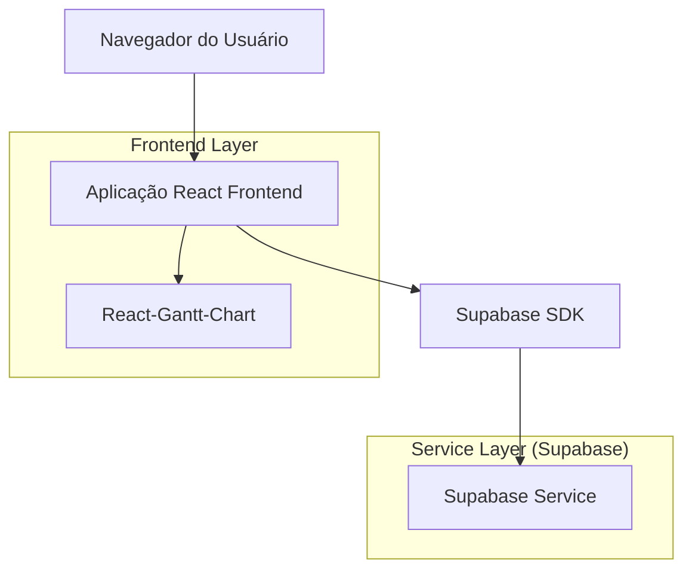
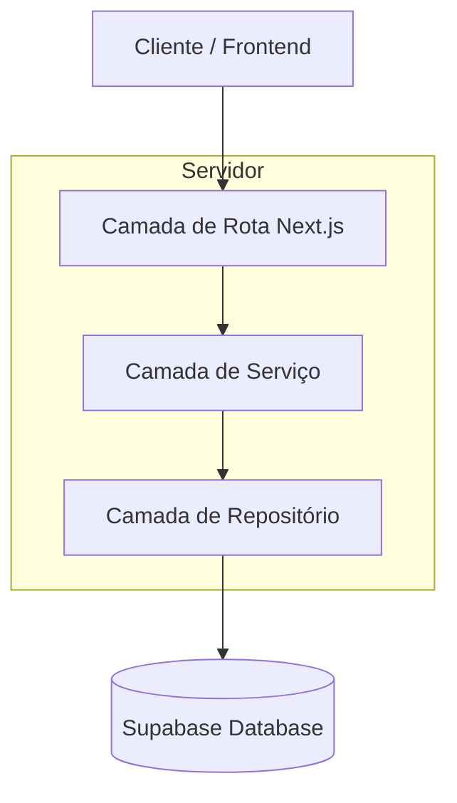
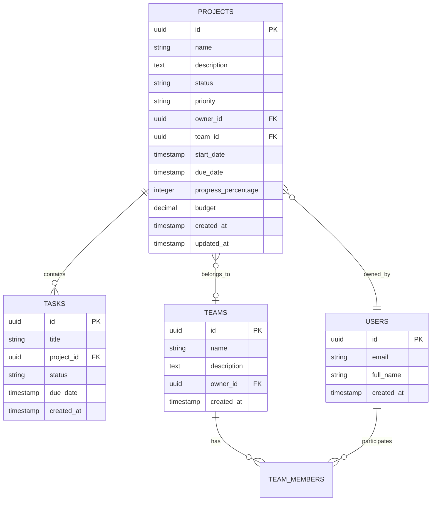

# Arquitetura Técnica - Funcionalidade de Gráfico de Gantt

## 1. Arquitetura do Sistema



## 2. Descrição das Tecnologias

- Frontend: React@18 + TypeScript + TailwindCSS@3 + Next.js@14
- Backend: Supabase (PostgreSQL + Auth + Real-time)
- Biblioteca de Gantt: @dhtmlx/trial ou react-gantt-timeline
- Gerenciamento de Estado: React Query + Context API
- UI Components: Shadcn/ui + Lucide React

## 3. Definições de Rotas

| Rota | Propósito |
|------|----------|
| /gantt | Página principal do gráfico de Gantt com visualização de todos os projetos |
| /gantt?project=[id] | Visualização focada em um projeto específico |
| /gantt?team=[id] | Visualização filtrada por equipe |
| /gantt?status=[status] | Visualização filtrada por status |

## 4. Definições de API

### 4.1 APIs Principais

**Buscar projetos para Gantt**
```
GET /api/projects/gantt
```

Request:
| Nome do Parâmetro | Tipo | Obrigatório | Descrição |
|-------------------|------|-------------|----------|
| status | string[] | false | Filtro por status dos projetos |
| priority | string[] | false | Filtro por prioridade |
| team_id | string | false | Filtro por equipe específica |
| start_date | string | false | Data de início do período |
| end_date | string | false | Data de fim do período |

Response:
| Nome do Parâmetro | Tipo | Descrição |
|-------------------|------|----------|
| projects | Project[] | Lista de projetos com dados para Gantt |
| total | number | Total de projetos encontrados |

Exemplo de Response:
```json
{
  "projects": [
    {
      "id": "proj-123",
      "name": "Sistema de Vendas",
      "description": "Desenvolvimento do sistema",
      "status": "active",
      "priority": "high",
      "start_date": "2024-01-15T00:00:00Z",
      "due_date": "2024-03-15T00:00:00Z",
      "progress_percentage": 65,
      "owner": {
        "id": "user-456",
        "full_name": "João Silva"
      },
      "team": {
        "id": "team-789",
        "name": "Desenvolvimento"
      }
    }
  ],
  "total": 25
}
```

**Atualizar datas do projeto**
```
PATCH /api/projects/[id]/dates
```

Request:
| Nome do Parâmetro | Tipo | Obrigatório | Descrição |
|-------------------|------|-------------|----------|
| start_date | string | false | Nova data de início |
| due_date | string | false | Nova data de entrega |

Response:
| Nome do Parâmetro | Tipo | Descrição |
|-------------------|------|----------|
| success | boolean | Status da operação |
| project | Project | Projeto atualizado |

## 5. Arquitetura do Servidor



## 6. Modelo de Dados

### 6.1 Definição do Modelo de Dados



### 6.2 Linguagem de Definição de Dados

**Consulta otimizada para Gantt**
```sql
-- Criar índices para performance
CREATE INDEX IF NOT EXISTS idx_projects_gantt_dates 
ON projects(start_date, due_date) 
WHERE start_date IS NOT NULL AND due_date IS NOT NULL;

CREATE INDEX IF NOT EXISTS idx_projects_gantt_status 
ON projects(status, priority);

CREATE INDEX IF NOT EXISTS idx_projects_gantt_team 
ON projects(team_id) 
WHERE team_id IS NOT NULL;

-- View otimizada para dados do Gantt
CREATE OR REPLACE VIEW projects_gantt_view AS
SELECT 
    p.id,
    p.name,
    p.description,
    p.status,
    p.priority,
    p.start_date,
    p.due_date,
    p.progress_percentage,
    p.budget,
    p.created_at,
    p.updated_at,
    u.id as owner_id,
    u.full_name as owner_name,
    u.email as owner_email,
    t.id as team_id,
    t.name as team_name,
    COUNT(tasks.id) as total_tasks,
    COUNT(CASE WHEN tasks.status = 'completed' THEN 1 END) as completed_tasks
FROM projects p
LEFT JOIN users u ON p.owner_id = u.id
LEFT JOIN teams t ON p.team_id = t.id
LEFT JOIN tasks ON p.id = tasks.project_id
WHERE p.deleted_at IS NULL
  AND (p.start_date IS NOT NULL OR p.due_date IS NOT NULL)
GROUP BY p.id, u.id, u.full_name, u.email, t.id, t.name;

-- Políticas RLS para acesso aos dados
CREATE POLICY "Users can view gantt data for accessible projects" ON projects_gantt_view
FOR SELECT USING (
    owner_id = auth.uid() OR
    team_id IN (
        SELECT team_id FROM team_members 
        WHERE user_id = auth.uid()
    )
);

-- Função para buscar projetos do Gantt com filtros
CREATE OR REPLACE FUNCTION get_gantt_projects(
    p_status text[] DEFAULT NULL,
    p_priority text[] DEFAULT NULL,
    p_team_id uuid DEFAULT NULL,
    p_start_date timestamp DEFAULT NULL,
    p_end_date timestamp DEFAULT NULL
)
RETURNS TABLE(
    id uuid,
    name text,
    description text,
    status text,
    priority text,
    start_date timestamp,
    due_date timestamp,
    progress_percentage integer,
    owner_name text,
    team_name text,
    total_tasks bigint,
    completed_tasks bigint
)
LANGUAGE plpgsql
SECURITY DEFINER
AS $$
BEGIN
    RETURN QUERY
    SELECT 
        pgv.id,
        pgv.name,
        pgv.description,
        pgv.status,
        pgv.priority,
        pgv.start_date,
        pgv.due_date,
        pgv.progress_percentage,
        pgv.owner_name,
        pgv.team_name,
        pgv.total_tasks,
        pgv.completed_tasks
    FROM projects_gantt_view pgv
    WHERE 
        (p_status IS NULL OR pgv.status = ANY(p_status))
        AND (p_priority IS NULL OR pgv.priority = ANY(p_priority))
        AND (p_team_id IS NULL OR pgv.team_id = p_team_id)
        AND (p_start_date IS NULL OR pgv.due_date >= p_start_date)
        AND (p_end_date IS NULL OR pgv.start_date <= p_end_date)
    ORDER BY 
        COALESCE(pgv.start_date, pgv.created_at) ASC,
        pgv.priority DESC;
END;
$$;
```