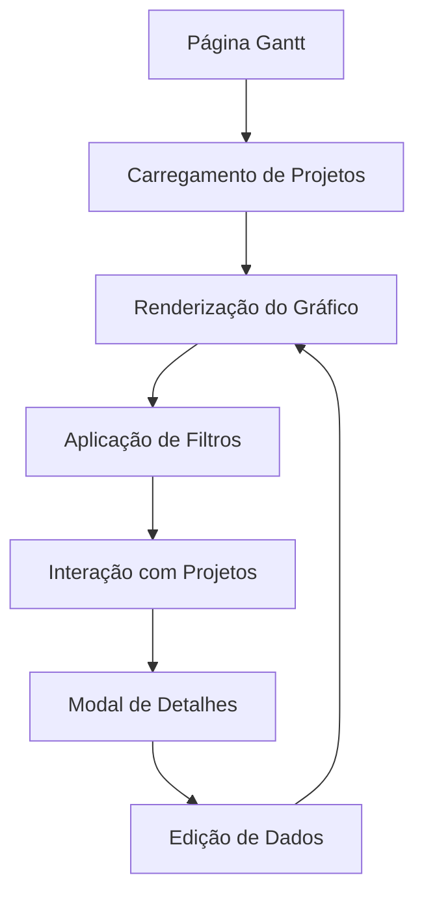

# Funcionalidade de Gráfico de Gantt - Requisitos do Produto

## 1. Visão Geral do Produto

Implementação de uma funcionalidade de gráfico de Gantt para visualização temporal de todos os projetos da aplicação, permitindo aos usuários acompanhar cronogramas, identificar sobreposições e gerenciar recursos de forma eficiente.

A funcionalidade resolve o problema de visualização temporal dos projetos, oferecendo uma interface intuitiva para gestores e membros de equipe acompanharem o progresso e planejamento dos projetos.

## 2. Funcionalidades Principais

### 2.1 Papéis de Usuário

| Papel | Método de Acesso | Permissões Principais |
|-------|------------------|----------------------|
| Usuário Autenticado | Login existente | Visualizar projetos próprios e de equipes que participa |
| Administrador | Permissões elevadas | Visualizar todos os projetos da organização |

### 2.2 Módulos de Funcionalidade

Nossa funcionalidade de Gantt consiste das seguintes páginas principais:

1. **Página de Gráfico de Gantt**: visualização principal, filtros, controles de zoom e navegação temporal.
2. **Modal de Detalhes do Projeto**: informações detalhadas, edição rápida de datas.

### 2.3 Detalhes das Páginas

| Nome da Página | Nome do Módulo | Descrição da Funcionalidade |
|----------------|----------------|-----------------------------|
| Página de Gráfico de Gantt | Visualização Principal | Renderizar gráfico de Gantt com todos os projetos. Exibir barras temporais baseadas em start_date e due_date. Mostrar nome, status, prioridade e progresso de cada projeto |
| Página de Gráfico de Gantt | Sistema de Filtros | Filtrar projetos por status (planning, active, on_hold, completed, cancelled). Filtrar por prioridade (low, medium, high, urgent). Filtrar por equipe específica |
| Página de Gráfico de Gantt | Controles de Navegação | Zoom temporal (dia, semana, mês, trimestre). Navegação por períodos. Scroll horizontal e vertical |
| Página de Gráfico de Gantt | Indicadores Visuais | Cores diferenciadas por status e prioridade. Barras de progresso dentro das tarefas. Indicadores de atraso para projetos vencidos |
| Modal de Detalhes | Informações do Projeto | Exibir detalhes completos do projeto selecionado. Mostrar equipe responsável, orçamento, descrição |
| Modal de Detalhes | Edição Rápida | Permitir edição de datas de início e entrega. Atualizar progresso do projeto |

## 3. Fluxo Principal

**Fluxo do Usuário:**
1. Usuário acessa a página /gantt através do menu lateral
2. Sistema carrega todos os projetos visíveis ao usuário
3. Gráfico de Gantt é renderizado com projetos organizados cronologicamente
4. Usuário pode aplicar filtros para refinar a visualização
5. Usuário pode clicar em um projeto para ver detalhes ou editar
6. Sistema atualiza a visualização em tempo real conforme alterações

## 4. Design da Interface

### 4.1 Estilo de Design

- **Cores Primárias**: Utilizar o sistema de cores existente da aplicação
- **Cores Secundárias**: 
  - Status: Verde (#22c55e) para concluído, Azul (#3b82f6) para ativo, Cinza (#6b7280) para pausado, Vermelho (#ef4444) para cancelado
  - Prioridade: Verde (#22c55e) para baixa, Amarelo (#eab308) para média, Laranja (#f97316) para alta, Vermelho (#ef4444) para urgente
- **Estilo de Botões**: Seguir padrão existente com bordas arredondadas
- **Fontes**: Manter consistência com sistema de tipografia atual
- **Layout**: Design responsivo com sidebar colapsível
- **Ícones**: Utilizar Lucide React para consistência

### 4.2 Visão Geral do Design das Páginas

| Nome da Página | Nome do Módulo | Elementos da UI |
|----------------|----------------|----------------|
| Página de Gráfico de Gantt | Header de Filtros | Dropdowns para status, prioridade e equipe. Botão de reset filtros. Controles de zoom temporal |
| Página de Gráfico de Gantt | Área do Gráfico | Timeline horizontal com marcadores de data. Lista vertical de projetos. Barras de Gantt coloridas por status. Tooltips com informações rápidas |
| Página de Gráfico de Gantt | Legenda | Indicadores de cores para status e prioridade. Explicação dos símbolos utilizados |
| Modal de Detalhes | Cabeçalho | Nome do projeto, status badge, prioridade badge. Botão de fechar |
| Modal de Detalhes | Conteúdo | Formulário com campos editáveis para datas. Informações de equipe e progresso. Botões de salvar/cancelar |

### 4.3 Responsividade

A funcionalidade é desktop-first com adaptações para mobile:
- Desktop: Visualização completa do gráfico com todos os controles
- Tablet: Gráfico adaptado com controles simplificados
- Mobile: Visualização em lista com opção de expandir para gráfico simplificado