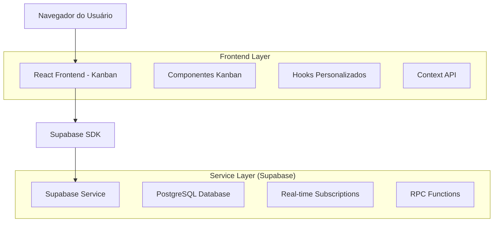
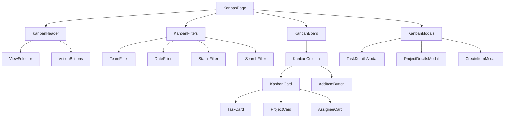
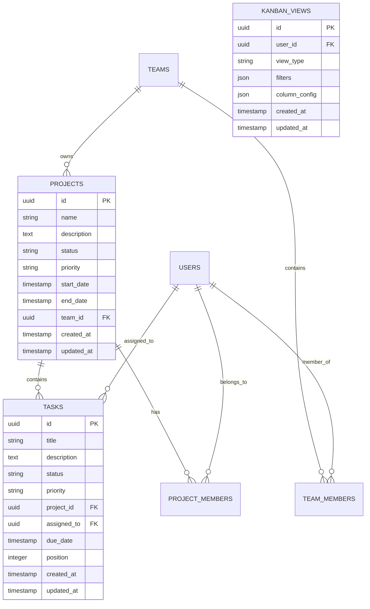

# Arquitetura Técnica - Sistema Kanban

## 1. Arquitetura Geral



## 2. Descrição das Tecnologias

* **Frontend**: React\@18 + TypeScript + Tailwind CSS + Vite

* **Backend**: Supabase (PostgreSQL + Real-time + Auth)

* **Drag & Drop**: @dnd-kit/core + @dnd-kit/sortable

* **Estado**: Context API + React Query para cache

* **UI Components**: Shadcn/ui + Lucide React

## 3. Definições de Rotas

| Rota                                | Propósito                                               |
| ----------------------------------- | ------------------------------------------------------- |
| /kanban                             | Página principal do Kanban com seletor de visualizações |
| /kanban?view=project\&id=:projectId | Visualização por projeto específico                     |
| /kanban?view=assignee\&team=:teamId | Visualização por responsáveis de uma equipe             |
| /kanban?view=status                 | Visualização por status de projetos                     |

## 4. Definições de API

### 4.1 APIs Principais

**Buscar dados do Kanban por projeto**

```
POST /api/kanban/project
```

Request:

| Nome do Parâmetro | Tipo      | Obrigatório | Descrição                     |
| ----------------- | --------- | ----------- | ----------------------------- |
| project\_id       | uuid      | true        | ID do projeto                 |
| team\_id          | uuid      | false       | Filtro por equipe             |
| status\_filter    | string\[] | false       | Filtro por status das tarefas |

Response:

| Nome do Parâmetro | Tipo            | Descrição                     |
| ----------------- | --------------- | ----------------------------- |
| columns           | KanbanColumn\[] | Colunas do quadro com tarefas |
| project\_info     | Project         | Informações do projeto        |

Exemplo:

```json
{
  "project_id": "123e4567-e89b-12d3-a456-426614174000",
  "status_filter": ["todo", "in_progress"]
}
```

**Buscar dados do Kanban por responsáveis**

```
POST /api/kanban/assignees
```

Request:

| Nome do Parâmetro | Tipo      | Obrigatório | Descrição           |
| ----------------- | --------- | ----------- | ------------------- |
| team\_id          | uuid      | true        | ID da equipe        |
| project\_filter   | uuid\[]   | false       | Filtro por projetos |
| date\_range       | DateRange | false       | Filtro por período  |

Response:

| Nome do Parâmetro | Tipo              | Descrição               |
| ----------------- | ----------------- | ----------------------- |
| assignee\_columns | AssigneeColumn\[] | Colunas por responsável |
| team\_info        | Team              | Informações da equipe   |

**Buscar projetos por status**

```
POST /api/kanban/project-status
```

Request:

| Nome do Parâmetro | Tipo      | Obrigatório | Descrição             |
| ----------------- | --------- | ----------- | --------------------- |
| team\_id          | uuid      | false       | Filtro por equipe     |
| priority\_filter  | string\[] | false       | Filtro por prioridade |

Response:

| Nome do Parâmetro | Tipo              | Descrição                     |
| ----------------- | ----------------- | ----------------------------- |
| status\_columns   | StatusColumn\[]   | Colunas por status de projeto |
| projects\_summary | ProjectSummary\[] | Resumo dos projetos           |

**Mover item no Kanban**

```
PUT /api/kanban/move
```

Request:

| Nome do Parâmetro | Tipo   | Obrigatório | Descrição                      |
| ----------------- | ------ | ----------- | ------------------------------ |
| item\_id          | uuid   | true        | ID do item (tarefa ou projeto) |
| item\_type        | string | true        | "task" ou "project"            |
| from\_column      | string | true        | Coluna de origem               |
| to\_column        | string | true        | Coluna de destino              |
| new\_position     | number | true        | Nova posição na coluna         |

Response:

| Nome do Parâmetro | Tipo            | Descrição          |
| ----------------- | --------------- | ------------------ |
| success           | boolean         | Status da operação |
| updated\_item     | Task \| Project | Item atualizado    |

## 5. Arquitetura de Componentes



### 5.1 Componentes Principais

**KanbanPage** - Componente raiz que gerencia estado global

* Props: view (project|assignee|status), filters

* Estado: dados do kanban, loading, erro

* Hooks: useKanbanData, useRealTimeUpdates

**KanbanBoard** - Quadro principal com drag & drop

* Props: columns, onMove, viewType

* Funcionalidades: DnD context, responsividade

* Bibliotecas: @dnd-kit/core

**KanbanColumn** - Coluna individual do quadro

* Props: title, items, onDrop, columnId

* Estado: isOver (drag state)

* Funcionalidades: drop zone, scroll virtual

**KanbanCard** - Card individual (tarefa/projeto)

* Props: item, viewType, onClick, onEdit

* Variantes: TaskCard, ProjectCard, AssigneeCard

* Funcionalidades: preview, badges, avatars

## 6. Modelo de Dados

### 6.1 Definição do Modelo



### 6.2 Linguagem de Definição de Dados (DDL)

**Tabela de Visualizações Kanban (kanban\_views)**

```sql
-- Criar tabela para salvar configurações de visualização
CREATE TABLE kanban_views (
    id UUID PRIMARY KEY DEFAULT gen_random_uuid(),
    user_id UUID REFERENCES users(id) ON DELETE CASCADE,
    view_type VARCHAR(20) NOT NULL CHECK (view_type IN ('project', 'assignee', 'status')),
    view_name VARCHAR(100) NOT NULL,
    filters JSONB DEFAULT '{}',
    column_config JSONB DEFAULT '{}',
    is_default BOOLEAN DEFAULT false,
    created_at TIMESTAMP WITH TIME ZONE DEFAULT NOW(),
    updated_at TIMESTAMP WITH TIME ZONE DEFAULT NOW()
);

-- Índices para performance
CREATE INDEX idx_kanban_views_user_id ON kanban_views(user_id);
CREATE INDEX idx_kanban_views_type ON kanban_views(view_type);

-- Função RPC para buscar dados do Kanban por projeto
CREATE OR REPLACE FUNCTION get_kanban_project_data(
    p_project_id UUID,
    p_team_id UUID DEFAULT NULL,
    p_status_filter TEXT[] DEFAULT NULL
)
RETURNS JSON AS $$
DECLARE
    result JSON;
BEGIN
    SELECT json_build_object(
        'project_info', row_to_json(p.*),
        'columns', (
            SELECT json_agg(
                json_build_object(
                    'id', status,
                    'title', CASE 
                        WHEN status = 'todo' THEN 'A Fazer'
                        WHEN status = 'in_progress' THEN 'Em Progresso'
                        WHEN status = 'in_review' THEN 'Em Revisão'
                        WHEN status = 'completed' THEN 'Concluído'
                        ELSE status
                    END,
                    'tasks', COALESCE(tasks_array, '[]'::json)
                )
            )
            FROM (
                SELECT 
                    unnest(ARRAY['todo', 'in_progress', 'in_review', 'completed']) as status
            ) statuses
            LEFT JOIN (
                SELECT 
                    t.status,
                    json_agg(
                        json_build_object(
                            'id', t.id,
                            'title', t.title,
                            'description', t.description,
                            'priority', t.priority,
                            'assigned_to', u.name,
                            'assigned_avatar', u.avatar_url,
                            'due_date', t.due_date,
                            'position', t.position
                        ) ORDER BY t.position
                    ) as tasks_array
                FROM tasks t
                LEFT JOIN users u ON t.assigned_to = u.id
                WHERE t.project_id = p_project_id
                    AND (p_status_filter IS NULL OR t.status = ANY(p_status_filter))
                    AND (p_team_id IS NULL OR EXISTS (
                        SELECT 1 FROM team_members tm 
                        WHERE tm.team_id = p_team_id AND tm.user_id = t.assigned_to
                    ))
                GROUP BY t.status
            ) tasks_by_status ON statuses.status = tasks_by_status.status
        )
    ) INTO result
    FROM projects p
    WHERE p.id = p_project_id;
    
    RETURN result;
END;
$$ LANGUAGE plpgsql SECURITY DEFINER;

-- Função RPC para buscar dados do Kanban por responsáveis
CREATE OR REPLACE FUNCTION get_kanban_assignee_data(
    p_team_id UUID,
    p_project_filter UUID[] DEFAULT NULL,
    p_date_start DATE DEFAULT NULL,
    p_date_end DATE DEFAULT NULL
)
RETURNS JSON AS $$
DECLARE
    result JSON;
BEGIN
    SELECT json_build_object(
        'team_info', row_to_json(t.*),
        'assignee_columns', (
            SELECT json_agg(
                json_build_object(
                    'id', u.id,
                    'title', u.name,
                    'avatar', u.avatar_url,
                    'tasks', COALESCE(user_tasks, '[]'::json)
                )
            )
            FROM team_members tm
            JOIN users u ON tm.user_id = u.id
            LEFT JOIN (
                SELECT 
                    assigned_to,
                    json_agg(
                        json_build_object(
                            'id', tasks.id,
                            'title', tasks.title,
                            'project_name', p.name,
                            'status', tasks.status,
                            'priority', tasks.priority,
                            'due_date', tasks.due_date
                        ) ORDER BY tasks.due_date NULLS LAST
                    ) as user_tasks
                FROM tasks
                JOIN projects p ON tasks.project_id = p.id
                WHERE (p_project_filter IS NULL OR tasks.project_id = ANY(p_project_filter))
                    AND (p_date_start IS NULL OR tasks.due_date >= p_date_start)
                    AND (p_date_end IS NULL OR tasks.due_date <= p_date_end)
                GROUP BY assigned_to
            ) task_data ON u.id = task_data.assigned_to
            WHERE tm.team_id = p_team_id
        )
    ) INTO result
    FROM teams t
    WHERE t.id = p_team_id;
    
    RETURN result;
END;
$$ LANGUAGE plpgsql SECURITY DEFINER;

-- Função RPC para buscar projetos por status
CREATE OR REPLACE FUNCTION get_kanban_project_status_data(
    p_team_id UUID DEFAULT NULL,
    p_priority_filter TEXT[] DEFAULT NULL
)
RETURNS JSON AS $$
DECLARE
    result JSON;
BEGIN
    SELECT json_build_object(
        'status_columns', (
            SELECT json_agg(
                json_build_object(
                    'id', status,
                    'title', CASE 
                        WHEN status = 'planning' THEN 'Planejamento'
                        WHEN status = 'active' THEN 'Em Andamento'
                        WHEN status = 'review' THEN 'Em Revisão'
                        WHEN status = 'completed' THEN 'Finalizado'
                        ELSE status
                    END,
                    'projects', COALESCE(projects_array, '[]'::json)
                )
            )
            FROM (
                SELECT unnest(ARRAY['planning', 'active', 'review', 'completed']) as status
            ) statuses
            LEFT JOIN (
                SELECT 
                    p.status,
                    json_agg(
                        json_build_object(
                            'id', p.id,
                            'name', p.name,
                            'description', p.description,
                            'priority', p.priority,
                            'team_name', t.name,
                            'start_date', p.start_date,
                            'end_date', p.end_date,
                            'progress', COALESCE(stats.progress, 0),
                            'total_tasks', COALESCE(stats.total_tasks, 0),
                            'completed_tasks', COALESCE(stats.completed_tasks, 0)
                        )
                    ) as projects_array
                FROM projects p
                JOIN teams t ON p.team_id = t.id
                LEFT JOIN (
                    SELECT 
                        project_id,
                        COUNT(*) as total_tasks,
                        COUNT(*) FILTER (WHERE status = 'completed') as completed_tasks,
                        CASE 
                            WHEN COUNT(*) > 0 THEN 
                                ROUND((COUNT(*) FILTER (WHERE status = 'completed')::FLOAT / COUNT(*)) * 100)
                            ELSE 0
                        END as progress
                    FROM tasks
                    GROUP BY project_id
                ) stats ON p.id = stats.project_id
                WHERE (p_team_id IS NULL OR p.team_id = p_team_id)
                    AND (p_priority_filter IS NULL OR p.priority = ANY(p_priority_filter))
                GROUP BY p.status
            ) projects_by_status ON statuses.status = projects_by_status.status
        )
    ) INTO result;
    
    RETURN result;
END;
$$ LANGUAGE plpgsql SECURITY DEFINER;

-- Políticas de segurança
GRANT SELECT ON kanban_views TO authenticated;
GRANT ALL PRIVILEGES ON kanban_views TO authenticated;

-- Dados iniciais
INSERT INTO kanban_views (user_id, view_type, view_name, is_default) 
SELECT id, 'project', 'Visualização Padrão por Projeto', true 
FROM users 
WHERE NOT EXISTS (SELECT 1 FROM kanban_views WHERE user_id = users.id AND view_type = 'project');
```

## 7. Hooks Personalizados

### useKanbanData

```typescript
interface UseKanbanDataProps {
  viewType: 'project' | 'assignee' | 'status';
  filters: KanbanFilters;
}

interface KanbanFilters {
  projectId?: string;
  teamId?: string;
  assigneeId?: string;
  statusFilter?: string[];
  dateRange?: { start: Date; end: Date };
  priorityFilter?: string[];
}
```

### useKanbanDragDrop

```typescript
interface UseKanbanDragDropProps {
  onMove: (itemId: string, fromColumn: string, toColumn: string, newPosition: number) => void;
  viewType: string;
}
```

### useKanbanRealTime

```typescript
interface UseKanbanRealTimeProps {
  projectIds?: string[];
  teamIds?: string[];
  onUpdate: (data: any) => void;
}
```

