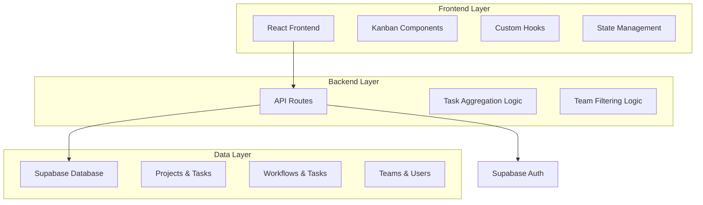
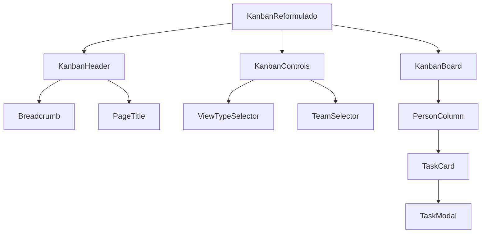
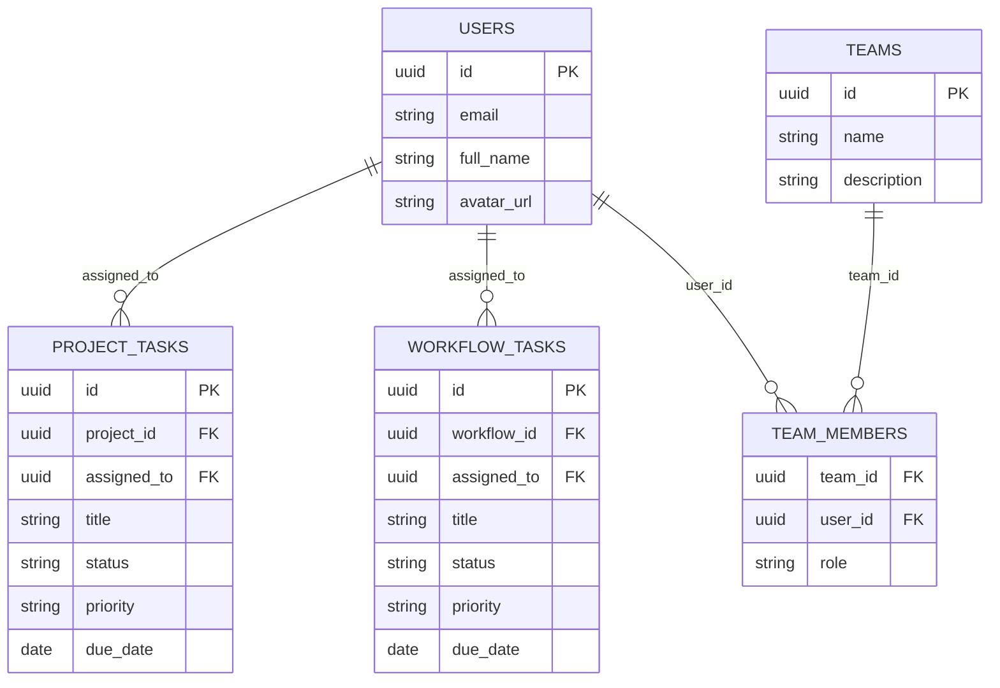

# Sistema Kanban Reformulado - Arquitetura Técnica

## 1. Arquitetura Geral



## 2. Stack Tecnológico

* **Frontend**: React\@18 + TypeScript + Tailwind CSS + Lucide React

* **Backend**: Next.js API Routes + Supabase

* **Database**: Supabase (PostgreSQL)

* **Estado**: React Query + useState para estado local

* **Drag & Drop**: @dnd-kit/core

## 3. Definições de Rotas

| Rota                           | Propósito                                            |
| ------------------------------ | ---------------------------------------------------- |
| /kanban-reformulado            | Página principal do Kanban reformulado com seletores |
| /api/kanban/pessoas            | API para buscar pessoas com tarefas atribuídas       |
| /api/kanban/tarefas-por-pessoa | API para buscar tarefas agrupadas por pessoa         |
| /api/kanban/equipes            | API para listar equipes disponíveis                  |
| /api/kanban/mover-tarefa       | API para alterar responsável de uma tarefa           |

## 4. APIs Necessárias

### 4.1 API Principal - Pessoas com Tarefas

**Endpoint**: `GET /api/kanban/pessoas`

**Query Parameters**:

| Parâmetro   | Tipo   | Obrigatório | Descrição                                            |
| ----------- | ------ | ----------- | ---------------------------------------------------- |
| tipo\_visao | string | true        | "pessoa" ou "equipe"                                 |
| equipe\_id  | string | false       | ID da equipe (obrigatório se tipo\_visao = "equipe") |

**Response**:

```json
{
  "pessoas": [
    {
      "id": "user-123",
      "nome": "João Silva",
      "email": "joao@empresa.com",
      "avatar_url": "https://...",
      "equipe": "Desenvolvimento",
      "total_tarefas": 8,
      "tarefas_pendentes": 5,
      "tarefas_concluidas": 3
    }
  ]
}
```

### 4.2 API de Tarefas por Pessoa

**Endpoint**: `GET /api/kanban/tarefas-por-pessoa`

**Query Parameters**:

| Parâmetro   | Tipo      | Obrigatório | Descrição                |
| ----------- | --------- | ----------- | ------------------------ |
| pessoa\_ids | string\[] | true        | Array de IDs das pessoas |

**Response**:

```json
{
  "tarefas_por_pessoa": {
    "user-123": [
      {
        "id": "task-456",
        "titulo": "Implementar login",
        "tipo": "projeto", // "projeto" ou "workflow"
        "projeto_nome": "Sistema Web",
        "status": "em_andamento",
        "prioridade": "alta",
        "prazo": "2024-01-15",
        "criado_em": "2024-01-01T10:00:00Z"
      }
    ]
  }
}
```

### 4.3 API de Movimentação de Tarefas

**Endpoint**: `PUT /api/kanban/mover-tarefa`

**Request Body**:

```json
{
  "tarefa_id": "task-456",
  "tipo_tarefa": "projeto", // "projeto" ou "workflow"
  "novo_responsavel_id": "user-789"
}
```

## 5. Estrutura de Componentes



### 5.1 Componentes Principais

**KanbanReformulado** (Página Principal)

* Gerencia estado global da visualização

* Coordena comunicação entre componentes

* Implementa lógica de drag & drop

**KanbanControls** (Controles de Filtro)

* Seletor de tipo de visualização (pessoa/equipe)

* Dropdown de seleção de equipe

* Filtros adicionais (status, prioridade)

**KanbanBoard** (Tabuleiro Principal)

* Renderiza colunas dinamicamente baseado em pessoas

* Implementa área de drop para movimentação

* Gerencia layout responsivo

**PersonColumn** (Coluna de Pessoa)

* Header com informações da pessoa

* Lista de tarefas ordenadas por status

* Indicadores visuais de carga de trabalho

**TaskCard** (Cartão de Tarefa)

* Informações resumidas da tarefa

* Indicadores de tipo (projeto/workflow)

* Status visual e prazo

## 6. Hooks Customizados

### 6.1 useKanbanData

```typescript
interface UseKanbanDataProps {
  tipoVisao: 'pessoa' | 'equipe'
  equipeId?: string
}

interface UseKanbanDataReturn {
  pessoas: Pessoa[]
  tarefasPorPessoa: Record<string, Tarefa[]>
  isLoading: boolean
  error: Error | null
  refetch: () => void
}
```

### 6.2 useKanbanDragDrop

```typescript
interface UseKanbanDragDropReturn {
  sensors: SensorDescriptor[]
  handleDragEnd: (event: DragEndEvent) => void
  moverTarefa: (tarefaId: string, novoResponsavelId: string) => Promise<void>
}
```

## 7. Modelo de Dados

### 7.1 Estruturas Principais



### 7.2 Queries de Agregação

**Buscar Pessoas com Tarefas (Visão Geral)**

```sql
WITH pessoas_com_tarefas AS (
  SELECT DISTINCT u.id, u.full_name, u.email, u.avatar_url
  FROM users u
  WHERE u.id IN (
    SELECT DISTINCT assigned_to FROM tasks WHERE assigned_to IS NOT NULL
    UNION
    SELECT DISTINCT assigned_to FROM workflow_tasks WHERE assigned_to IS NOT NULL
  )
)
SELECT * FROM pessoas_com_tarefas;
```

**Buscar Tarefas Unificadas por Pessoa**

```sql
WITH tarefas_unificadas AS (
  SELECT 
    t.id,
    t.title,
    'projeto' as tipo,
    p.name as projeto_nome,
    t.status,
    t.priority,
    t.due_date,
    t.assigned_to,
    t.created_at
  FROM tasks t
  JOIN projects p ON t.project_id = p.id
  WHERE t.assigned_to = $1
  
  UNION ALL
  
  SELECT 
    wt.id,
    wt.title,
    'workflow' as tipo,
    w.name as projeto_nome,
    wt.status,
    wt.priority,
    wt.due_date,
    wt.assigned_to,
    wt.created_at
  FROM workflow_tasks wt
  JOIN workflows w ON wt.workflow_id = w.id
  WHERE wt.assigned_to = $1
)
SELECT * FROM tarefas_unificadas
ORDER BY 
  CASE WHEN status IN ('pendente', 'em_andamento') THEN 0 ELSE 1 END,
  created_at DESC;
```

## 8. Considerações de Performance

* **Paginação**: Implementar lazy loading para equipes com muitos membros

* **Cache**: Usar React Query para cache de dados de pessoas e tarefas

* **Otimização de Queries**: Índices em assigned\_to, status e created\_at

* **Debounce**: Aplicar debounce em filtros e buscas

* **Virtualização**: Considerar virtualização para listas muito grandes

## 9. Segurança e Permissões

* **RLS (Row Level Security)**: Políticas para garantir que usuários vejam apenas dados permitidos

* **Validação de Equipe**: Verificar se usuário tem permissão para visualizar equipe selecionada

* **Auditoria**: Log de movimentações de tarefas entre responsáveis

