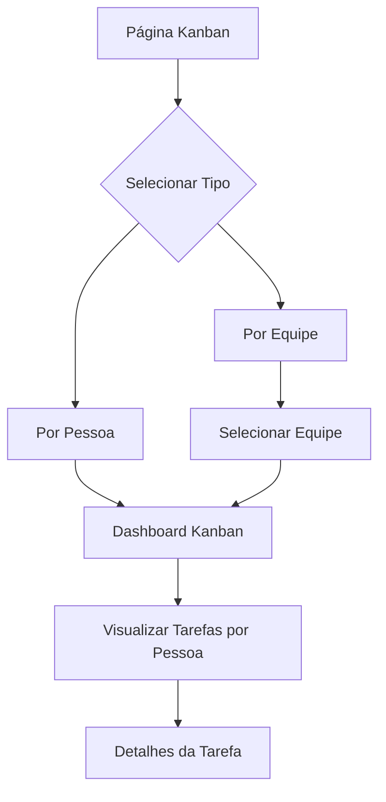

# Sistema Kanban Reformulado - Requisitos Funcionais

## 1. Visão Geral do Produto

Sistema Kanban reformulado focado na visualização de tarefas por responsável, permitindo à liderança acompanhar a distribuição e progresso das atividades de cada membro da equipe. O sistema unifica tarefas de projetos tradicionais e workflows em uma única visualização organizada por pessoas.

## 2. Funcionalidades Principais

### 2.1 Tipos de Usuário

| Papel | Método de Acesso | Permissões Principais |
|-------|------------------|----------------------|
| Líder/Gestor | Login com perfil de liderança | Visualizar todas as equipes e membros, acessar relatórios |
| Membro da Equipe | Login padrão | Visualizar apenas suas próprias tarefas |

### 2.2 Módulos Funcionais

O sistema Kanban reformulado consiste nas seguintes páginas principais:

1. **Página de Seleção de Visualização**: seletor de tipo de visão (pessoa/equipe), filtros de equipe
2. **Dashboard Kanban por Pessoa**: colunas representando pessoas, cartões de tarefas organizados por status
3. **Dashboard Kanban por Equipe**: visualização filtrada por equipe selecionada
4. **Detalhes da Tarefa**: modal com informações completas da tarefa selecionada

### 2.3 Detalhes das Páginas

| Página | Módulo | Descrição da Funcionalidade |
|--------|--------|--------------------------|
| Seleção de Visualização | Seletor de Tipo | Botões de alternância entre "Por Pessoa" e "Por Equipe" |
| Seleção de Visualização | Filtro de Equipe | Dropdown para seleção de equipe (visível apenas no modo "Por Equipe") |
| Dashboard Kanban | Colunas Dinâmicas | Gerar colunas baseadas em pessoas com tarefas atribuídas |
| Dashboard Kanban | Cartões de Tarefa | Exibir tarefas de projetos e workflows, ordenadas por status (pendentes primeiro) |
| Dashboard Kanban | Drag & Drop | Permitir movimentação de tarefas entre responsáveis |
| Detalhes da Tarefa | Modal de Informações | Mostrar detalhes completos, permitir edição de responsável e status |

## 3. Fluxo Principal de Uso

**Fluxo do Gestor:**
1. Acessa a página do Kanban reformulado
2. Seleciona tipo de visualização ("Por Pessoa" ou "Por Equipe")
3. Se "Por Equipe", seleciona a equipe desejada no dropdown
4. Visualiza o dashboard com colunas de pessoas e suas respectivas tarefas
5. Pode clicar em tarefas para ver detalhes ou mover tarefas entre responsáveis
6. Monitora progresso e distribuição de trabalho

## 4. Design da Interface

### 4.1 Estilo Visual
- **Cores Primárias**: Azul (#3B82F6) para elementos principais, Verde (#10B981) para tarefas concluídas
- **Cores Secundárias**: Cinza (#6B7280) para textos secundários, Amarelo (#F59E0B) para tarefas em andamento
- **Estilo dos Botões**: Arredondados com sombra sutil
- **Tipografia**: Inter, tamanhos 14px (corpo), 16px (títulos), 12px (legendas)
- **Layout**: Grid responsivo com colunas flexíveis
- **Ícones**: Lucide React para consistência visual

### 4.2 Estrutura Visual das Páginas

| Página | Módulo | Elementos da Interface |
|--------|--------|-----------------------|
| Seleção | Header | Título "Kanban por Responsável", breadcrumb de navegação |
| Seleção | Controles | Toggle buttons para tipo de visão, dropdown de equipes com ícone |
| Dashboard | Colunas | Cards com nome da pessoa, avatar, contador de tarefas |
| Dashboard | Tarefas | Cards coloridos por status, título, projeto/workflow, prazo |
| Modal | Detalhes | Formulário com campos editáveis, botões de ação |

### 4.3 Responsividade

O sistema é mobile-first com adaptação para desktop. Em dispositivos móveis, as colunas se tornam uma lista vertical com seções expansíveis por pessoa.
