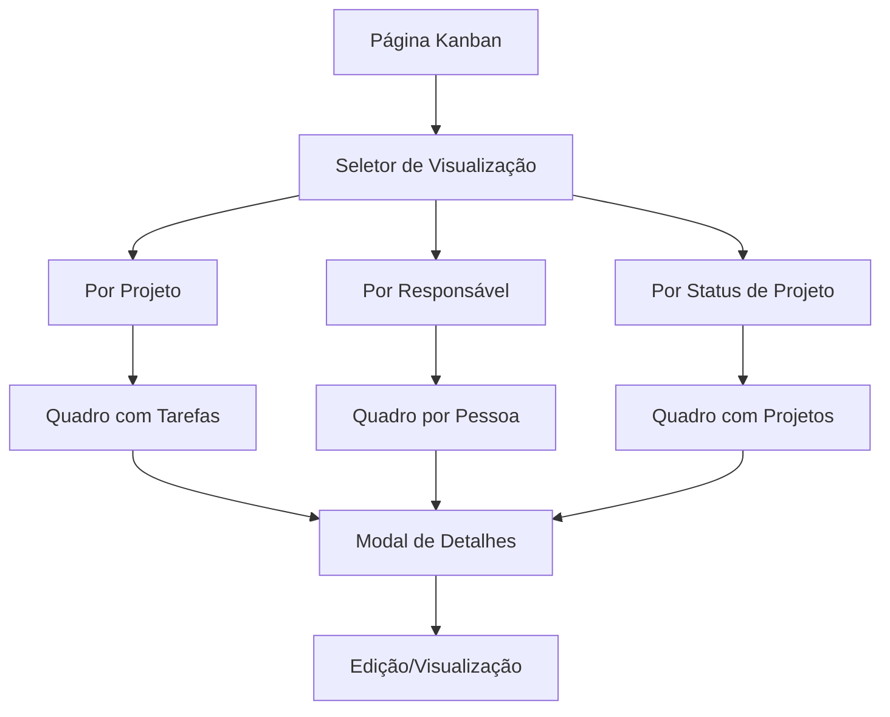

# Documentação de Requisitos - Sistema Kanban

## 1. Visão Geral do Produto

Sistema Kanban integrado ao gerenciador de projetos que oferece três visualizações distintas para organização e acompanhamento de tarefas e projetos através de quadros visuais drag-and-drop.

- Facilita o gerenciamento visual de fluxo de trabalho com diferentes perspectivas organizacionais
- Permite acompanhamento em tempo real do progresso de tarefas e projetos
- Integra-se perfeitamente com o sistema existente de projetos e equipes

## 2. Funcionalidades Principais

### 2.1 Papéis de Usuário

| Papel | Método de Registro | Permissões Principais |
|-------|-------------------|----------------------|
| Usuário Padrão | Registro por email | Visualizar kanbans de projetos onde é membro |
| Gerente de Projeto | Convite ou promoção | Gerenciar kanbans de seus projetos, mover tarefas |
| Administrador | Acesso total | Visualizar e gerenciar todos os kanbans |

### 2.2 Módulos de Funcionalidade

Nosso sistema Kanban consiste nas seguintes páginas principais:

1. **Página Principal do Kanban**: seletor de visualização, filtros, quadro kanban interativo
2. **Modal de Detalhes**: informações detalhadas de tarefas/projetos, edição rápida
3. **Configurações de Visualização**: personalização de colunas, filtros salvos

### 2.3 Detalhes das Páginas

| Nome da Página | Nome do Módulo | Descrição da Funcionalidade |
|----------------|----------------|-----------------------------|
| Página Principal do Kanban | Seletor de Visualização | Alternar entre as 3 visualizações (projeto, responsável, status) |
| Página Principal do Kanban | Filtros Avançados | Filtrar por equipe, data, prioridade, status |
| Página Principal do Kanban | Quadro Kanban | Colunas dinâmicas com cards drag-and-drop |
| Página Principal do Kanban | Barra de Ações | Criar nova tarefa/projeto, exportar, configurações |
| Modal de Detalhes | Informações da Tarefa | Exibir título, descrição, responsável, datas, anexos |
| Modal de Detalhes | Edição Rápida | Alterar status, responsável, prioridade sem sair do modal |
| Modal de Detalhes | Histórico de Atividades | Log de mudanças e comentários da tarefa/projeto |
| Configurações | Personalização de Colunas | Definir colunas personalizadas para cada visualização |
| Configurações | Filtros Salvos | Salvar combinações de filtros para acesso rápido |

## 3. Fluxo Principal de Uso

### Fluxo do Usuário Padrão
1. Acessa página do Kanban através do menu lateral
2. Seleciona visualização desejada (projeto/responsável/status)
3. Aplica filtros conforme necessário
4. Visualiza e interage com cards no quadro
5. Clica em card para ver detalhes ou editar
6. Move cards entre colunas via drag-and-drop

### Fluxo do Gerente de Projeto
1. Acessa Kanban e seleciona seus projetos
2. Cria novas tarefas diretamente no quadro
3. Atribui responsáveis e define prioridades
4. Monitora progresso através das visualizações
5. Gera relatórios de produtividade

## 4. Design da Interface

### 4.1 Estilo de Design

- **Cores primárias**: #3B82F6 (azul), #10B981 (verde), #F59E0B (amarelo)
- **Cores secundárias**: #6B7280 (cinza), #EF4444 (vermelho)
- **Estilo dos botões**: Arredondados com sombra sutil
- **Fonte**: Inter, tamanhos 12px-24px
- **Layout**: Grid responsivo com cards em colunas
- **Ícones**: Lucide React com estilo minimalista

### 4.2 Visão Geral do Design das Páginas

| Nome da Página | Nome do Módulo | Elementos da UI |
|----------------|----------------|----------------|
| Página Principal | Cabeçalho | Título "Kanban", seletor de visualização (tabs), botão "Nova Tarefa" |
| Página Principal | Filtros | Dropdown de equipes, seletor de datas, filtro de status, busca por texto |
| Página Principal | Quadro Kanban | Colunas verticais com títulos, cards arrastáveis, indicadores de quantidade |
| Página Principal | Cards | Título da tarefa, avatar do responsável, badges de prioridade, datas |
| Modal de Detalhes | Cabeçalho | Título editável, botão fechar, menu de ações |
| Modal de Detalhes | Conteúdo | Descrição, responsável, datas, status, anexos, comentários |
| Modal de Detalhes | Rodapé | Botões "Salvar", "Cancelar", "Excluir" |

### 4.3 Responsividade

Desktop-first com adaptação para mobile. Em telas menores, o quadro Kanban se torna scrollável horizontalmente e os cards se ajustam para melhor visualização touch.

## 5. Visualizações Detalhadas

### 5.1 Visualização por Projeto
- **Colunas**: A Fazer, Em Progresso, Em Revisão, Concluído
- **Cards**: Tarefas individuais do projeto selecionado
- **Filtros**: Projeto específico, responsável, prioridade
- **Ações**: Criar tarefa, mover entre status, editar tarefa

### 5.2 Visualização por Responsável
- **Colunas**: Cada coluna representa um membro da equipe
- **Cards**: Todas as tarefas atribuídas a cada pessoa
- **Filtros**: Equipe, projeto, status da tarefa
- **Ações**: Reatribuir tarefas, balancear carga de trabalho

### 5.3 Visualização por Status de Projeto
- **Colunas**: Planejamento, Em Andamento, Em Revisão, Finalizado
- **Cards**: Projetos completos com informações resumidas
- **Filtros**: Equipe responsável, data de entrega, prioridade
- **Ações**: Alterar status do projeto, ver detalhes, criar projeto

## 6. Regras de Negócio

### 6.1 Permissões
- Usuários só podem mover tarefas de projetos onde são membros
- Gerentes podem mover qualquer tarefa de seus projetos
- Administradores têm acesso total a todas as operações

### 6.2 Validações
- Tarefas não podem ser movidas para status incompatíveis
- Projetos devem ter pelo menos um responsável
- Datas de entrega não podem ser anteriores à data atual

### 6.3 Notificações
- Notificar responsável quando tarefa é atribuída ou movida
- Alertar gerente quando projeto muda de status
- Lembrete automático para tarefas próximas do prazo