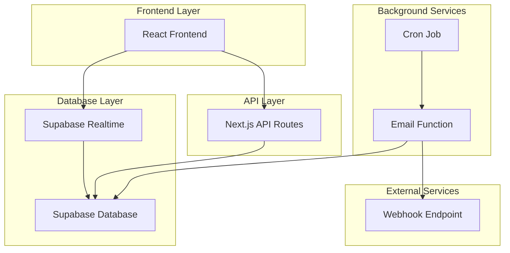
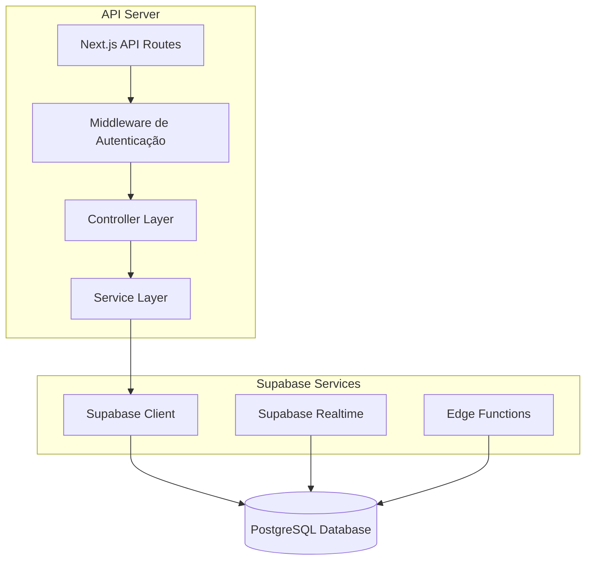
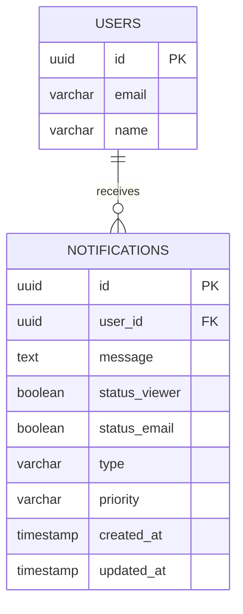

# Sistema de Notificações - Arquitetura Técnica

## 1. Design da Arquitetura



## 2. Descrição da Tecnologia
- Frontend: React@18 + Next.js@14 + TailwindCSS@3 + Supabase Realtime
- Backend: Next.js API Routes + Supabase Functions
- Database: Supabase (PostgreSQL)
- Cron: Supabase Edge Functions com pg_cron

## 3. Definições de Rotas
| Rota | Propósito |
|------|----------|
| /notifications | Central de notificações do usuário, exibe lista em tempo real |
| /api/notifications | API para CRUD de notificações |
| /api/notifications/mark-read | API para marcar notificações como lidas |
| /api/notifications/stats | API para estatísticas administrativas |
| /admin/notifications | Painel administrativo para criação e gestão |

## 4. Definições de API

### 4.1 APIs Principais

**Buscar notificações do usuário**
```
GET /api/notifications
```

Request:
| Nome do Parâmetro | Tipo | Obrigatório | Descrição |
|-------------------|------|-------------|----------|
| user_id | string | true | ID do usuário autenticado |
| limit | number | false | Limite de notificações (padrão: 20) |
| offset | number | false | Offset para paginação |
| unread_only | boolean | false | Filtrar apenas não lidas |

Response:
| Nome do Parâmetro | Tipo | Descrição |
|-------------------|------|----------|
| notifications | array | Lista de notificações |
| total_count | number | Total de notificações |
| unread_count | number | Total de não lidas |

Exemplo:
```json
{
  "notifications": [
    {
      "id": "uuid",
      "message": "Novo projeto atribuído",
      "user_id": "uuid",
      "status_viewer": false,
      "status_email": true,
      "created_at": "2024-01-15T10:30:00Z",
      "type": "project_assignment",
      "priority": "normal"
    }
  ],
  "total_count": 15,
  "unread_count": 3
}
```

**Marcar notificação como lida**
```
PUT /api/notifications/mark-read
```

Request:
| Nome do Parâmetro | Tipo | Obrigatório | Descrição |
|-------------------|------|-------------|----------|
| notification_id | string | true | ID da notificação |

Response:
| Nome do Parâmetro | Tipo | Descrição |
|-------------------|------|----------|
| success | boolean | Status da operação |
| message | string | Mensagem de confirmação |

**Criar nova notificação (Admin)**
```
POST /api/notifications
```

Request:
| Nome do Parâmetro | Tipo | Obrigatório | Descrição |
|-------------------|------|-------------|----------|
| user_id | string | true | ID do destinatário |
| message | string | true | Conteúdo da notificação |
| type | string | true | Tipo da notificação |
| priority | string | false | Prioridade (normal, high, urgent) |

## 5. Arquitetura do Servidor



## 6. Modelo de Dados

### 6.1 Definição do Modelo de Dados



### 6.2 Linguagem de Definição de Dados

**Tabela de Notificações (notifications)**
```sql
-- Criar tabela
CREATE TABLE notifications (
    id UUID PRIMARY KEY DEFAULT gen_random_uuid(),
    user_id UUID NOT NULL REFERENCES users(id) ON DELETE CASCADE,
    message TEXT NOT NULL,
    status_viewer BOOLEAN DEFAULT FALSE,
    status_email BOOLEAN DEFAULT FALSE,
    type VARCHAR(50) DEFAULT 'general',
    priority VARCHAR(20) DEFAULT 'normal' CHECK (priority IN ('low', 'normal', 'high', 'urgent')),
    created_at TIMESTAMP WITH TIME ZONE DEFAULT NOW(),
    updated_at TIMESTAMP WITH TIME ZONE DEFAULT NOW()
);

-- Criar índices
CREATE INDEX idx_notifications_user_id ON notifications(user_id);
CREATE INDEX idx_notifications_status_viewer ON notifications(status_viewer);
CREATE INDEX idx_notifications_status_email ON notifications(status_email);
CREATE INDEX idx_notifications_created_at ON notifications(created_at DESC);
CREATE INDEX idx_notifications_type ON notifications(type);

-- Políticas RLS
ALTER TABLE notifications ENABLE ROW LEVEL SECURITY;

-- Usuários podem ver apenas suas próprias notificações
CREATE POLICY "Users can view own notifications" ON notifications
    FOR SELECT USING (auth.uid() = user_id);

-- Usuários podem atualizar apenas suas próprias notificações
CREATE POLICY "Users can update own notifications" ON notifications
    FOR UPDATE USING (auth.uid() = user_id);

-- Apenas usuários autenticados podem inserir notificações
CREATE POLICY "Authenticated users can insert notifications" ON notifications
    FOR INSERT WITH CHECK (auth.role() = 'authenticated');

-- Função para envio de emails
CREATE OR REPLACE FUNCTION send_pending_notifications()
RETURNS void
LANGUAGE plpgsql
SECURITY DEFINER
AS $$
DECLARE
    notification_data jsonb;
    webhook_url text := 'https://defaultb3d960a7e68f4610a7290414acbe7f.48.environment.api.powerplatform.com:443/powerautomate/automations/direct/workflows/b7c7805d3c4b44829c9e7b220ef69458/triggers/manual/paths/invoke?api-version=1&sp=%2Ftriggers%2Fmanual%2Frun&sv=1.0&sig=6U3NECy3xki0DRlNT6-znEVOoAobpDTL0WI0g_0n8mw';
    http_response record;
BEGIN
    -- Buscar notificações pendentes e agrupar por usuário
    SELECT jsonb_agg(
        jsonb_build_object(
            'user_email', u.email,
            'user_name', u.name,
            'notifications', notifications_array
        )
    ) INTO notification_data
    FROM (
        SELECT 
            n.user_id,
            jsonb_agg(
                jsonb_build_object(
                    'id', n.id,
                    'message', n.message,
                    'type', n.type,
                    'priority', n.priority,
                    'created_at', n.created_at
                )
            ) as notifications_array
        FROM notifications n
        WHERE n.status_email = false
        GROUP BY n.user_id
    ) grouped_notifications
    JOIN users u ON u.id = grouped_notifications.user_id;
    
    -- Se há notificações pendentes, enviar para webhook
    IF notification_data IS NOT NULL THEN
        -- Fazer requisição HTTP POST para webhook
        SELECT * INTO http_response
        FROM http_post(
            webhook_url,
            notification_data::text,
            'application/json'
        );
        
        -- Se envio foi bem-sucedido, marcar como enviado
        IF http_response.status_code BETWEEN 200 AND 299 THEN
            UPDATE notifications 
            SET status_email = true, updated_at = NOW()
            WHERE status_email = false;
        END IF;
    END IF;
END;
$$;

-- Configurar cron job para executar a cada 3 minutos
SELECT cron.schedule(
    'send-notifications-email',
    '*/3 * * * *',
    'SELECT send_pending_notifications();'
);

-- Trigger para atualizar updated_at
CREATE OR REPLACE FUNCTION update_updated_at_column()
RETURNS TRIGGER AS $$
BEGIN
    NEW.updated_at = NOW();
    RETURN NEW;
END;
$$ language 'plpgsql';

CREATE TRIGGER update_notifications_updated_at
    BEFORE UPDATE ON notifications
    FOR EACH ROW
    EXECUTE FUNCTION update_updated_at_column();

-- Dados iniciais para teste
INSERT INTO notifications (user_id, message, type, priority)
SELECT 
    u.id,
    'Bem-vindo ao sistema de notificações!',
    'welcome',
    'normal'
FROM users u
LIMIT 5;
```

**Função para Realtime Subscriptions**
```sql
-- Habilitar realtime para a tabela notifications
ALTER PUBLICATION supabase_realtime ADD TABLE notifications;

-- Função para contar notificações não lidas
CREATE OR REPLACE FUNCTION get_unread_notifications_count(user_uuid uuid)
RETURNS integer
LANGUAGE plpgsql
SECURITY DEFINER
AS $$
DECLARE
    unread_count integer;
BEGIN
    SELECT COUNT(*) INTO unread_count
    FROM notifications
    WHERE user_id = user_uuid AND status_viewer = false;
    
    RETURN unread_count;
END;
$$;

-- Grant permissions
GRANT SELECT ON notifications TO anon;
GRANT ALL PRIVILEGES ON notifications TO authenticated;
GRANT EXECUTE ON FUNCTION get_unread_notifications_count TO authenticated;
GRANT EXECUTE ON FUNCTION send_pending_notifications TO authenticated;
```