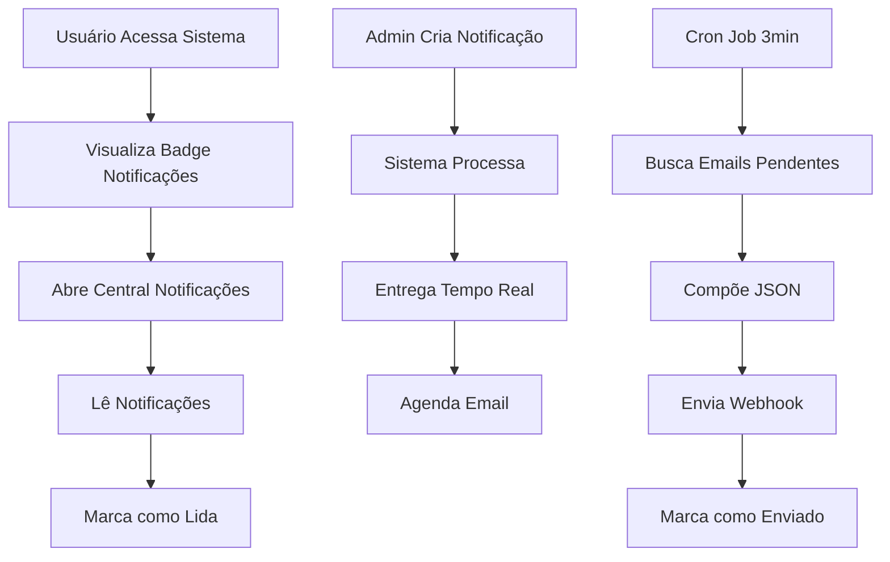

# Sistema de Notificações - Requisitos do Produto

## 1. Visão Geral do Produto
Sistema de notificações em tempo real para ações estratégicas do gerenciador de projetos, permitindo comunicação eficiente entre usuários e envio automático de emails.
- Resolve a necessidade de comunicação imediata sobre eventos importantes do sistema
- Destinado a todos os usuários da plataforma de gerenciamento de projetos
- Aumenta o engajamento e garante que informações críticas sejam comunicadas rapidamente

## 2. Funcionalidades Principais

### 2.1 Papéis de Usuário
| Papel | Método de Registro | Permissões Principais |
|-------|-------------------|----------------------|
| Usuário Comum | Registro existente no sistema | Pode visualizar suas notificações, marcar como lida |
| Administrador | Acesso administrativo existente | Pode criar notificações para outros usuários, visualizar estatísticas |

### 2.2 Módulo de Funcionalidades
Nosso sistema de notificações consiste nas seguintes páginas principais:
1. **Central de Notificações**: exibição em tempo real, marcação como lida, histórico de notificações.
2. **Painel de Administração**: criação de notificações, estatísticas de entrega, configurações do sistema.

### 2.3 Detalhes das Páginas
| Nome da Página | Nome do Módulo | Descrição da Funcionalidade |
|----------------|----------------|-----------------------------|
| Central de Notificações | Lista de Notificações | Exibir notificações não lidas em tempo real, permitir marcação como lida, filtrar por data/tipo |
| Central de Notificações | Contador de Notificações | Mostrar badge com número de notificações não lidas no header |
| Central de Notificações | Histórico | Visualizar todas as notificações (lidas e não lidas) com paginação |
| Painel Admin | Criação de Notificações | Criar notificações para usuários específicos ou grupos, definir prioridade e tipo |
| Painel Admin | Estatísticas | Visualizar métricas de entrega de emails, taxa de leitura, notificações por período |

## 3. Processo Principal

### Fluxo do Usuário Regular
1. Usuário acessa o sistema e visualiza badge de notificações não lidas
2. Clica na central de notificações para ver detalhes
3. Lê as notificações e marca como visualizada
4. Pode acessar histórico de notificações antigas

### Fluxo do Administrador
1. Acessa painel administrativo de notificações
2. Cria nova notificação selecionando destinatários
3. Define mensagem, prioridade e tipo de notificação
4. Sistema processa e entrega em tempo real
5. Acompanha estatísticas de entrega e leitura

### Fluxo Automático de Email
1. Sistema executa função a cada 3 minutos via cron job
2. Busca notificações com status_email = false
3. Agrupa por usuário e compõe JSON com dados
4. Envia para webhook configurado via POST
5. Marca notificações como enviadas (status_email = true)

## 4. Design da Interface do Usuário

### 4.1 Estilo de Design
- **Cores primárias**: Azul (#3B82F6) para notificações normais, Vermelho (#EF4444) para urgentes
- **Estilo de botão**: Rounded com hover effects, ícones Material Design
- **Fonte**: Inter, tamanhos 14px (corpo), 16px (títulos), 12px (metadados)
- **Layout**: Card-based com sidebar para central de notificações
- **Ícones**: Material Icons para sino, check, clock, email

### 4.2 Visão Geral do Design das Páginas
| Nome da Página | Nome do Módulo | Elementos da UI |
|----------------|----------------|----------------|
| Central de Notificações | Lista de Notificações | Cards com avatar, mensagem, timestamp, botão "marcar como lida", indicador de status |
| Central de Notificações | Badge Contador | Círculo vermelho com número, posicionado no ícone do sino no header |
| Central de Notificações | Filtros | Dropdown para filtrar por tipo, data, status de leitura |
| Painel Admin | Formulário Criação | Campos para destinatário, mensagem, tipo, prioridade, botões salvar/cancelar |
| Painel Admin | Dashboard Estatísticas | Gráficos de barras/pizza, cards com métricas, tabela de notificações recentes |

### 4.3 Responsividade
Design mobile-first com adaptação para desktop, otimizado para touch em dispositivos móveis, sidebar colapsável em telas menores.