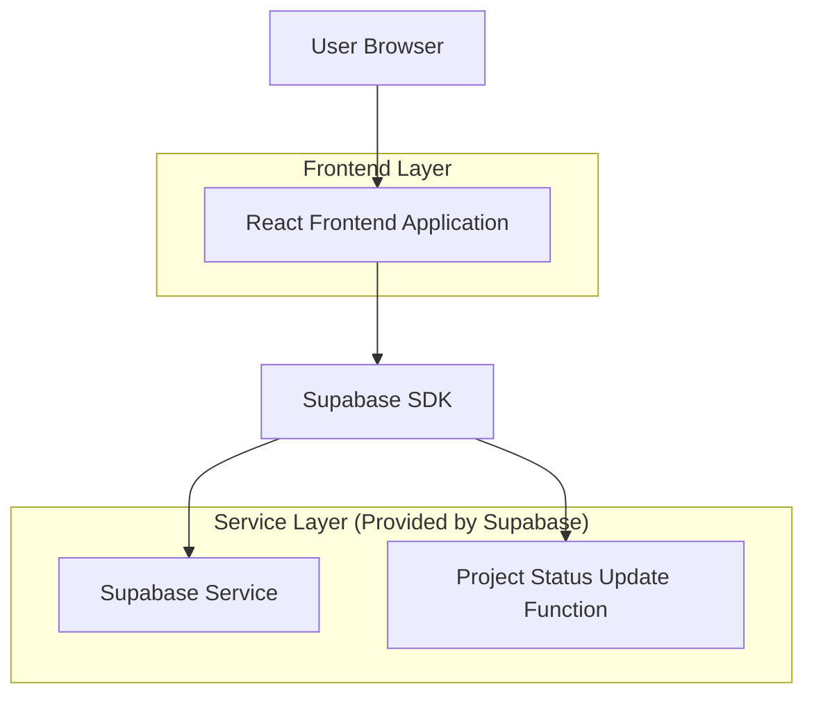
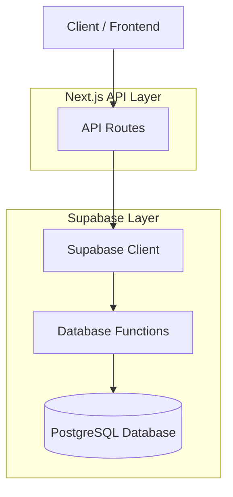
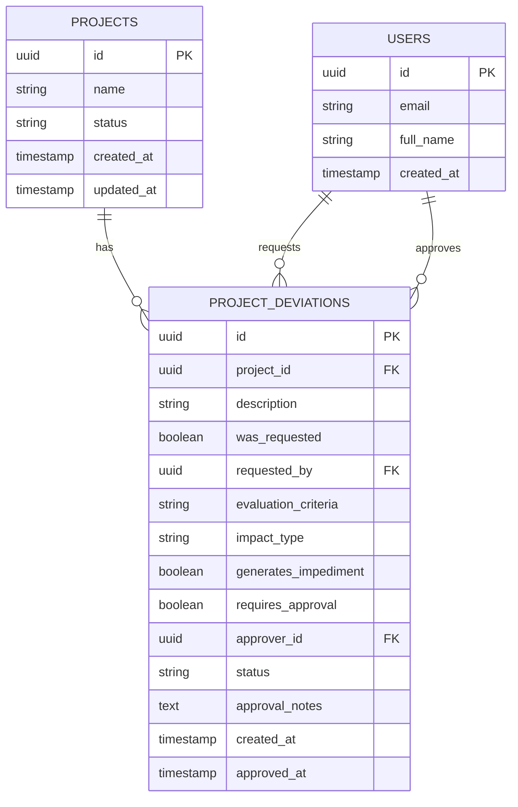

# Documentação de Arquitetura Técnica - Sistema de Gestão de Desvios

## 1. Design da Arquitetura



## 2. Descrição da Tecnologia

- Frontend: React@18 + tailwindcss@3 + vite
- Backend: Supabase (PostgreSQL + Auth + Real-time)
- Componentes UI: shadcn/ui + lucide-react

## 3. Definições de Rotas

| Rota | Propósito |
|------|----------|
| /projects/[id] | Página de gerenciamento do projeto com seção de desvios |
| /projects/[id]/deviations | Lista completa de desvios do projeto |
| /projects/[id]/deviations/new | Modal/página para criar novo desvio |
| /projects/[id]/deviations/[deviationId] | Modal/página para editar desvio específico |

## 4. Definições de API

### 4.1 API Principal

**Listar desvios do projeto**
```
GET /api/projects/[id]/deviations
```

Response:
| Nome do Parâmetro | Tipo do Parâmetro | Descrição |
|-------------------|-------------------|----------|
| deviations | array | Lista de desvios do projeto |
| project_status | string | Status atual do projeto |

Exemplo:
```json
{
  "deviations": [
    {
      "id": "uuid",
      "project_id": "uuid",
      "description": "Mudança no escopo do projeto",
      "was_requested": true,
      "requested_by": "uuid",
      "evaluation_criteria": "Melhorias",
      "impact_type": "Aumento de escopo",
      "generates_impediment": false,
      "requires_approval": true,
      "approver_id": "uuid",
      "status": "Pendente",
      "created_at": "2024-01-15T10:00:00Z",
      "approved_at": null
    }
  ],
  "project_status": "Em andamento"
}
```

**Criar novo desvio**
```
POST /api/projects/[id]/deviations
```

Request:
| Nome do Parâmetro | Tipo do Parâmetro | Obrigatório | Descrição |
|-------------------|-------------------|-------------|----------|
| description | string | true | Descrição do desvio |
| was_requested | boolean | true | Se foi solicitado |
| requested_by | string | false | ID do usuário solicitante |
| evaluation_criteria | string | true | Critério de avaliação |
| impact_type | string | true | Tipo de impacto |
| generates_impediment | boolean | true | Se gera impedimento |
| requires_approval | boolean | true | Se requer aprovação |
| approver_id | string | false | ID do aprovador |

**Atualizar desvio**
```
PUT /api/projects/[id]/deviations/[deviationId]
```

**Aprovar/Rejeitar desvio**
```
PATCH /api/projects/[id]/deviations/[deviationId]/approval
```

Request:
| Nome do Parâmetro | Tipo do Parâmetro | Obrigatório | Descrição |
|-------------------|-------------------|-------------|----------|
| status | string | true | "Aprovado" ou "Rejeitado" |
| approval_notes | string | false | Observações da aprovação |

## 5. Diagrama da Arquitetura do Servidor



## 6. Modelo de Dados

### 6.1 Definição do Modelo de Dados



### 6.2 Linguagem de Definição de Dados

**Tabela de Desvios de Projeto (project_deviations)**
```sql
-- Criar tabela
CREATE TABLE project_deviations (
    id UUID PRIMARY KEY DEFAULT gen_random_uuid(),
    project_id UUID NOT NULL REFERENCES projects(id) ON DELETE CASCADE,
    description TEXT NOT NULL,
    was_requested BOOLEAN NOT NULL DEFAULT false,
    requested_by UUID REFERENCES users(id),
    evaluation_criteria VARCHAR(50) NOT NULL CHECK (evaluation_criteria IN (
        'Fatores externo', 'Inovação', 'Medida corretiva', 'Melhorias', 'Repriorização'
    )),
    impact_type VARCHAR(50) NOT NULL CHECK (impact_type IN (
        'Custo/orçamento', 'Aumento de escopo', 'Não se aplica'
    )),
    generates_impediment BOOLEAN NOT NULL DEFAULT false,
    requires_approval BOOLEAN NOT NULL DEFAULT false,
    approver_id UUID REFERENCES users(id),
    status VARCHAR(20) NOT NULL DEFAULT 'Pendente' CHECK (status IN (
        'Pendente', 'Aprovado', 'Rejeitado', 'Em análise', 'Implementado'
    )),
    approval_notes TEXT,
    created_at TIMESTAMP WITH TIME ZONE DEFAULT NOW(),
    approved_at TIMESTAMP WITH TIME ZONE,
    updated_at TIMESTAMP WITH TIME ZONE DEFAULT NOW()
);

-- Criar índices
CREATE INDEX idx_project_deviations_project_id ON project_deviations(project_id);
CREATE INDEX idx_project_deviations_status ON project_deviations(status);
CREATE INDEX idx_project_deviations_generates_impediment ON project_deviations(generates_impediment);
CREATE INDEX idx_project_deviations_created_at ON project_deviations(created_at DESC);

-- Função para atualizar status do projeto baseado em desvios impeditivos
CREATE OR REPLACE FUNCTION update_project_status_on_deviation()
RETURNS TRIGGER AS $$
BEGIN
    -- Se o desvio gera impedimento e foi aprovado, paralisa o projeto
    IF NEW.generates_impediment = true AND NEW.status = 'Aprovado' THEN
        UPDATE projects 
        SET status = 'Paralisado', 
            updated_at = NOW()
        WHERE id = NEW.project_id;
    END IF;
    
    -- Se não há mais desvios impeditivos ativos, volta projeto para "Em andamento"
    IF OLD.generates_impediment = true AND NEW.status IN ('Rejeitado', 'Implementado') THEN
        IF NOT EXISTS (
            SELECT 1 FROM project_deviations 
            WHERE project_id = NEW.project_id 
            AND generates_impediment = true 
            AND status = 'Aprovado'
        ) THEN
            UPDATE projects 
            SET status = 'Em andamento', 
                updated_at = NOW()
            WHERE id = NEW.project_id AND status = 'Paralisado';
        END IF;
    END IF;
    
    RETURN NEW;
END;
$$ LANGUAGE plpgsql;

-- Trigger para atualizar status do projeto
CREATE TRIGGER trigger_update_project_status_on_deviation
    AFTER INSERT OR UPDATE ON project_deviations
    FOR EACH ROW
    EXECUTE FUNCTION update_project_status_on_deviation();

-- Políticas RLS
ALTER TABLE project_deviations ENABLE ROW LEVEL SECURITY;

-- Política para leitura (usuários autenticados podem ver desvios dos projetos que têm acesso)
CREATE POLICY "Users can view project deviations" ON project_deviations
    FOR SELECT USING (
        auth.uid() IN (
            SELECT user_id FROM team_members tm
            JOIN projects p ON p.team_id = tm.team_id
            WHERE p.id = project_id
        )
    );

-- Política para inserção (usuários autenticados podem criar desvios em projetos que têm acesso)
CREATE POLICY "Users can create project deviations" ON project_deviations
    FOR INSERT WITH CHECK (
        auth.uid() IN (
            SELECT user_id FROM team_members tm
            JOIN projects p ON p.team_id = tm.team_id
            WHERE p.id = project_id
        )
    );

-- Política para atualização (apenas criador ou aprovador podem atualizar)
CREATE POLICY "Users can update their deviations or approve" ON project_deviations
    FOR UPDATE USING (
        auth.uid() = requested_by OR 
        auth.uid() = approver_id OR
        auth.uid() IN (
            SELECT user_id FROM team_members tm
            JOIN projects p ON p.team_id = tm.team_id
            WHERE p.id = project_id AND tm.role IN ('admin', 'manager')
        )
    );

-- Dados iniciais de exemplo
INSERT INTO project_deviations (project_id, description, was_requested, evaluation_criteria, impact_type, generates_impediment, requires_approval, status)
SELECT 
    p.id,
    'Exemplo de desvio para teste do sistema',
    false,
    'Medida corretiva',
    'Não se aplica',
    false,
    false,
    'Implementado'
FROM projects p
LIMIT 1;
```