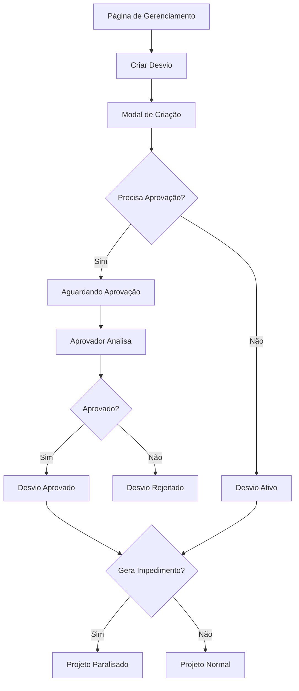

# Documentação de Requisitos - Sistema de Gestão de Desvios em Projetos

## 1. Visão Geral do Produto

Sistema de gestão de desvios integrado ao gerenciador de projetos, permitindo o controle e acompanhamento de alterações, mudanças e impedimentos que possam impactar o andamento dos projetos.

O sistema resolve a necessidade de rastrear e gerenciar desvios de forma estruturada, com controle de aprovações e impacto direto no status dos projetos, garantindo transparência e governança.

## 2. Funcionalidades Principais

### 2.1 Papéis de Usuário

| Papel | Método de Registro | Permissões Principais |
|-------|-------------------|----------------------|
| Usuário Comum | Registro existente no sistema | Pode criar desvios, visualizar desvios do projeto |
| Gerente de Projeto | Usuário com permissão de projeto | Pode aprovar desvios, gerenciar todos os desvios do projeto |
| Administrador | Usuário com papel admin | Acesso completo a todos os desvios do sistema |

### 2.2 Módulo de Funcionalidades

Nosso sistema de gestão de desvios consiste nas seguintes páginas principais:

1. **Página de Gerenciamento de Projeto**: visualização de desvios ativos, alertas de impedimentos, status do projeto.
2. **Modal de Criação de Desvio**: formulário completo para registro de novos desvios.
3. **Modal de Edição de Desvio**: edição de desvios existentes com controle de permissões.
4. **Lista de Desvios**: visualização completa dos desvios do projeto com filtros.

### 2.3 Detalhes das Páginas

| Nome da Página | Nome do Módulo | Descrição da Funcionalidade |
|----------------|----------------|-----------------------------|
| Página de Gerenciamento de Projeto | Seção de Desvios | Exibir lista de desvios ativos, destacar desvios impeditivos, mostrar impacto no status do projeto |
| Página de Gerenciamento de Projeto | Alerta de Impedimento | Destacar visualmente quando projeto está paralisado por desvio impeditivo |
| Modal de Criação de Desvio | Formulário de Desvio | Campos: solicitação (sim/não + usuário), descrição, critérios de avaliação, tipo de impacto, impedimento, aprovação (sim/não + aprovador), status |
| Modal de Edição de Desvio | Formulário de Edição | Editar campos do desvio, controlar aprovação, atualizar status, registrar data de aprovação |
| Lista de Desvios | Tabela de Desvios | Listar todos os desvios do projeto, filtros por status, tipo, impedimento |
| Lista de Desvios | Ações de Desvio | Editar, excluir, aprovar desvios conforme permissões |

## 3. Processo Principal

### Fluxo do Usuário Comum:
1. Acessa página de gerenciamento do projeto
2. Clica em "Adicionar Desvio"
3. Preenche formulário com dados do desvio
4. Submete para aprovação (se necessário)
5. Acompanha status na lista de desvios

### Fluxo do Aprovador:
1. Recebe notificação de desvio pendente
2. Acessa lista de desvios
3. Analisa desvio e aprova/rejeita
4. Sistema atualiza status do projeto se necessário

## 4. Design da Interface do Usuário

### 4.1 Estilo de Design

- **Cores primárias**: Azul (#3B82F6) para ações principais, Vermelho (#EF4444) para alertas de impedimento
- **Cores secundárias**: Cinza (#6B7280) para textos, Verde (#10B981) para aprovações
- **Estilo de botões**: Arredondados com sombra sutil
- **Fonte**: Inter, tamanhos 14px (corpo), 16px (títulos), 12px (labels)
- **Layout**: Cards para desvios, modal overlay para formulários
- **Ícones**: Lucide React (AlertTriangle para impedimentos, CheckCircle para aprovados)

### 4.2 Visão Geral do Design das Páginas

| Nome da Página | Nome do Módulo | Elementos da UI |
|----------------|----------------|----------------|
| Página de Gerenciamento | Seção de Desvios | Cards com bordas coloridas (vermelho para impeditivos), badges de status, botão "Adicionar Desvio" |
| Página de Gerenciamento | Alerta de Impedimento | Banner vermelho no topo com ícone de alerta, texto destacado "PROJETO PARALISADO" |
| Modal de Criação | Formulário | Campos organizados em seções, dropdowns para seleções, toggle switches para sim/não |
| Modal de Edição | Formulário de Edição | Layout similar ao de criação, campos desabilitados conforme permissões |
| Lista de Desvios | Tabela | Colunas: Descrição, Status, Tipo, Impedimento, Data, Ações. Filtros no cabeçalho |

### 4.3 Responsividade

Desktop-first com adaptação para mobile. Em dispositivos móveis, a tabela de desvios se transforma em cards empilhados. Modais ocupam tela completa em telas pequenas.