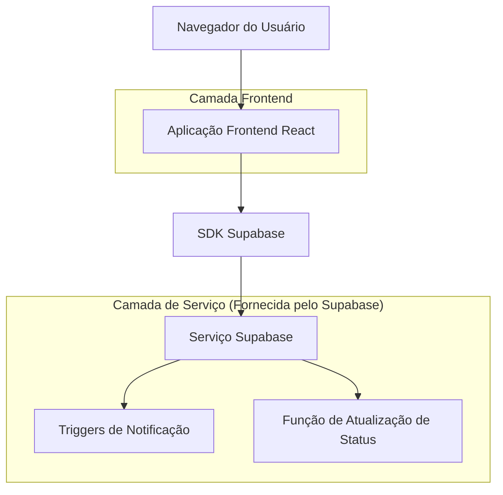
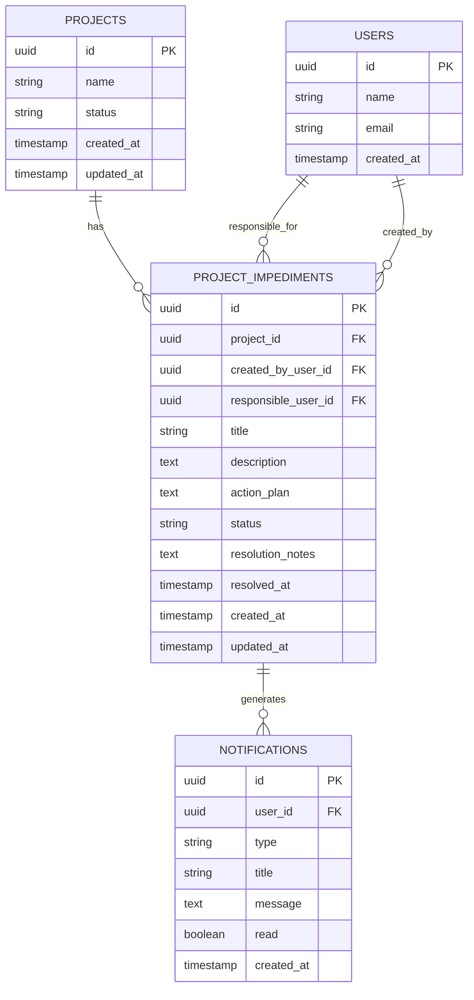

# Gestão de Impedimentos de Projetos - Documento de Arquitetura Técnica

## 1. Design da Arquitetura



## 2. Descrição das Tecnologias

- Frontend: React@18 + tailwindcss@3 + vite
- Backend: Supabase (PostgreSQL + Auth + Real-time)
- Notificações: Sistema existente de notificações do Supabase

## 3. Definições de Rotas

| Rota | Propósito |
|------|----------|
| /projects/:id/impediments | Aba de impedimentos dentro da gestão do projeto |
| /projects/:id/impediments/new | Modal/formulário para criar novo impedimento |
| /projects/:id/impediments/:impedimentId | Detalhes e edição de impedimento específico |

## 4. Definições de API

### 4.1 APIs Principais

**Listar impedimentos do projeto**
```
GET /api/projects/:projectId/impediments
```

Request:
| Nome do Parâmetro | Tipo | Obrigatório | Descrição |
|-------------------|------|-------------|----------|
| projectId | string | true | ID do projeto |
| status | string | false | Filtro por status ("Em análise" ou "Finalizado") |

Response:
| Nome do Parâmetro | Tipo | Descrição |
|-------------------|------|----------|
| impediments | array | Lista de impedimentos do projeto |
| count | number | Total de impedimentos |

**Criar novo impedimento**
```
POST /api/projects/:projectId/impediments
```

Request:
| Nome do Parâmetro | Tipo | Obrigatório | Descrição |
|-------------------|------|-------------|----------|
| title | string | true | Título do impedimento |
| description | string | true | Descrição detalhada |
| responsible_user_id | string | true | ID do usuário responsável |
| action_plan | string | true | Plano de ação inicial |

Response:
| Nome do Parâmetro | Tipo | Descrição |
|-------------------|------|----------|
| id | string | ID do impedimento criado |
| status | string | Status inicial ("Em análise") |
| created_at | string | Data de criação |

**Atualizar impedimento**
```
PUT /api/projects/:projectId/impediments/:impedimentId
```

Request:
| Nome do Parâmetro | Tipo | Obrigatório | Descrição |
|-------------------|------|-------------|----------|
| status | string | false | Novo status do impedimento |
| action_plan | string | false | Plano de ação atualizado |
| resolution_notes | string | false | Notas de resolução |

Response:
| Nome do Parâmetro | Tipo | Descrição |
|-------------------|------|----------|
| success | boolean | Status da operação |
| project_status | string | Novo status do projeto |

## 5. Modelo de Dados

### 5.1 Definição do Modelo de Dados



### 5.2 Linguagem de Definição de Dados

**Tabela de Impedimentos (project_impediments)**
```sql
-- Criar tabela de impedimentos
CREATE TABLE project_impediments (
    id UUID PRIMARY KEY DEFAULT gen_random_uuid(),
    project_id UUID NOT NULL REFERENCES projects(id) ON DELETE CASCADE,
    created_by_user_id UUID NOT NULL REFERENCES users(id),
    responsible_user_id UUID NOT NULL REFERENCES users(id),
    title VARCHAR(255) NOT NULL,
    description TEXT NOT NULL,
    action_plan TEXT NOT NULL,
    status VARCHAR(20) DEFAULT 'Em análise' CHECK (status IN ('Em análise', 'Finalizado')),
    resolution_notes TEXT,
    resolved_at TIMESTAMP WITH TIME ZONE,
    created_at TIMESTAMP WITH TIME ZONE DEFAULT NOW(),
    updated_at TIMESTAMP WITH TIME ZONE DEFAULT NOW()
);

-- Criar índices
CREATE INDEX idx_project_impediments_project_id ON project_impediments(project_id);
CREATE INDEX idx_project_impediments_status ON project_impediments(status);
CREATE INDEX idx_project_impediments_responsible ON project_impediments(responsible_user_id);
CREATE INDEX idx_project_impediments_created_at ON project_impediments(created_at DESC);

-- Políticas RLS
ALTER TABLE project_impediments ENABLE ROW LEVEL SECURITY;

-- Permitir leitura para usuários autenticados
CREATE POLICY "Users can view impediments" ON project_impediments
    FOR SELECT USING (auth.role() = 'authenticated');

-- Permitir criação para usuários autenticados
CREATE POLICY "Users can create impediments" ON project_impediments
    FOR INSERT WITH CHECK (auth.role() = 'authenticated');

-- Permitir atualização para criador e responsável
CREATE POLICY "Users can update their impediments" ON project_impediments
    FOR UPDATE USING (
        auth.uid() = created_by_user_id OR 
        auth.uid() = responsible_user_id
    );

-- Função para atualizar timestamp
CREATE OR REPLACE FUNCTION update_impediment_updated_at()
RETURNS TRIGGER AS $$
BEGIN
    NEW.updated_at = NOW();
    RETURN NEW;
END;
$$ LANGUAGE plpgsql;

-- Trigger para atualizar timestamp
CREATE TRIGGER update_impediment_updated_at_trigger
    BEFORE UPDATE ON project_impediments
    FOR EACH ROW
    EXECUTE FUNCTION update_impediment_updated_at();

-- Função para gerenciar status do projeto
CREATE OR REPLACE FUNCTION manage_project_status_on_impediment()
RETURNS TRIGGER AS $$
BEGIN
    -- Quando impedimento é criado com status "Em análise"
    IF TG_OP = 'INSERT' AND NEW.status = 'Em análise' THEN
        UPDATE projects SET status = 'blocked' WHERE id = NEW.project_id;
        
        -- Criar notificação
        INSERT INTO notifications (user_id, type, title, message)
        VALUES (
            NEW.responsible_user_id,
            'impediment_assigned',
            'Novo Impedimento Atribuído',
            'Você foi designado como responsável pelo impedimento: ' || NEW.title
        );
        
    -- Quando impedimento é finalizado
    ELSIF TG_OP = 'UPDATE' AND OLD.status = 'Em análise' AND NEW.status = 'Finalizado' THEN
        NEW.resolved_at = NOW();
        
        -- Verificar se não há outros impedimentos ativos
        IF NOT EXISTS (
            SELECT 1 FROM project_impediments 
            WHERE project_id = NEW.project_id 
            AND status = 'Em análise' 
            AND id != NEW.id
        ) THEN
            UPDATE projects SET status = 'active' WHERE id = NEW.project_id;
        END IF;
        
        -- Criar notificação de resolução
        INSERT INTO notifications (user_id, type, title, message)
        VALUES (
            NEW.created_by_user_id,
            'impediment_resolved',
            'Impedimento Resolvido',
            'O impedimento "' || NEW.title || '" foi marcado como finalizado.'
        );
    END IF;
    
    RETURN NEW;
END;
$$ LANGUAGE plpgsql;

-- Trigger para gerenciar status do projeto
CREATE TRIGGER manage_project_status_on_impediment_trigger
    AFTER INSERT OR UPDATE ON project_impediments
    FOR EACH ROW
    EXECUTE FUNCTION manage_project_status_on_impediment();

-- Dados iniciais (opcional)
-- Nenhum dado inicial necessário
```