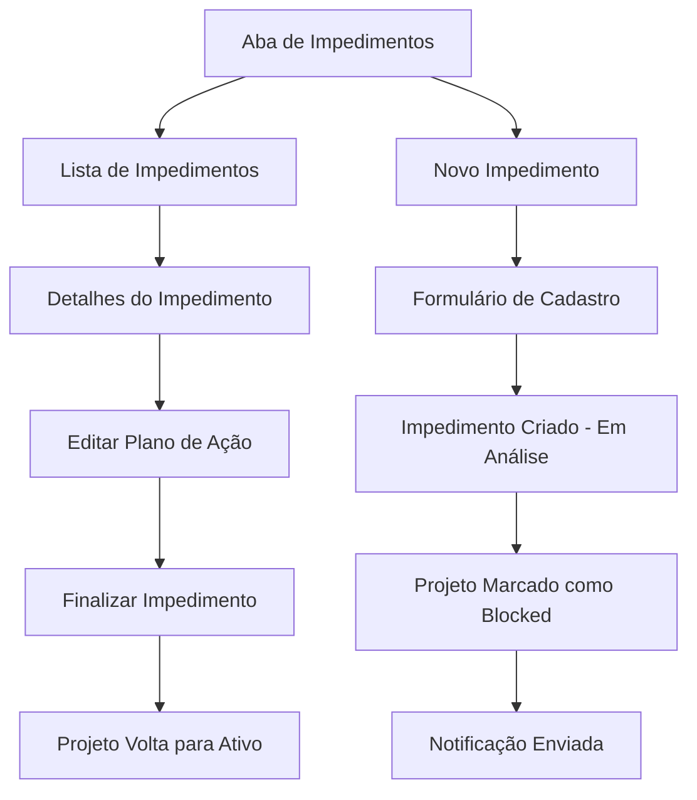

# Gestão de Impedimentos de Projetos - Documento de Requisitos

## 1. Visão Geral do Produto

Sistema de gestão de impedimentos que permite identificar, registrar e acompanhar obstáculos que podem bloquear o progresso de projetos. A funcionalidade integra-se ao sistema existente de gerenciamento de projetos, fornecendo visibilidade e controle sobre situações que impedem o avanço normal das atividades.

- Resolve o problema de falta de visibilidade sobre impedimentos que bloqueiam projetos
- Destinado a todos os usuários autenticados do sistema de gerenciamento de projetos
- Proporciona controle e rastreabilidade de obstáculos, melhorando a eficiência na resolução de problemas

## 2. Funcionalidades Principais

### 2.1 Papéis de Usuário

| Papel | Método de Registro | Permissões Principais |
|-------|-------------------|----------------------|
| Usuário Autenticado | Login no sistema existente | Pode cadastrar, visualizar e editar impedimentos |
| Responsável pelo Impedimento | Atribuído durante o cadastro | Pode editar status, plano de ação e finalizar impedimentos |

### 2.2 Módulo de Funcionalidades

Nossos requisitos de gestão de impedimentos consistem nas seguintes páginas principais:
1. **Aba de Impedimentos**: listagem de impedimentos, filtros por status, botão de novo impedimento.
2. **Formulário de Cadastro**: campos de impedimento, seleção de responsável, plano de ação.
3. **Detalhes do Impedimento**: visualização completa, edição de status, histórico de alterações.

### 2.3 Detalhes das Páginas

| Nome da Página | Nome do Módulo | Descrição da Funcionalidade |
|----------------|----------------|-----------------------------|
| Aba de Impedimentos | Lista de Impedimentos | Exibir todos os impedimentos do projeto, filtrar por status (Em análise/Finalizado), ordenar por data de criação |
| Aba de Impedimentos | Botão Novo Impedimento | Abrir modal/formulário para cadastrar novo impedimento |
| Formulário de Cadastro | Campos do Impedimento | Capturar título, descrição, responsável, plano de ação inicial |
| Formulário de Cadastro | Validação e Salvamento | Validar campos obrigatórios, salvar impedimento, atualizar status do projeto para "blocked" |
| Detalhes do Impedimento | Visualização Completa | Mostrar todos os dados do impedimento, histórico de alterações |
| Detalhes do Impedimento | Edição de Status | Permitir alteração entre "Em análise" e "Finalizado", atualizar plano de ação |
| Detalhes do Impedimento | Finalização | Marcar como finalizado, retornar projeto para status "Ativo", registrar data de resolução |

## 3. Processo Principal

**Fluxo de Gestão de Impedimentos:**
1. Usuário acessa a aba de impedimentos dentro da gestão do projeto
2. Visualiza lista de impedimentos existentes ou clica em "Novo Impedimento"
3. Preenche formulário com título, descrição, responsável e plano de ação
4. Sistema salva impedimento com status "Em análise" e marca projeto como "blocked"
5. Sistema gera notificação/alerta para o responsável e stakeholders
6. Responsável trabalha no plano de ação e atualiza o impedimento
7. Quando resolvido, responsável marca impedimento como "Finalizado"
8. Sistema retorna projeto para status "Ativo" automaticamente

## 4. Design da Interface do Usuário

### 4.1 Estilo de Design

- **Cores primárias e secundárias**: Vermelho (#ef4444) para impedimentos ativos, verde (#22c55e) para finalizados, cinza (#6b7280) para neutro
- **Estilo de botões**: Arredondados com sombra sutil, estilo moderno
- **Fonte e tamanhos**: Inter, tamanhos 14px (corpo), 16px (títulos), 12px (legendas)
- **Estilo de layout**: Cards com bordas arredondadas, navegação por abas, modal para formulários
- **Ícones**: Lucide icons para consistência, ícones de alerta (⚠️) e check (✅)

### 4.2 Visão Geral do Design das Páginas

| Nome da Página | Nome do Módulo | Elementos da UI |
|----------------|----------------|----------------|
| Aba de Impedimentos | Lista de Impedimentos | Cards com título, status badge, responsável, data. Cores: vermelho para "Em análise", verde para "Finalizado" |
| Aba de Impedimentos | Filtros e Ações | Dropdown de filtro por status, botão "Novo Impedimento" (azul, destaque) |
| Formulário de Cadastro | Modal de Cadastro | Campos de texto, textarea, select de usuários, botões "Cancelar" e "Salvar" |
| Detalhes do Impedimento | Card de Detalhes | Layout em duas colunas, informações à esquerda, ações à direita, histórico em timeline |

### 4.3 Responsividade

Produto desktop-first com adaptação mobile. Em dispositivos móveis, cards empilham verticalmente, modal ocupa tela inteira, botões ficam maiores para touch. Navegação por abas mantém-se horizontal com scroll se necessário.