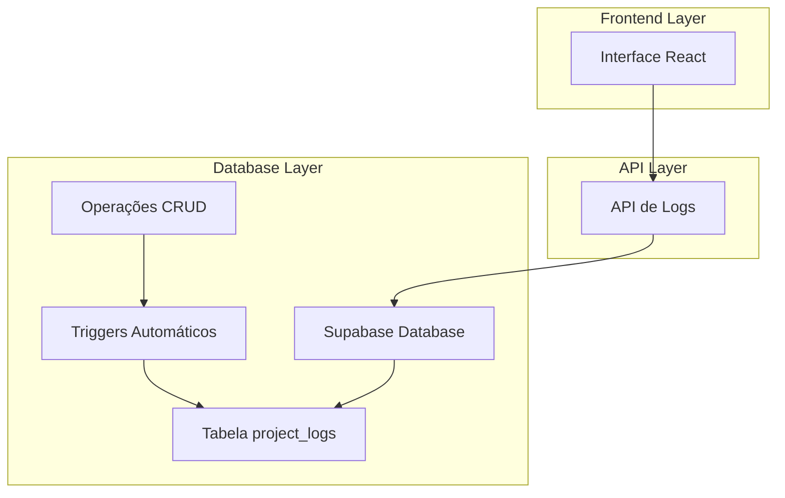
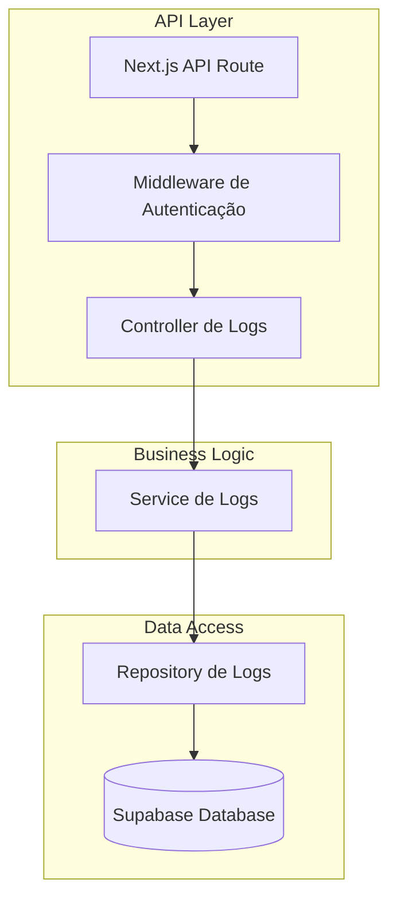
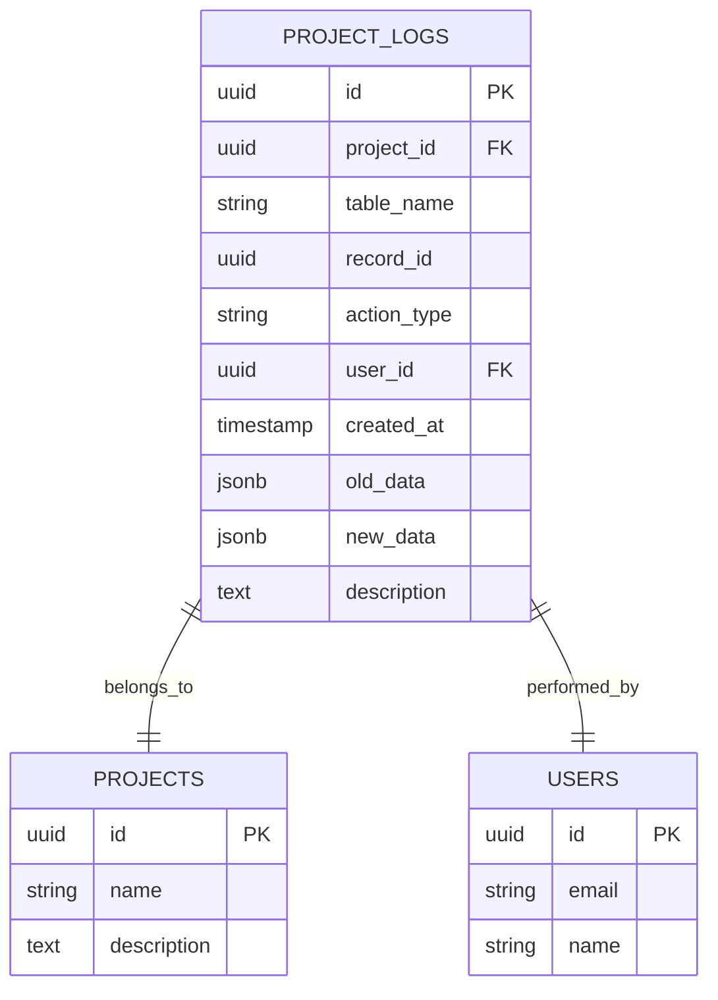

# Sistema de Logs de Projeto - Arquitetura Técnica

## 1. Arquitetura Geral



## 2. Descrição das Tecnologias

- Frontend: React@18 + TypeScript + TailwindCSS + Lucide React
- Backend: Supabase (PostgreSQL + Triggers + RLS)
- API: Next.js API Routes
- Autenticação: Supabase Auth

## 3. Definições de Rotas

| Rota | Propósito |
|------|----------|
| /projects/[id] | Página de detalhes do projeto com aba de logs |
| /api/projects/[id]/logs | API para buscar logs do projeto |
| /api/projects/[id]/logs/export | API para exportar logs (funcionalidade futura) |

## 4. Definições de API

### 4.1 API Principal de Logs

**Buscar logs do projeto**
```
GET /api/projects/[id]/logs
```

Request Query Parameters:
| Nome do Parâmetro | Tipo | Obrigatório | Descrição |
|-------------------|------|-------------|----------|
| page | number | false | Número da página (padrão: 1) |
| limit | number | false | Itens por página (padrão: 20, máx: 100) |
| action_type | string | false | Filtro por tipo de ação (INSERT, UPDATE, DELETE) |
| table_name | string | false | Filtro por tabela afetada |
| user_id | string | false | Filtro por usuário que realizou a ação |
| start_date | string | false | Data inicial (ISO 8601) |
| end_date | string | false | Data final (ISO 8601) |

Response:
| Nome do Parâmetro | Tipo | Descrição |
|-------------------|------|----------|
| logs | ProjectLog[] | Array de logs do projeto |
| total | number | Total de logs encontrados |
| page | number | Página atual |
| totalPages | number | Total de páginas |

Exemplo de Response:
```json
{
  "logs": [
    {
      "id": "uuid",
      "project_id": "uuid",
      "table_name": "tasks",
      "record_id": "uuid",
      "action_type": "UPDATE",
      "user_id": "uuid",
      "user_name": "João Silva",
      "timestamp": "2024-01-15T10:30:00Z",
      "old_data": {"status": "pending", "title": "Tarefa antiga"},
      "new_data": {"status": "completed", "title": "Tarefa atualizada"},
      "description": "Atualizou status da tarefa de 'pending' para 'completed'"
    }
  ],
  "total": 150,
  "page": 1,
  "totalPages": 8
}
```

## 5. Arquitetura do Servidor



## 6. Modelo de Dados

### 6.1 Definição do Modelo de Dados



### 6.2 Linguagem de Definição de Dados (DDL)

**Tabela de Logs do Projeto (project_logs)**
```sql
-- Criar tabela de logs
CREATE TABLE project_logs (
    id UUID PRIMARY KEY DEFAULT gen_random_uuid(),
    project_id UUID NOT NULL,
    table_name VARCHAR(50) NOT NULL,
    record_id UUID NOT NULL,
    action_type VARCHAR(10) NOT NULL CHECK (action_type IN ('INSERT', 'UPDATE', 'DELETE')),
    user_id UUID NOT NULL,
    created_at TIMESTAMP WITH TIME ZONE DEFAULT NOW(),
    old_data JSONB,
    new_data JSONB,
    description TEXT,
    CONSTRAINT fk_project_logs_project FOREIGN KEY (project_id) REFERENCES projects(id) ON DELETE CASCADE,
    CONSTRAINT fk_project_logs_user FOREIGN KEY (user_id) REFERENCES auth.users(id)
);

-- Criar índices para performance
CREATE INDEX idx_project_logs_project_id ON project_logs(project_id);
CREATE INDEX idx_project_logs_created_at ON project_logs(created_at DESC);
CREATE INDEX idx_project_logs_table_name ON project_logs(table_name);
CREATE INDEX idx_project_logs_action_type ON project_logs(action_type);
CREATE INDEX idx_project_logs_user_id ON project_logs(user_id);

-- Política RLS para project_logs
ALTER TABLE project_logs ENABLE ROW LEVEL SECURITY;

-- Usuários podem ver logs apenas de projetos onde são membros
CREATE POLICY "Users can view logs of their projects" ON project_logs
    FOR SELECT USING (
        project_id IN (
            SELECT p.id FROM projects p
            JOIN project_members pm ON p.id = pm.project_id
            WHERE pm.user_id = auth.uid()
        )
    );

-- Apenas o sistema pode inserir logs (via triggers)
CREATE POLICY "System can insert logs" ON project_logs
    FOR INSERT WITH CHECK (true);
```

**Função para criar logs automaticamente**
```sql
-- Função para processar logs
CREATE OR REPLACE FUNCTION create_project_log()
RETURNS TRIGGER AS $$
DECLARE
    project_uuid UUID;
    current_user_id UUID;
    log_description TEXT;
BEGIN
    -- Obter user_id atual
    current_user_id := auth.uid();
    
    -- Se não há usuário autenticado, pular log
    IF current_user_id IS NULL THEN
        RETURN COALESCE(NEW, OLD);
    END IF;
    
    -- Determinar project_id baseado na tabela
    CASE TG_TABLE_NAME
        WHEN 'projects' THEN
            project_uuid := COALESCE(NEW.id, OLD.id);
        WHEN 'stages' THEN
            project_uuid := COALESCE(NEW.project_id, OLD.project_id);
        WHEN 'tasks' THEN
            SELECT s.project_id INTO project_uuid 
            FROM stages s 
            WHERE s.id = COALESCE(NEW.stage_id, OLD.stage_id);
        WHEN 'risks', 'impediments', 'project_deviations' THEN
            SELECT s.project_id INTO project_uuid 
            FROM stages s 
            WHERE s.id = COALESCE(NEW.stage_id, OLD.stage_id);
        WHEN 'comments' THEN
            -- Assumindo que comments tem project_id direto ou via task
            project_uuid := COALESCE(NEW.project_id, OLD.project_id);
        WHEN 'attachments' THEN
            -- Assumindo que attachments tem project_id direto
            project_uuid := COALESCE(NEW.project_id, OLD.project_id);
        ELSE
            -- Se não conseguir determinar o projeto, pular
            RETURN COALESCE(NEW, OLD);
    END CASE;
    
    -- Se não conseguiu determinar o projeto, pular
    IF project_uuid IS NULL THEN
        RETURN COALESCE(NEW, OLD);
    END IF;
    
    -- Gerar descrição baseada na operação
    CASE TG_OP
        WHEN 'INSERT' THEN
            log_description := 'Criou ' || get_entity_name(TG_TABLE_NAME) || ': ' || COALESCE(NEW.name, NEW.title, NEW.description, 'Novo registro');
        WHEN 'UPDATE' THEN
            log_description := 'Atualizou ' || get_entity_name(TG_TABLE_NAME) || ': ' || COALESCE(NEW.name, NEW.title, NEW.description, 'Registro');
        WHEN 'DELETE' THEN
            log_description := 'Excluiu ' || get_entity_name(TG_TABLE_NAME) || ': ' || COALESCE(OLD.name, OLD.title, OLD.description, 'Registro');
    END CASE;
    
    -- Inserir log
    INSERT INTO project_logs (
        project_id,
        table_name,
        record_id,
        action_type,
        user_id,
        old_data,
        new_data,
        description
    ) VALUES (
        project_uuid,
        TG_TABLE_NAME,
        COALESCE(NEW.id, OLD.id),
        TG_OP,
        current_user_id,
        CASE WHEN TG_OP = 'DELETE' OR TG_OP = 'UPDATE' THEN row_to_json(OLD) ELSE NULL END,
        CASE WHEN TG_OP = 'INSERT' OR TG_OP = 'UPDATE' THEN row_to_json(NEW) ELSE NULL END,
        log_description
    );
    
    RETURN COALESCE(NEW, OLD);
END;
$$ LANGUAGE plpgsql SECURITY DEFINER;

-- Função auxiliar para nomes de entidades
CREATE OR REPLACE FUNCTION get_entity_name(table_name TEXT)
RETURNS TEXT AS $$
BEGIN
    CASE table_name
        WHEN 'projects' THEN RETURN 'projeto';
        WHEN 'stages' THEN RETURN 'etapa';
        WHEN 'tasks' THEN RETURN 'tarefa';
        WHEN 'risks' THEN RETURN 'risco';
        WHEN 'impediments' THEN RETURN 'impedimento';
        WHEN 'project_deviations' THEN RETURN 'desvio';
        WHEN 'comments' THEN RETURN 'comentário';
        WHEN 'attachments' THEN RETURN 'anexo';
        ELSE RETURN 'registro';
    END CASE;
END;
$$ LANGUAGE plpgsql;
```

**Triggers para todas as tabelas monitoradas**
```sql
-- Triggers para cada tabela
CREATE TRIGGER trigger_projects_log
    AFTER INSERT OR UPDATE OR DELETE ON projects
    FOR EACH ROW EXECUTE FUNCTION create_project_log();

CREATE TRIGGER trigger_stages_log
    AFTER INSERT OR UPDATE OR DELETE ON stages
    FOR EACH ROW EXECUTE FUNCTION create_project_log();

CREATE TRIGGER trigger_tasks_log
    AFTER INSERT OR UPDATE OR DELETE ON tasks
    FOR EACH ROW EXECUTE FUNCTION create_project_log();

CREATE TRIGGER trigger_risks_log
    AFTER INSERT OR UPDATE OR DELETE ON risks
    FOR EACH ROW EXECUTE FUNCTION create_project_log();

CREATE TRIGGER trigger_impediments_log
    AFTER INSERT OR UPDATE OR DELETE ON impediments
    FOR EACH ROW EXECUTE FUNCTION create_project_log();

CREATE TRIGGER trigger_project_deviations_log
    AFTER INSERT OR UPDATE OR DELETE ON project_deviations
    FOR EACH ROW EXECUTE FUNCTION create_project_log();

CREATE TRIGGER trigger_comments_log
    AFTER INSERT OR UPDATE OR DELETE ON comments
    FOR EACH ROW EXECUTE FUNCTION create_project_log();

CREATE TRIGGER trigger_attachments_log
    AFTER INSERT OR UPDATE OR DELETE ON attachments
    FOR EACH ROW EXECUTE FUNCTION create_project_log();
```

**Dados iniciais e configurações**
```sql
-- Garantir que a tabela tenha as permissões corretas
GRANT SELECT ON project_logs TO authenticated;
GRANT INSERT ON project_logs TO service_role;

-- Exemplo de dados iniciais (opcional)
INSERT INTO project_logs (project_id, table_name, record_id, action_type, user_id, description)
SELECT 
    p.id,
    'projects',
    p.id,
    'INSERT',
    p.created_by,
    'Projeto criado: ' || p.name
FROM projects p
WHERE NOT EXISTS (
    SELECT 1 FROM project_logs pl 
    WHERE pl.project_id = p.id AND pl.table_name = 'projects' AND pl.action_type = 'INSERT'
);
```