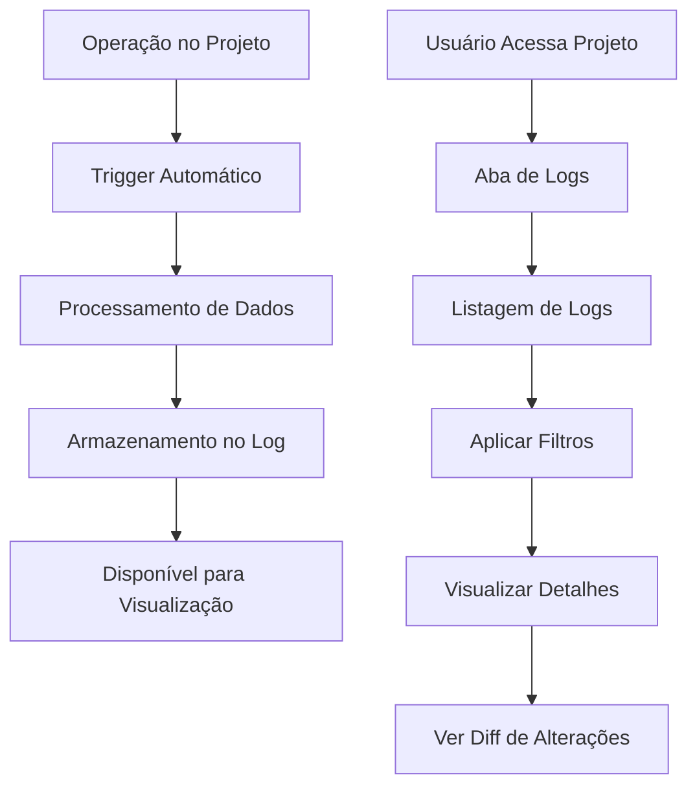

# Sistema de Logs de Projeto - Documento de Requisitos

## 1. Visão Geral do Produto

O Sistema de Logs de Projeto é uma funcionalidade de auditoria e rastreabilidade que registra automaticamente todas as operações realizadas em projetos e suas entidades relacionadas. O sistema permite aos usuários visualizar um histórico completo de alterações, identificar quem fez cada modificação e quando, proporcionando transparência e controle sobre a evolução dos projetos.

- **Problema a resolver**: Falta de rastreabilidade das alterações em projetos, dificultando a identificação de responsáveis por mudanças e o histórico de evolução.
- **Usuários**: Gerentes de projeto, membros da equipe e stakeholders que precisam acompanhar mudanças.
- **Valor**: Aumenta a transparência, facilita auditorias e melhora a governança de projetos.

## 2. Funcionalidades Principais

### 2.1 Papéis de Usuário

| Papel | Método de Registro | Permissões Principais |
|-------|-------------------|----------------------|
| Membro da Equipe | Convite para projeto | Pode visualizar logs de projetos onde participa |
| Gerente de Projeto | Criação/atribuição de projeto | Pode visualizar todos os logs dos seus projetos |
| Administrador | Acesso administrativo | Pode visualizar logs de todos os projetos |

### 2.2 Módulos de Funcionalidade

Nosso sistema de logs consiste nas seguintes páginas principais:

1. **Aba de Logs do Projeto**: visualização de logs, filtros de busca, detalhes de alterações.
2. **Sistema de Captura Automática**: triggers de banco, processamento de dados, armazenamento de logs.

### 2.3 Detalhes das Páginas

| Nome da Página | Nome do Módulo | Descrição da Funcionalidade |
|----------------|----------------|-----------------------------|
| Aba de Logs do Projeto | Listagem de Logs | Exibir cronologicamente todos os logs do projeto com paginação |
| Aba de Logs do Projeto | Filtros de Busca | Filtrar por tipo de ação (INSERT/UPDATE/DELETE), tabela afetada, usuário responsável, período de tempo |
| Aba de Logs do Projeto | Visualização de Alterações | Mostrar dados antes e depois para operações UPDATE em formato diff |
| Aba de Logs do Projeto | Detalhes da Ação | Expandir log para ver informações completas da operação realizada |
| Sistema de Captura | Triggers Automáticos | Capturar automaticamente INSERT/UPDATE/DELETE em todas as tabelas monitoradas |
| Sistema de Captura | Processamento de Dados | Formatar e estruturar dados capturados para armazenamento |
| Sistema de Captura | Armazenamento | Salvar logs na tabela project_logs com metadados completos |

## 3. Processo Principal

**Fluxo de Captura de Logs:**
1. Usuário realiza operação em qualquer entidade do projeto (etapa, tarefa, risco, etc.)
2. Trigger automático do banco de dados captura a operação
3. Sistema processa e formata os dados da operação
4. Log é armazenado na tabela project_logs com metadados
5. Log fica disponível para visualização na aba de logs do projeto

**Fluxo de Visualização de Logs:**
1. Usuário acessa detalhes do projeto
2. Usuário clica na aba "Logs"
3. Sistema carrega logs do projeto com paginação
4. Usuário pode aplicar filtros para refinar a busca
5. Usuário pode expandir logs individuais para ver detalhes
6. Para UPDATEs, usuário pode visualizar diff das alterações

## 4. Design da Interface do Usuário

### 4.1 Estilo de Design

- **Cores primárias**: Azul (#3B82F6) para elementos principais, Verde (#10B981) para ações positivas
- **Cores secundárias**: Cinza (#6B7280) para texto secundário, Vermelho (#EF4444) para exclusões
- **Estilo de botões**: Arredondados com sombra sutil
- **Fonte**: Inter, tamanhos 12px-16px para texto, 18px-24px para títulos
- **Layout**: Baseado em cards com navegação por abas
- **Ícones**: Lucide React para consistência com o sistema existente

### 4.2 Visão Geral do Design das Páginas

| Nome da Página | Nome do Módulo | Elementos de UI |
|----------------|----------------|----------------|
| Aba de Logs | Cabeçalho da Aba | Título "Logs do Projeto", contador de logs, botão de atualização |
| Aba de Logs | Filtros | Dropdown para tipo de ação, seletor de tabela, seletor de usuário, date picker para período |
| Aba de Logs | Lista de Logs | Cards expansíveis com ícone da ação, timestamp, usuário, descrição resumida |
| Aba de Logs | Detalhes do Log | Modal ou seção expandida com dados completos, diff colorido para UPDATEs |
| Aba de Logs | Paginação | Controles de página com "Carregar mais" ou paginação tradicional |

### 4.3 Responsividade

O sistema é desktop-first com adaptação para mobile. Em dispositivos móveis, os filtros ficam em um drawer lateral e a visualização de diffs é otimizada para telas menores com scroll horizontal quando necessário.