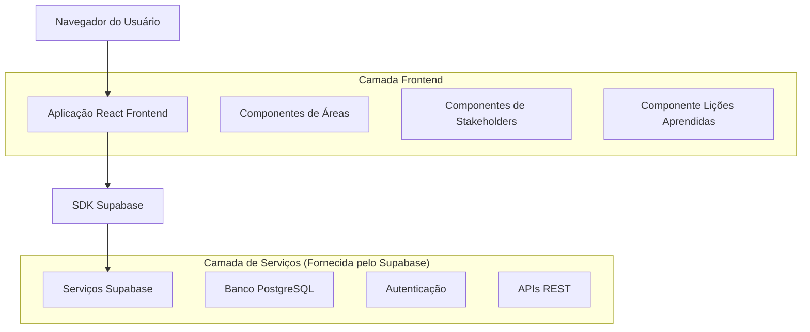
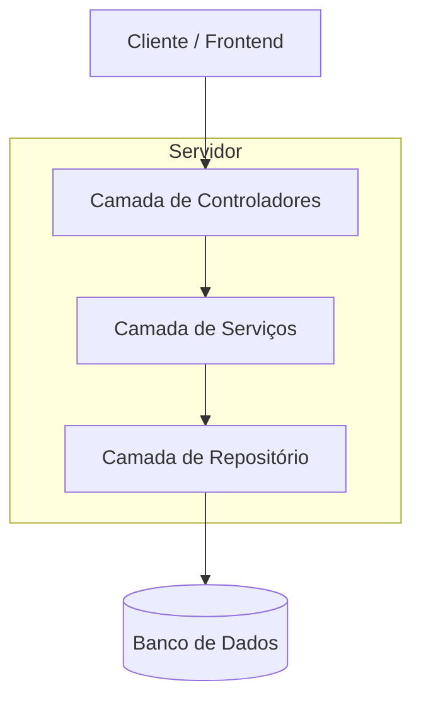
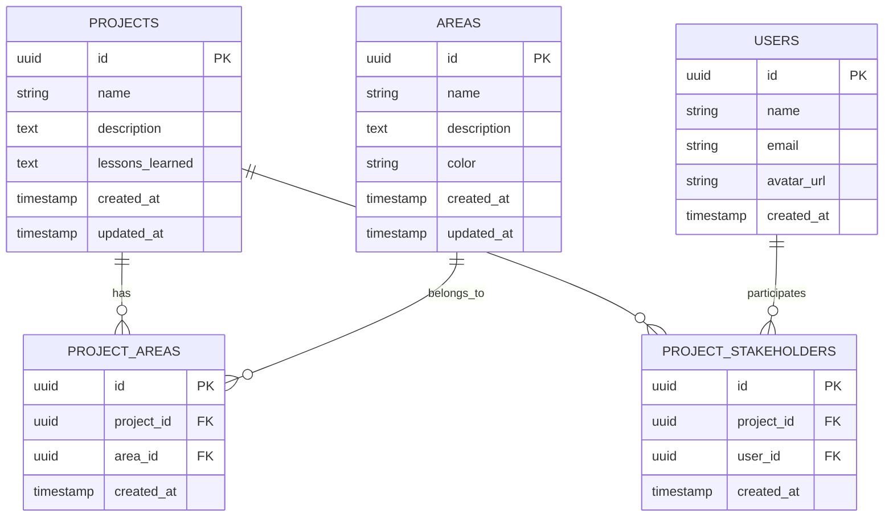

# Arquitetura Técnica - Expansão Estratégica: Áreas, Stakeholders e Lições Aprendidas

## 1. Diagrama de Arquitetura



## 2. Descrição da Tecnologia

* Frontend: React\@18 + TypeScript + TailwindCSS\@3 + Vite

* Backend: Supabase (PostgreSQL + APIs REST + Autenticação)

* Componentes UI: shadcn/ui + Lucide React Icons

## 3. Definições de Rotas

| Rota                             | Propósito                                                                                |
| -------------------------------- | ---------------------------------------------------------------------------------------- |
| /projects/\[id]/strategic        | Página de informações estratégicas expandida com áreas, stakeholders e lições aprendidas |
| /api/areas                       | API para gerenciamento de áreas organizacionais                                          |
| /api/projects/\[id]/areas        | API para associação de áreas ao projeto                                                  |
| /api/projects/\[id]/stakeholders | API para gestão de stakeholders do projeto                                               |
| /api/users                       | API para listagem de usuários (stakeholders)                                             |

## 4. Definições de API

### 4.1 APIs Principais

**Gerenciamento de Áreas**

```
GET /api/areas
```

Response:

| Nome do Parâmetro | Tipo do Parâmetro | Descrição                                 |
| ----------------- | ----------------- | ----------------------------------------- |
| id                | string (UUID)     | ID único da área                          |
| name              | string            | Nome da área organizacional               |
| description       | string            | Descrição da área                         |
| color             | string            | Cor hexadecimal para identificação visual |
| created\_at       | timestamp         | Data de criação                           |

Exemplo:

```json
{
  "success": true,
  "data": [
    {
      "id": "123e4567-e89b-12d3-a456-426614174000",
      "name": "Tecnologia da Informação",
      "description": "Área responsável por sistemas e infraestrutura",
      "color": "#3B82F6",
      "created_at": "2024-01-15T10:30:00Z"
    }
  ]
}
```

**Criação de Nova Área**

```
POST /api/areas
```

Request:

| Nome do Parâmetro | Tipo do Parâmetro | Obrigatório | Descrição            |
| ----------------- | ----------------- | ----------- | -------------------- |
| name              | string            | true        | Nome da área (único) |
| description       | string            | false       | Descrição da área    |
| color             | string            | true        | Cor hexadecimal      |

**Associação de Áreas ao Projeto**

```
PUT /api/projects/[id]/areas
```

Request:

| Nome do Parâmetro | Tipo do Parâmetro | Obrigatório | Descrição                           |
| ----------------- | ----------------- | ----------- | ----------------------------------- |
| area\_ids         | string\[]         | true        | Array de IDs das áreas selecionadas |

**Gestão de Stakeholders do Projeto**

```
GET /api/users
```

Response:

| Nome do Parâmetro | Tipo do Parâmetro | Descrição        |
| ----------------- | ----------------- | ---------------- |
| id                | string (UUID)     | ID do usuário    |
| name              | string            | Nome completo    |
| email             | string            | Email do usuário |
| avatar\_url       | string            | URL do avatar    |

```
PUT /api/projects/[id]/stakeholders
```

Request:

| Nome do Parâmetro | Tipo do Parâmetro | Obrigatório | Descrição                              |
| ----------------- | ----------------- | ----------- | -------------------------------------- |
| stakeholder\_ids  | string\[]         | true        | Array de IDs dos usuários stakeholders |

**Lições Aprendidas**

```
PUT /api/projects/[id]/lessons
```

Request:

| Nome do Parâmetro | Tipo do Parâmetro | Obrigatório | Descrição                   |
| ----------------- | ----------------- | ----------- | --------------------------- |
| lessons\_learned  | string            | false       | Texto das lições aprendidas |

## 5. Diagrama de Arquitetura do Servidor



## 6. Modelo de Dados

### 6.1 Definição do Modelo de Dados



### 6.2 Linguagem de Definição de Dados

**Tabela de Áreas (areas)**

```sql
-- Criar tabela de áreas
CREATE TABLE areas (
    id UUID PRIMARY KEY DEFAULT gen_random_uuid(),
    name VARCHAR(255) UNIQUE NOT NULL,
    description TEXT,
    color VARCHAR(7) NOT NULL DEFAULT '#3B82F6',
    created_at TIMESTAMP WITH TIME ZONE DEFAULT NOW(),
    updated_at TIMESTAMP WITH TIME ZONE DEFAULT NOW()
);

-- Criar índices
CREATE INDEX idx_areas_name ON areas(name);
CREATE INDEX idx_areas_created_at ON areas(created_at DESC);

-- Dados iniciais
INSERT INTO areas (name, description, color) VALUES
('Tecnologia da Informação', 'Área responsável por sistemas e infraestrutura tecnológica', '#3B82F6'),
('Recursos Humanos', 'Gestão de pessoas e desenvolvimento organizacional', '#10B981'),
('Financeiro', 'Controle financeiro e orçamentário', '#F59E0B'),
('Marketing', 'Estratégias de marketing e comunicação', '#EF4444'),
('Operações', 'Processos operacionais e produção', '#8B5CF6');
```

**Tabela de Associação Projeto-Áreas (project\_areas)**

```sql
-- Criar tabela de associação projeto-áreas
CREATE TABLE project_areas (
    id UUID PRIMARY KEY DEFAULT gen_random_uuid(),
    project_id UUID NOT NULL REFERENCES projects(id) ON DELETE CASCADE,
    area_id UUID NOT NULL REFERENCES areas(id) ON DELETE CASCADE,
    created_at TIMESTAMP WITH TIME ZONE DEFAULT NOW(),
    UNIQUE(project_id, area_id)
);

-- Criar índices
CREATE INDEX idx_project_areas_project_id ON project_areas(project_id);
CREATE INDEX idx_project_areas_area_id ON project_areas(area_id);
```

**Tabela de Stakeholders do Projeto (project\_stakeholders)**

```sql
-- Criar tabela de stakeholders do projeto
CREATE TABLE project_stakeholders (
    id UUID PRIMARY KEY DEFAULT gen_random_uuid(),
    project_id UUID NOT NULL REFERENCES projects(id) ON DELETE CASCADE,
    user_id UUID NOT NULL REFERENCES users(id) ON DELETE CASCADE,
    created_at TIMESTAMP WITH TIME ZONE DEFAULT NOW(),
    UNIQUE(project_id, user_id)
);

-- Criar índices
CREATE INDEX idx_project_stakeholders_project_id ON project_stakeholders(project_id);
CREATE INDEX idx_project_stakeholders_user_id ON project_stakeholders(user_id);
```

**Adicionar coluna de Lições Aprendidas à tabela projects**

```sql
-- Adicionar coluna de lições aprendidas
ALTER TABLE projects ADD COLUMN lessons_learned TEXT;

-- Criar índice para busca de texto
CREATE INDEX idx_projects_lessons_learned ON projects USING gin(to_tsvector('portuguese', lessons_learned));
```

**Políticas de Segurança RLS (Row Level Security)**

```sql
-- Habilitar RLS nas novas tabelas
ALTER TABLE areas ENABLE ROW LEVEL SECURITY;
ALTER TABLE project_areas ENABLE ROW LEVEL SECURITY;
ALTER TABLE project_stakeholders ENABLE ROW LEVEL SECURITY;

-- Políticas para áreas (globais - todos podem ver)
CREATE POLICY "Áreas são visíveis para usuários autenticados" ON areas
    FOR SELECT TO authenticated USING (true);

CREATE POLICY "Usuários autenticados podem criar áreas" ON areas
    FOR INSERT TO authenticated WITH CHECK (true);

-- Políticas para project_areas
CREATE POLICY "Usuários podem ver áreas de projetos que participam" ON project_areas
    FOR SELECT TO authenticated USING (
        EXISTS (
            SELECT 1 FROM team_members tm
            JOIN projects p ON p.team_id = tm.team_id
            WHERE p.id = project_areas.project_id
            AND tm.user_id = auth.uid()
        )
    );

CREATE POLICY "Usuários podem gerenciar áreas de projetos que participam" ON project_areas
    FOR ALL TO authenticated USING (
        EXISTS (
            SELECT 1 FROM team_members tm
            JOIN projects p ON p.team_id = tm.team_id
            WHERE p.id = project_areas.project_id
            AND tm.user_id = auth.uid()
        )
    );

-- Políticas similares para project_stakeholders
CREATE POLICY "Usuários podem ver stakeholders de projetos que participam" ON project_stakeholders
    FOR SELECT TO authenticated USING (
        EXISTS (
            SELECT 1 FROM team_members tm
            JOIN projects p ON p.team_id = tm.team_id
            WHERE p.id = project_stakeholders.project_id
            AND tm.user_id = auth.uid()
        )
    );

CREATE POLICY "Usuários podem gerenciar stakeholders de projetos que participam" ON project_stakeholders
    FOR ALL TO authenticated USING (
        EXISTS (
            SELECT 1 FROM team_members tm
            JOIN projects p ON p.team_id = tm.team_id
            WHERE p.id = project_stakeholders.project_id
            AND tm.user_id = auth.uid()
        )
    );
```

