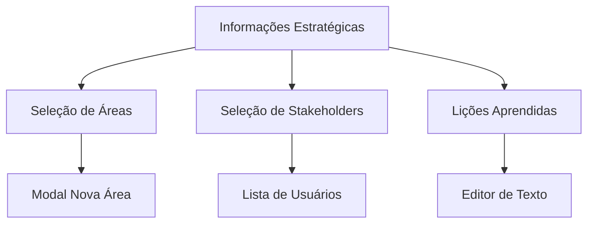

# Expansão do Módulo Estratégico - Áreas, Stakeholders e Lições Aprendidas

## 1. Visão Geral do Produto

Expansão do sistema de gestão estratégica de projetos para incluir três novas funcionalidades: gerenciamento de áreas organizacionais com seleção múltipla, gestão de stakeholders baseada em usuários do sistema, e registro de lições aprendidas.

## 2. Funcionalidades Principais

### 2.1 Papéis de Usuário

| Papel | Método de Registro | Permissões Principais |
|-------|-------------------|----------------------|
| Usuário Autenticado | Login no sistema | Pode visualizar e gerenciar informações estratégicas de projetos |
| Administrador | Acesso administrativo | Pode criar/editar áreas globais e gerenciar todos os aspectos estratégicos |

### 2.2 Módulos de Funcionalidade

Nossa expansão estratégica consiste das seguintes funcionalidades principais:

1. **Gestão de Áreas**: seleção múltipla, cadastro dinâmico, gerenciamento global
2. **Gestão de Stakeholders**: seleção múltipla de usuários, visualização de perfis
3. **Lições Aprendidas**: campo de texto livre, histórico de aprendizados

### 2.3 Detalhes das Páginas

| Nome da Página | Nome do Módulo | Descrição da Funcionalidade |
|----------------|----------------|-----------------------------|
| Informações Estratégicas | Seletor de Áreas | Permite seleção múltipla de áreas organizacionais. Inclui botão para criar nova área caso não exista. Exibe badges das áreas selecionadas. |
| Informações Estratégicas | Gerenciador de Áreas | Modal para criação/edição de áreas com campos nome, descrição e cor. Validação de duplicatas. Lista de áreas existentes. |
| Informações Estratégicas | Seletor de Stakeholders | Permite seleção múltipla de usuários cadastrados no sistema. Exibe avatar, nome e email dos usuários. Busca e filtros por nome/email. |
| Informações Estratégicas | Lições Aprendidas | Campo de texto rico para registro de lições aprendidas do projeto. Suporte a formatação básica. Histórico de alterações. |

## 3. Processo Principal

### Fluxo de Gestão de Áreas
1. Usuário acessa informações estratégicas do projeto
2. Seleciona múltiplas áreas organizacionais relevantes
3. Caso área não exista, clica em "Nova Área" e preenche formulário
4. Sistema valida e salva nova área globalmente
5. Área fica disponível para seleção em todos os projetos

### Fluxo de Gestão de Stakeholders
1. Usuário acessa seleção de stakeholders
2. Sistema carrega todos os usuários cadastrados
3. Usuário busca e seleciona múltiplos stakeholders
4. Sistema associa stakeholders ao projeto
5. Stakeholders ficam visíveis nas informações do projeto

### Fluxo de Lições Aprendidas
1. Usuário acessa campo de lições aprendidas
2. Digita texto livre com aprendizados do projeto
3. Sistema salva automaticamente as alterações
4. Histórico de alterações fica disponível para consulta

## 4. Design da Interface do Usuário

### 4.1 Estilo de Design

- **Cores primárias e secundárias**: Manter consistência com o sistema existente (#3B82F6 azul, #10B981 verde)
- **Estilo de botões**: Rounded corners, hover effects, ícones intuitivos
- **Fonte e tamanhos**: Inter font family, tamanhos 14px-16px para texto principal
- **Estilo de layout**: Card-based design, grid responsivo, navegação lateral
- **Ícones e emojis**: Lucide icons para consistência, cores temáticas para áreas

### 4.2 Visão Geral do Design das Páginas

| Nome da Página | Nome do Módulo | Elementos da UI |
|----------------|----------------|----------------|
| Informações Estratégicas | Seletor de Áreas | Multi-select dropdown com badges coloridos, botão "+ Nova Área", lista de áreas selecionadas com opção de remoção |
| Modal de Áreas | Formulário de Área | Campos nome/descrição, seletor de cor, botão salvar/cancelar, lista de áreas existentes |
| Informações Estratégicas | Seletor de Stakeholders | Multi-select com avatares, busca por nome/email, badges dos selecionados, contador de stakeholders |
| Informações Estratégicas | Lições Aprendidas | Textarea expansível, contador de caracteres, botão salvar, indicador de última modificação |

### 4.3 Responsividade

Design mobile-first com adaptação para desktop. Otimização para touch em dispositivos móveis, com dropdowns que se transformam em modais full-screen em telas pequenas.