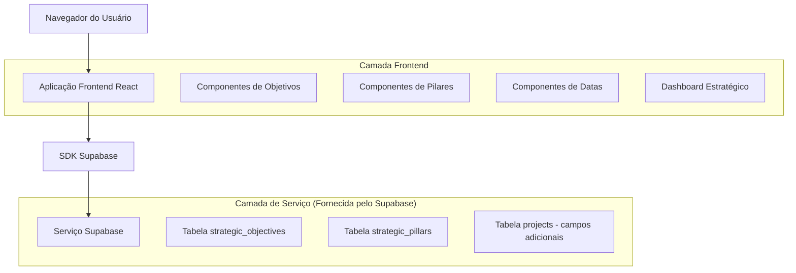
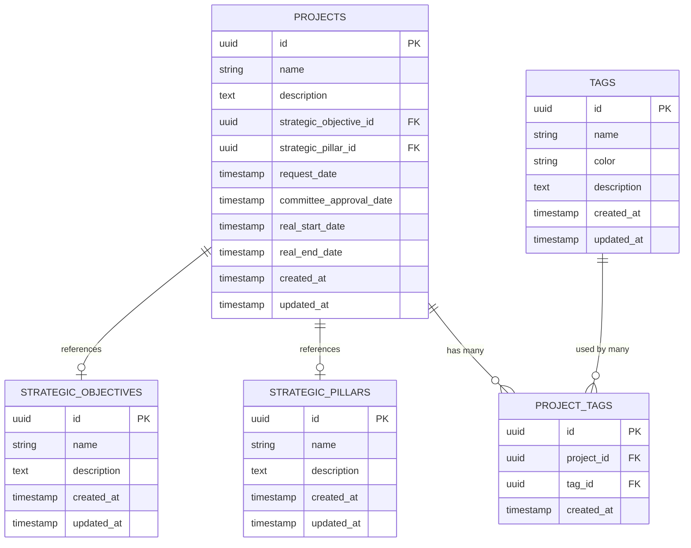

# Arquitetura Técnica - Sistema de Gerenciamento Estratégico de Projetos

## 1. Design da Arquitetura



## 2. Descrição das Tecnologias

- Frontend: React@18 + TypeScript + Tailwind CSS@3 + Vite
- Backend: Supabase (PostgreSQL + Auth + Real-time)
- Componentes UI: Shadcn/ui + Lucide React
- Gerenciamento de Estado: React Hooks + Context API
- Validação: Zod + React Hook Form

## 3. Definições de Rotas

| Rota | Propósito |
|------|----------|
| /projects/[id]/strategic | Página de gerenciamento de informações estratégicas do projeto |
| /admin/strategic-objectives | Página de gerenciamento de objetivos estratégicos (CRUD) |
| /admin/strategic-pillars | Página de gerenciamento de pilares estratégicos (CRUD) |
| /dashboard/strategic | Dashboard com visão estratégica consolidada |
| /api/strategic-objectives | API para operações CRUD de objetivos estratégicos |
| /api/strategic-pillars | API para operações CRUD de pilares estratégicos |
| /api/projects/[id]/strategic | API para atualização de informações estratégicas do projeto |

## 4. Definições de API

### 4.1 APIs Principais

**Objetivos Estratégicos**
```
GET /api/strategic-objectives
POST /api/strategic-objectives
PUT /api/strategic-objectives/:id
DELETE /api/strategic-objectives/:id
```
Resposta:
| Nome do Parâmetro | Tipo do Parâmetro | Descrição |
|-------------------|-------------------|----------|
| id | string (UUID) | ID único do objetivo |
| name | string | Nome do objetivo estratégico |
| description | string | Descrição detalhada |
| created_at | string (ISO) | Data de criação |
| updated_at | string (ISO) | Data de atualização |

```
POST /api/strategic-objectives
```
Requisição:
| Nome do Parâmetro | Tipo do Parâmetro | Obrigatório | Descrição |
|-------------------|-------------------|-------------|----------|
| name | string | true | Nome do objetivo estratégico |
| description | string | false | Descrição do objetivo |

**Pilares Estratégicos**
```
GET /api/strategic-pillars
POST /api/strategic-pillars
PUT /api/strategic-pillars/:id
DELETE /api/strategic-pillars/:id
```

**Tags**
```
GET /api/tags
POST /api/tags
PUT /api/tags/:id
DELETE /api/tags/:id
```
Resposta:
| Nome do Parâmetro | Tipo do Parâmetro | Descrição |
|-------------------|-------------------|----------|
| id | string (UUID) | ID único do pilar |
| name | string | Nome do pilar estratégico |
| description | string | Descrição detalhada |
| created_at | string (ISO) | Data de criação |

```
POST /api/strategic-pillars
```
Requisição:
| Nome do Parâmetro | Tipo do Parâmetro | Obrigatório | Descrição |
|-------------------|-------------------|-------------|----------|
| name | string | true | Nome do pilar estratégico |
| description | string | false | Descrição do pilar |

**Informações Estratégicas do Projeto**
```
PUT /api/projects/[id]/strategic
```
Requisição:
| Nome do Parâmetro | Tipo do Parâmetro | Obrigatório | Descrição |
|-------------------|-------------------|-------------|----------|
| strategic_objective_id | string (UUID) | false | ID do objetivo estratégico |
| strategic_pillar_id | string (UUID) | false | ID do pilar estratégico |
| tag_ids | array | false | Array de IDs das tags aplicadas ao projeto |
| request_date | string (ISO) | false | Data de solicitação do projeto |
| committee_approval_date | string (ISO) | false | Data de aprovação no comitê |
| real_start_date | string (ISO) | false | Data de início real |
| real_end_date | string (ISO) | false | Data de término real |

Exemplo:
```json
{
  "strategic_objective_id": "123e4567-e89b-12d3-a456-426614174000",
  "strategic_pillar_id": "987fcdeb-51a2-43d1-b789-123456789abc",
  "request_date": "2024-01-15T00:00:00.000Z",
  "committee_approval_date": "2024-01-20T00:00:00.000Z",
  "real_start_date": "2024-02-01T00:00:00.000Z",
  "real_end_date": "2024-06-30T00:00:00.000Z"
}
```

## 5. Modelo de Dados

### 5.1 Definição do Modelo de Dados



### 5.2 Linguagem de Definição de Dados

**Tabela de Objetivos Estratégicos (strategic_objectives)**
```sql
-- Criar tabela
CREATE TABLE strategic_objectives (
    id UUID PRIMARY KEY DEFAULT gen_random_uuid(),
    name VARCHAR(255) NOT NULL,
    description TEXT,
    created_at TIMESTAMP WITH TIME ZONE DEFAULT NOW(),
    updated_at TIMESTAMP WITH TIME ZONE DEFAULT NOW()
);

-- Criar índices
CREATE INDEX idx_strategic_objectives_name ON strategic_objectives(name);
CREATE INDEX idx_strategic_objectives_created_at ON strategic_objectives(created_at DESC);

-- Políticas RLS
ALTER TABLE strategic_objectives ENABLE ROW LEVEL SECURITY;

-- Permitir leitura para usuários autenticados
CREATE POLICY "Allow read access for authenticated users" ON strategic_objectives
    FOR SELECT TO authenticated USING (true);

-- Permitir todas as operações para administradores
CREATE POLICY "Allow all operations for admins" ON strategic_objectives
    FOR ALL TO authenticated USING (auth.jwt() ->> 'role' = 'admin');

-- Dados iniciais
INSERT INTO strategic_objectives (name, description) VALUES
('Crescimento de Receita', 'Objetivos relacionados ao aumento da receita organizacional'),
('Eficiência Operacional', 'Objetivos focados na melhoria de processos e redução de custos'),
('Inovação e Tecnologia', 'Objetivos relacionados à modernização e inovação tecnológica'),
('Sustentabilidade', 'Objetivos ambientais e de responsabilidade social');
```

**Tabela de Pilares Estratégicos (strategic_pillars)**
```sql
-- Criar tabela
CREATE TABLE strategic_pillars (
    id UUID PRIMARY KEY DEFAULT gen_random_uuid(),
    name VARCHAR(255) NOT NULL,
    description TEXT,
    created_at TIMESTAMP WITH TIME ZONE DEFAULT NOW(),
    updated_at TIMESTAMP WITH TIME ZONE DEFAULT NOW()
);

-- Criar índices
CREATE INDEX idx_strategic_pillars_name ON strategic_pillars(name);
CREATE INDEX idx_strategic_pillars_created_at ON strategic_pillars(created_at DESC);

-- Políticas RLS
ALTER TABLE strategic_pillars ENABLE ROW LEVEL SECURITY;

-- Permitir leitura para usuários autenticados
CREATE POLICY "Allow read access for authenticated users" ON strategic_pillars
    FOR SELECT TO authenticated USING (true);

-- Permitir todas as operações para administradores
CREATE POLICY "Allow all operations for admins" ON strategic_pillars
    FOR ALL TO authenticated USING (auth.jwt() ->> 'role' = 'admin');

-- Dados iniciais
INSERT INTO strategic_pillars (name, description) VALUES
('Excelência em Atendimento', 'Foco na satisfação e experiência do cliente'),
('Pessoas e Cultura', 'Desenvolvimento humano e cultura organizacional'),
('Tecnologia e Inovação', 'Modernização tecnológica e processos inovadores'),
('Sustentabilidade Financeira', 'Gestão financeira e rentabilidade');
```

**Tabela de Tags (tags)**
```sql
-- Criar tabela
CREATE TABLE tags (
    id UUID PRIMARY KEY DEFAULT gen_random_uuid(),
    name VARCHAR(100) NOT NULL UNIQUE,
    color VARCHAR(7) DEFAULT '#3B82F6',
    description TEXT,
    created_at TIMESTAMP WITH TIME ZONE DEFAULT NOW(),
    updated_at TIMESTAMP WITH TIME ZONE DEFAULT NOW()
);

-- Criar índices
CREATE INDEX idx_tags_name ON tags(name);
CREATE INDEX idx_tags_created_at ON tags(created_at DESC);

-- Políticas RLS
ALTER TABLE tags ENABLE ROW LEVEL SECURITY;

-- Permitir leitura para usuários autenticados
CREATE POLICY "Allow read access for authenticated users" ON tags
    FOR SELECT TO authenticated USING (true);

-- Permitir todas as operações para administradores
CREATE POLICY "Allow all operations for admins" ON tags
    FOR ALL TO authenticated USING (auth.jwt() ->> 'role' = 'admin');

-- Dados iniciais
INSERT INTO tags (name, color, description) VALUES
('Urgente', '#EF4444', 'Projetos com alta prioridade'),
('Inovação', '#8B5CF6', 'Projetos focados em inovação'),
('Melhoria', '#10B981', 'Projetos de melhoria contínua'),
('Estratégico', '#F59E0B', 'Projetos estratégicos da organização');
```

**Tabela de Relacionamento Projeto-Tags (project_tags)**
```sql
-- Criar tabela
CREATE TABLE project_tags (
    id UUID PRIMARY KEY DEFAULT gen_random_uuid(),
    project_id UUID NOT NULL REFERENCES projects(id) ON DELETE CASCADE,
    tag_id UUID NOT NULL REFERENCES tags(id) ON DELETE CASCADE,
    created_at TIMESTAMP WITH TIME ZONE DEFAULT NOW(),
    UNIQUE(project_id, tag_id)
);

-- Criar índices
CREATE INDEX idx_project_tags_project_id ON project_tags(project_id);
CREATE INDEX idx_project_tags_tag_id ON project_tags(tag_id);
CREATE INDEX idx_project_tags_created_at ON project_tags(created_at DESC);

-- Políticas RLS
ALTER TABLE project_tags ENABLE ROW LEVEL SECURITY;

-- Permitir leitura para usuários autenticados
CREATE POLICY "Allow read access for authenticated users" ON project_tags
    FOR SELECT TO authenticated USING (true);

-- Permitir todas as operações para administradores
CREATE POLICY "Allow all operations for admins" ON project_tags
    FOR ALL TO authenticated USING (auth.jwt() ->> 'role' = 'admin');
```

**Alterações na Tabela de Projetos**
```sql
-- Adicionar colunas estratégicas à tabela projects
ALTER TABLE projects ADD COLUMN strategic_objective_id UUID REFERENCES strategic_objectives(id);
ALTER TABLE projects ADD COLUMN strategic_pillar_id UUID REFERENCES strategic_pillars(id);
ALTER TABLE projects ADD COLUMN request_date TIMESTAMP WITH TIME ZONE;
ALTER TABLE projects ADD COLUMN committee_approval_date TIMESTAMP WITH TIME ZONE;
ALTER TABLE projects ADD COLUMN real_start_date TIMESTAMP WITH TIME ZONE;
ALTER TABLE projects ADD COLUMN real_end_date TIMESTAMP WITH TIME ZONE;

-- Criar índices para as novas colunas
CREATE INDEX idx_projects_strategic_objective ON projects(strategic_objective_id);
CREATE INDEX idx_projects_strategic_pillar ON projects(strategic_pillar_id);
CREATE INDEX idx_projects_request_date ON projects(request_date);
CREATE INDEX idx_projects_real_dates ON projects(real_start_date, real_end_date);

-- Função para atualizar updated_at automaticamente
CREATE OR REPLACE FUNCTION update_updated_at_column()
RETURNS TRIGGER AS $$
BEGIN
    NEW.updated_at = NOW();
    RETURN NEW;
END;
$$ language 'plpgsql';

-- Triggers para atualização automática
CREATE TRIGGER update_strategic_objectives_updated_at BEFORE UPDATE ON strategic_objectives
    FOR EACH ROW EXECUTE FUNCTION update_updated_at_column();

CREATE TRIGGER update_strategic_pillars_updated_at BEFORE UPDATE ON strategic_pillars
    FOR EACH ROW EXECUTE FUNCTION update_updated_at_column();
```