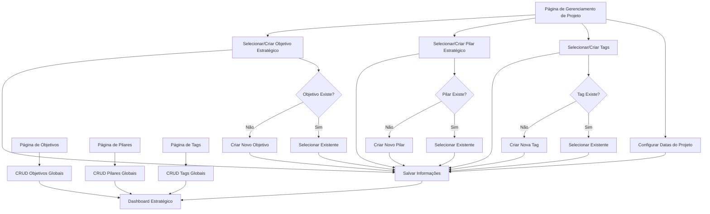

# Sistema de Gerenciamento Estratégico de Projetos

## 1. Visão Geral do Produto

Este documento especifica as melhorias para o sistema de gerenciamento de projetos, adicionando funcionalidades estratégicas que permitem aos usuários cadastrar e gerenciar informações estratégicas dos projetos após sua criação inicial. O sistema permitirá o controle completo de objetivos estratégicos, pilares estratégicos e datas importantes do ciclo de vida do projeto.

- O sistema visa melhorar o controle estratégico e o acompanhamento temporal dos projetos organizacionais.
- Destinado a gerentes de projeto, coordenadores e stakeholders que precisam de visibilidade estratégica completa.

## 2. Funcionalidades Principais

### 2.1 Papéis de Usuário

| Papel | Método de Registro | Permissões Principais |
|-------|-------------------|----------------------|
| Usuário Padrão | Registro existente | Pode visualizar informações estratégicas dos projetos que participa |
| Gerente de Projeto | Atribuição por admin | Pode editar informações estratégicas dos projetos que gerencia, criar novos objetivos/pilares/tags durante edição |
| Administrador | Acesso administrativo | Pode gerenciar objetivos estratégicos, pilares estratégicos, tags e todas as informações globalmente |

### 2.2 Módulos de Funcionalidade

Nosso sistema de gerenciamento estratégico consiste nas seguintes páginas principais:

1. **Página de Gerenciamento de Projeto**: interface principal para edição de informações estratégicas, seleção/criação dinâmica de objetivos e pilares, configuração de datas, gerenciamento de tags.
2. **Página de Objetivos Estratégicos**: cadastro e gerenciamento global de objetivos estratégicos, listagem e edição de objetivos existentes.
3. **Página de Pilares Estratégicos**: cadastro e gerenciamento global de pilares estratégicos, listagem e edição de pilares existentes.
4. **Página de Tags**: cadastro e gerenciamento global de tags, listagem e edição de tags existentes.
5. **Dashboard Estratégico**: visualização consolidada de informações estratégicas, relatórios e métricas.

### 2.3 Detalhes das Páginas

**IMPORTANTE**: Objetivos estratégicos, pilares estratégicos e tags são entidades GLOBAIS que podem ser utilizadas por qualquer projeto. Durante a edição de um projeto, o usuário pode selecionar itens existentes ou criar novos dinamicamente.

| Nome da Página | Nome do Módulo | Descrição da Funcionalidade |
|----------------|----------------|-----------------------------|
| Gerenciamento de Projeto | Informações Estratégicas | Selecionar/criar objetivo estratégico via dropdown com opção "Criar Novo", selecionar/criar pilar estratégico via dropdown com opção "Criar Novo", configurar datas do projeto (solicitação, aprovação, início real, término real) |
| Gerenciamento de Projeto | Gerenciamento de Tags | Selecionar tags existentes via multi-select, criar novas tags dinamicamente, visualizar tags aplicadas ao projeto |
| Gerenciamento de Projeto | Formulário de Datas | Inserir data de solicitação, data de aprovação no comitê, data de início real, data de término real com validação |
| Objetivos Estratégicos | CRUD de Objetivos | Criar novos objetivos estratégicos globais, listar objetivos existentes, editar objetivos, excluir objetivos, buscar e filtrar objetivos |
| Pilares Estratégicos | CRUD de Pilares | Criar novos pilares estratégicos globais, listar pilares existentes, editar pilares, excluir pilares, buscar e filtrar pilares |
| Tags | CRUD de Tags | Criar novas tags globais, listar tags existentes, editar tags, excluir tags, buscar e filtrar tags |
| Dashboard Estratégico | Visualização de Dados | Exibir projetos por objetivo estratégico, exibir projetos por pilar estratégico, exibir projetos por tags, relatórios de datas e prazos, métricas de desempenho |

## 3. Processo Principal

**Fluxo do Gerente de Projeto:**
1. Acessa a página de gerenciamento do projeto
2. Seleciona um objetivo estratégico existente no dropdown OU cria um novo objetivo dinamicamente
3. Seleciona um pilar estratégico existente no dropdown OU cria um novo pilar dinamicamente
4. Seleciona tags existentes no multi-select OU cria novas tags dinamicamente
5. Preenche as datas do projeto (solicitação, aprovação no comitê, início real, término real)
6. Salva as informações estratégicas do projeto

**Fluxo do Administrador:**
1. Gerencia objetivos estratégicos globalmente (criar, editar, excluir)
2. Gerencia pilares estratégicos globalmente (criar, editar, excluir)
3. Gerencia tags globalmente (criar, editar, excluir)
4. Visualiza dashboard com informações consolidadas
5. Gera relatórios estratégicos por objetivos, pilares e tags

## 4. Design da Interface do Usuário

### 4.1 Estilo de Design

- **Cores primárias e secundárias**: Manter o esquema de cores atual do sistema (azul primário #3B82F6, cinza secundário #6B7280)
- **Estilo de botões**: Botões arredondados com sombra sutil, seguindo o padrão Tailwind CSS atual
- **Fonte e tamanhos**: Inter font family, tamanhos de 14px para texto padrão, 16px para labels, 24px para títulos
- **Estilo de layout**: Layout baseado em cards com navegação superior, grid responsivo
- **Ícones**: Lucide React icons para consistência com o sistema atual

### 4.2 Visão Geral do Design das Páginas

| Nome da Página | Nome do Módulo | Elementos da UI |
|----------------|----------------|----------------|
| Gerenciamento de Projeto | Informações Estratégicas | Card com título "Informações Estratégicas", dropdown para objetivos com busca e opção "+ Criar Novo", dropdown para pilares com busca e opção "+ Criar Novo", multi-select para tags com chips coloridos e opção "+ Criar Nova", grid 2x2 para campos de data com date pickers |
| Gerenciamento de Projeto | Gerenciamento de Tags | Seção dedicada para tags com multi-select, preview das tags selecionadas como chips coloridos, modal para criação de nova tag (nome, seletor de cor, descrição) |
| Objetivos Estratégicos | Lista de Objetivos | Tabela responsiva com colunas (Nome, Descrição, Projetos Associados, Data Criação, Ações), botão "Novo Objetivo" no canto superior direito, modal para criação/edição |
| Pilares Estratégicos | Lista de Pilares | Tabela responsiva com colunas (Nome, Descrição, Projetos Associados, Data Criação, Ações), botão "Novo Pilar" no canto superior direito, modal para criação/edição |
| Tags | Lista de Tags | Grid de cards coloridos mostrando cada tag com sua cor, nome e contador de projetos, botão "Nova Tag" destacado, modal para criação/edição com preview |
| Tags | Formulário de Tag | Modal com campos para nome, seletor de cor (color picker), descrição opcional, preview da tag em tempo real |
| Dashboard Estratégico | Métricas Visuais | Cards de estatísticas com ícones, gráficos de barras para distribuição por objetivos/pilares, nuvem de tags interativa, timeline de projetos por datas, filtros por tags/objetivos/pilares |

### 4.3 Responsividade

O sistema é desktop-first com adaptação mobile completa. Inclui otimização para interação touch em dispositivos móveis, com dropdowns adaptados para telas menores e date pickers nativos em mobile.