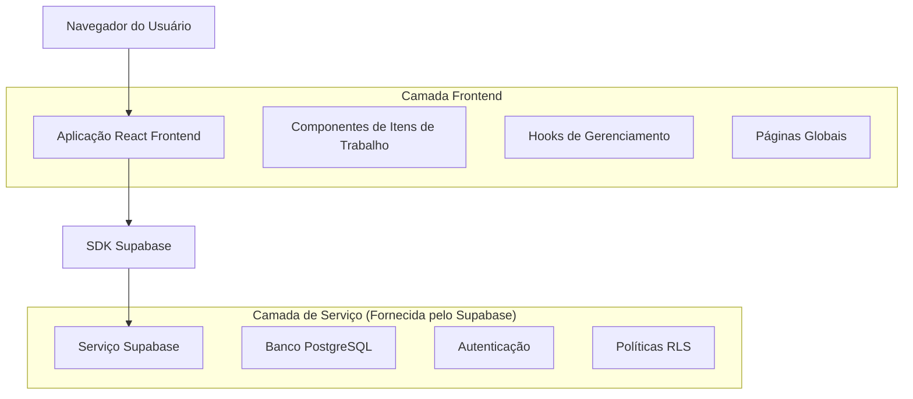
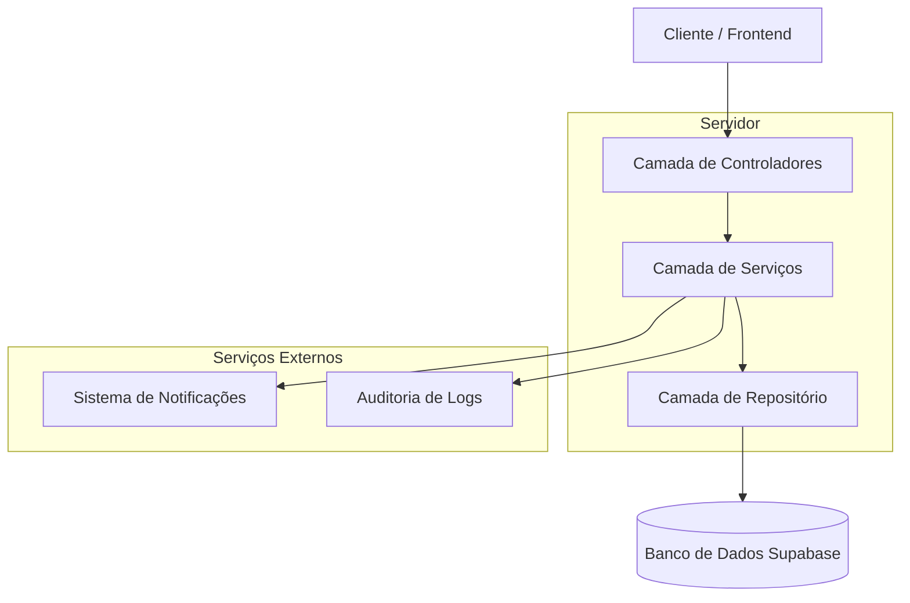
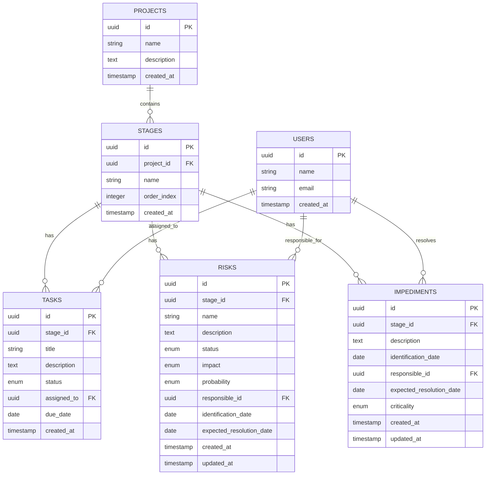

# Arquitetura Técnica - Sistema de Itens de Trabalho

## 1. Design da Arquitetura



## 2. Descrição das Tecnologias

- **Frontend**: React@18 + TypeScript + Tailwind CSS@3 + Vite
- **Backend**: Supabase (PostgreSQL + Auth + RLS)
- **Bibliotecas**: Lucide React (ícones), React Hook Form (formulários), React DnD (drag-and-drop)
- **Estado**: React Query para cache e sincronização de dados

## 3. Definições de Rotas

| Rota | Propósito |
|------|----------|
| /projects/[id]/work-items | Página principal de itens de trabalho (antiga cronograma) |
| /projects/[id]/work-items/risks | Gestão global de riscos do projeto |
| /projects/[id]/work-items/impediments | Gestão global de impedimentos do projeto |
| /work-items/risks | Visão global de todos os riscos (admin) |
| /work-items/impediments | Visão global de todos os impedimentos (admin) |

## 4. Definições de API

### 4.1 APIs Principais

**Gestão de Riscos**
```
POST /api/projects/[id]/risks
```

Request:
| Nome do Parâmetro | Tipo | Obrigatório | Descrição |
|------------------|------|-------------|----------|
| name | string | true | Nome do risco |
| description | string | false | Descrição detalhada |
| status | enum | true | Status atual do risco |
| impact | enum | true | Tipo de impacto |
| probability | enum | true | Probabilidade de ocorrência |
| responsible_id | uuid | true | ID do responsável |
| stage_id | uuid | true | ID da etapa |
| identification_date | date | true | Data de identificação |
| expected_resolution_date | date | false | Data prevista para resolução |

Response:
| Nome do Parâmetro | Tipo | Descrição |
|------------------|------|----------|
| id | uuid | ID único do risco |
| created_at | timestamp | Data de criação |
| updated_at | timestamp | Data da última atualização |

Exemplo:
```json
{
  "name": "Atraso na entrega de componentes",
  "description": "Fornecedor pode atrasar entrega devido a problemas logísticos",
  "status": "identificado",
  "impact": "prazo",
  "probability": "media",
  "responsible_id": "123e4567-e89b-12d3-a456-426614174000",
  "stage_id": "987fcdeb-51a2-43d1-b789-123456789abc",
  "identification_date": "2024-01-15",
  "expected_resolution_date": "2024-02-15"
}
```

**Gestão de Impedimentos**
```
POST /api/projects/[id]/impediments
```

Request:
| Nome do Parâmetro | Tipo | Obrigatório | Descrição |
|------------------|------|-------------|----------|
| description | string | true | Descrição do impedimento |
| identification_date | date | true | Data de identificação |
| responsible_id | uuid | true | ID do responsável pela resolução |
| stage_id | uuid | true | ID da etapa |
| expected_resolution_date | date | false | Previsão de resolução |
| criticality | enum | true | Nível de criticidade |

**Listagem de Itens por Etapa**
```
GET /api/projects/[id]/stages/[stageId]/items
```

Response:
```json
{
  "tasks": [...],
  "risks": [...],
  "impediments": [...]
}
```

## 5. Arquitetura do Servidor



## 6. Modelo de Dados

### 6.1 Definição do Modelo de Dados



### 6.2 Linguagem de Definição de Dados

**Tabela de Riscos (risks)**
```sql
-- Criar tabela de riscos
CREATE TABLE risks (
    id UUID PRIMARY KEY DEFAULT gen_random_uuid(),
    stage_id UUID NOT NULL,
    name VARCHAR(255) NOT NULL,
    description TEXT,
    status VARCHAR(20) NOT NULL DEFAULT 'identificado' 
        CHECK (status IN ('identificado', 'em_analise', 'em_mitigacao', 'monitorado', 'materializado', 'encerrado')),
    impact VARCHAR(20) NOT NULL 
        CHECK (impact IN ('prazo', 'custo', 'qualidade', 'reputacao')),
    probability VARCHAR(10) NOT NULL 
        CHECK (probability IN ('baixa', 'media', 'alta')),
    responsible_id UUID NOT NULL,
    identification_date DATE NOT NULL,
    expected_resolution_date DATE,
    created_at TIMESTAMP WITH TIME ZONE DEFAULT NOW(),
    updated_at TIMESTAMP WITH TIME ZONE DEFAULT NOW(),
    
    CONSTRAINT fk_risks_stage FOREIGN KEY (stage_id) REFERENCES stages(id) ON DELETE CASCADE,
    CONSTRAINT fk_risks_responsible FOREIGN KEY (responsible_id) REFERENCES users(id)
);

-- Criar índices
CREATE INDEX idx_risks_stage_id ON risks(stage_id);
CREATE INDEX idx_risks_responsible_id ON risks(responsible_id);
CREATE INDEX idx_risks_status ON risks(status);
CREATE INDEX idx_risks_identification_date ON risks(identification_date DESC);

-- Políticas RLS
ALTER TABLE risks ENABLE ROW LEVEL SECURITY;

CREATE POLICY "Usuários podem ver riscos de projetos que participam" ON risks
    FOR SELECT USING (
        EXISTS (
            SELECT 1 FROM stages s
            JOIN projects p ON s.project_id = p.id
            JOIN team_members tm ON tm.project_id = p.id
            WHERE s.id = risks.stage_id AND tm.user_id = auth.uid()
        )
    );

CREATE POLICY "Usuários podem criar riscos em projetos que participam" ON risks
    FOR INSERT WITH CHECK (
        EXISTS (
            SELECT 1 FROM stages s
            JOIN projects p ON s.project_id = p.id
            JOIN team_members tm ON tm.project_id = p.id
            WHERE s.id = risks.stage_id AND tm.user_id = auth.uid()
        )
    );

CREATE POLICY "Usuários podem atualizar riscos que são responsáveis" ON risks
    FOR UPDATE USING (responsible_id = auth.uid());
```

**Tabela de Impedimentos (impediments)**
```sql
-- Criar tabela de impedimentos
CREATE TABLE impediments (
    id UUID PRIMARY KEY DEFAULT gen_random_uuid(),
    stage_id UUID NOT NULL,
    description TEXT NOT NULL,
    identification_date DATE NOT NULL,
    responsible_id UUID NOT NULL,
    expected_resolution_date DATE,
    criticality VARCHAR(10) NOT NULL DEFAULT 'media'
        CHECK (criticality IN ('alta', 'media', 'baixa')),
    status VARCHAR(20) NOT NULL DEFAULT 'aberto'
        CHECK (status IN ('aberto', 'em_resolucao', 'resolvido', 'cancelado')),
    created_at TIMESTAMP WITH TIME ZONE DEFAULT NOW(),
    updated_at TIMESTAMP WITH TIME ZONE DEFAULT NOW(),
    
    CONSTRAINT fk_impediments_stage FOREIGN KEY (stage_id) REFERENCES stages(id) ON DELETE CASCADE,
    CONSTRAINT fk_impediments_responsible FOREIGN KEY (responsible_id) REFERENCES users(id)
);

-- Criar índices
CREATE INDEX idx_impediments_stage_id ON impediments(stage_id);
CREATE INDEX idx_impediments_responsible_id ON impediments(responsible_id);
CREATE INDEX idx_impediments_criticality ON impediments(criticality);
CREATE INDEX idx_impediments_identification_date ON impediments(identification_date DESC);

-- Políticas RLS
ALTER TABLE impediments ENABLE ROW LEVEL SECURITY;

CREATE POLICY "Usuários podem ver impedimentos de projetos que participam" ON impediments
    FOR SELECT USING (
        EXISTS (
            SELECT 1 FROM stages s
            JOIN projects p ON s.project_id = p.id
            JOIN team_members tm ON tm.project_id = p.id
            WHERE s.id = impediments.stage_id AND tm.user_id = auth.uid()
        )
    );

CREATE POLICY "Usuários podem criar impedimentos em projetos que participam" ON impediments
    FOR INSERT WITH CHECK (
        EXISTS (
            SELECT 1 FROM stages s
            JOIN projects p ON s.project_id = p.id
            JOIN team_members tm ON tm.project_id = p.id
            WHERE s.id = impediments.stage_id AND tm.user_id = auth.uid()
        )
    );

CREATE POLICY "Usuários podem atualizar impedimentos que são responsáveis" ON impediments
    FOR UPDATE USING (responsible_id = auth.uid());
```

**Função para buscar itens de trabalho por etapa**
```sql
-- Função para buscar todos os itens de uma etapa
CREATE OR REPLACE FUNCTION get_stage_work_items(stage_uuid UUID)
RETURNS JSON AS $$
DECLARE
    result JSON;
BEGIN
    SELECT json_build_object(
        'tasks', (
            SELECT COALESCE(json_agg(json_build_object(
                'id', t.id,
                'title', t.title,
                'description', t.description,
                'status', t.status,
                'assigned_to', json_build_object(
                    'id', u.id,
                    'name', u.name,
                    'email', u.email
                ),
                'due_date', t.due_date,
                'created_at', t.created_at
            )), '[]'::json)
            FROM tasks t
            LEFT JOIN users u ON t.assigned_to = u.id
            WHERE t.stage_id = stage_uuid
            ORDER BY t.created_at
        ),
        'risks', (
            SELECT COALESCE(json_agg(json_build_object(
                'id', r.id,
                'name', r.name,
                'description', r.description,
                'status', r.status,
                'impact', r.impact,
                'probability', r.probability,
                'responsible', json_build_object(
                    'id', u.id,
                    'name', u.name,
                    'email', u.email
                ),
                'identification_date', r.identification_date,
                'expected_resolution_date', r.expected_resolution_date,
                'created_at', r.created_at
            )), '[]'::json)
            FROM risks r
            LEFT JOIN users u ON r.responsible_id = u.id
            WHERE r.stage_id = stage_uuid
            ORDER BY r.identification_date DESC
        ),
        'impediments', (
            SELECT COALESCE(json_agg(json_build_object(
                'id', i.id,
                'description', i.description,
                'identification_date', i.identification_date,
                'responsible', json_build_object(
                    'id', u.id,
                    'name', u.name,
                    'email', u.email
                ),
                'expected_resolution_date', i.expected_resolution_date,
                'criticality', i.criticality,
                'status', i.status,
                'created_at', i.created_at
            )), '[]'::json)
            FROM impediments i
            LEFT JOIN users u ON i.responsible_id = u.id
            WHERE i.stage_id = stage_uuid
            ORDER BY i.identification_date DESC
        )
    ) INTO result;
    
    RETURN result;
END;
$$ LANGUAGE plpgsql SECURITY DEFINER;
```

**Triggers para auditoria e notificações**
```sql
-- Trigger para atualizar updated_at automaticamente
CREATE OR REPLACE FUNCTION update_updated_at_column()
RETURNS TRIGGER AS $$
BEGIN
    NEW.updated_at = NOW();
    RETURN NEW;
END;
$$ LANGUAGE plpgsql;

CREATE TRIGGER update_risks_updated_at
    BEFORE UPDATE ON risks
    FOR EACH ROW
    EXECUTE FUNCTION update_updated_at_column();

CREATE TRIGGER update_impediments_updated_at
    BEFORE UPDATE ON impediments
    FOR EACH ROW
    EXECUTE FUNCTION update_updated_at_column();

-- Dados iniciais para testes
INSERT INTO risks (stage_id, name, description, status, impact, probability, responsible_id, identification_date)
SELECT 
    s.id,
    'Risco de exemplo',
    'Este é um risco de exemplo para testes',
    'identificado',
    'prazo',
    'media',
    tm.user_id,
    CURRENT_DATE
FROM stages s
JOIN projects p ON s.project_id = p.id
JOIN team_members tm ON tm.project_id = p.id
LIMIT 1;
```