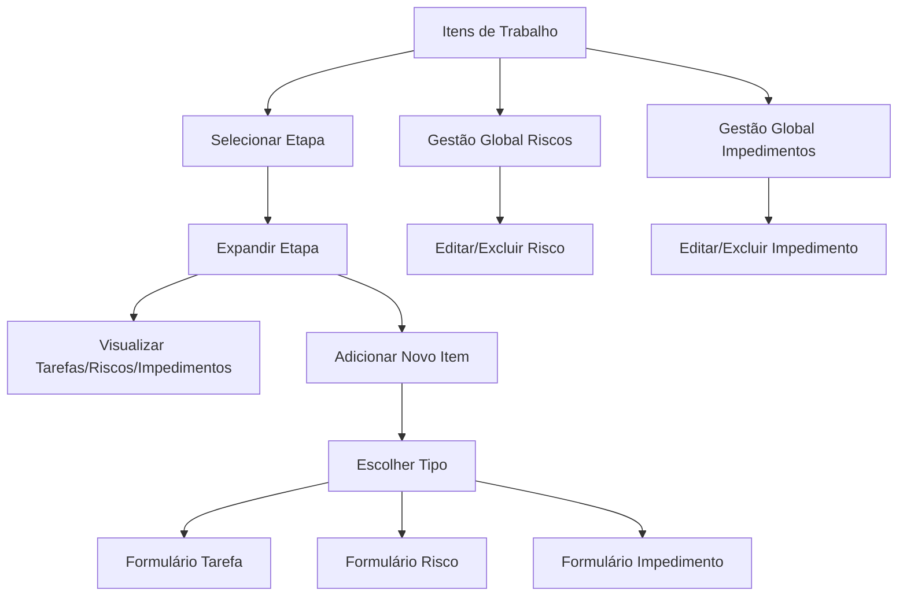

# Requisitos de Produto - Sistema de Itens de Trabalho

## 1. Visão Geral do Produto

Remodelação completa da funcionalidade de cronograma para um sistema abrangente de "Itens de Trabalho" que permite gerenciar tarefas, riscos e impedimentos organizados por etapas de projeto. O sistema oferece uma visão unificada e estruturada de todos os elementos que compõem o trabalho de um projeto, facilitando o acompanhamento e controle de execução.

## 2. Funcionalidades Principais

### 2.1 Papéis de Usuário

| Papel | Método de Registro | Permissões Principais |
|-------|-------------------|----------------------|
| Membro da Equipe | Convite do projeto | Pode visualizar e editar itens atribuídos a ele |
| Gerente de Projeto | Criação/convite | Pode criar, editar e excluir todos os itens do projeto |
| Administrador | Acesso total | Pode gerenciar todos os projetos e itens |

### 2.2 Módulos de Funcionalidade

Nossos requisitos de Itens de Trabalho consistem nas seguintes páginas principais:

1. **Itens de Trabalho**: visualização por etapas, criação de tarefas/riscos/impedimentos, drag-and-drop de etapas
2. **Gestão Global de Riscos**: listagem, edição e exclusão de todos os riscos do sistema
3. **Gestão Global de Impedimentos**: listagem, edição e exclusão de todos os impedimentos do sistema
4. **Formulários de Criação**: modais para criação de tarefas, riscos e impedimentos

### 2.3 Detalhes das Páginas

| Nome da Página | Nome do Módulo | Descrição da Funcionalidade |
|----------------|----------------|-----------------------------|
| Itens de Trabalho | Visualização por Etapas | Exibir etapas expansíveis com tarefas, riscos e impedimentos agrupados. Drag-and-drop para reordenar etapas |
| Itens de Trabalho | Botão de Adição | Permitir escolha entre adicionar tarefa, risco ou impedimento com ícones distintos |
| Itens de Trabalho | Agrupamento de Itens | Organizar itens dentro de cada etapa: tarefas primeiro, depois riscos e impedimentos |
| Gestão Global de Riscos | Lista de Riscos | Exibir todos os riscos com projeto e etapa de origem, permitir edição e exclusão |
| Gestão Global de Impedimentos | Lista de Impedimentos | Exibir todos os impedimentos com projeto e etapa de origem, permitir edição e exclusão |
| Formulário de Risco | Criação/Edição | Capturar nome, descrição, status, impacto, probabilidade, responsável e datas |
| Formulário de Impedimento | Criação/Edição | Capturar data identificação, responsável, previsão resolução e criticidade |

## 3. Processo Principal

### Fluxo do Gerente de Projeto
1. Acessa a aba "Itens de Trabalho" (anteriormente "Cronograma")
2. Visualiza etapas do projeto de forma expansível
3. Clica no botão "+" para adicionar novo item
4. Escolhe entre Tarefa, Risco ou Impedimento
5. Preenche formulário específico do tipo de item
6. Item é adicionado à etapa correspondente com ícone distintivo
7. Pode reordenar etapas usando drag-and-drop
8. Acessa páginas globais para visão consolidada de riscos e impedimentos

### Fluxo do Membro da Equipe
1. Visualiza itens de trabalho atribuídos a ele
2. Atualiza status e progresso dos itens
3. Pode criar novos riscos e impedimentos relacionados ao seu trabalho

## 4. Design da Interface do Usuário

### 4.1 Estilo de Design

- **Cores primárias**: Azul (#3B82F6) para tarefas, Amarelo (#F59E0B) para riscos, Vermelho (#EF4444) para impedimentos
- **Cores secundárias**: Cinza (#6B7280) para textos, Verde (#10B981) para status positivos
- **Estilo de botões**: Arredondados com sombra sutil
- **Fonte**: Inter, tamanhos 14px (corpo), 16px (títulos), 12px (legendas)
- **Layout**: Baseado em cards expansíveis com navegação superior
- **Ícones**: Lucide React - CheckSquare (tarefas), AlertTriangle (riscos), XCircle (impedimentos)

### 4.2 Visão Geral do Design das Páginas

| Nome da Página | Nome do Módulo | Elementos da UI |
|----------------|----------------|----------------|
| Itens de Trabalho | Cabeçalho | Título "Itens de Trabalho", breadcrumb, botão "Nova Etapa" |
| Itens de Trabalho | Lista de Etapas | Cards expansíveis com drag handles, contadores de itens por tipo |
| Itens de Trabalho | Itens da Etapa | Lista agrupada com ícones distintivos, badges de status, botões de ação |
| Itens de Trabalho | Botão de Adição | Dropdown com 3 opções: Tarefa, Risco, Impedimento (com ícones) |
| Gestão Global | Tabela de Dados | DataTable com filtros, busca, paginação e ações inline |
| Formulários | Modal de Criação | Campos organizados em seções, validação em tempo real, botões de ação |

### 4.3 Responsividade

O sistema é desktop-first com adaptação para tablets. Em dispositivos móveis, as etapas são empilhadas verticalmente e o drag-and-drop é substituído por botões de reordenação. Touch interactions são otimizadas para seleção e expansão de cards.

## 5. Especificações Técnicas

### 5.1 Estrutura de Dados

**Riscos:**
- Nome (string, obrigatório)
- Descrição (text, opcional)
- Status (enum: identificado, em_analise, em_mitigacao, monitorado, materializado, encerrado)
- Impacto (enum: prazo, custo, qualidade, reputacao)
- Probabilidade (enum: baixa, media, alta)
- Responsável (referência para membro da equipe)
- Data de identificação (date, obrigatório)
- Data prevista de resolução (date, opcional)

**Impedimentos:**
- Data da identificação (date, obrigatório)
- Responsável pela resolução (referência para membro da equipe)
- Previsão de resolução (date, opcional)
- Criticidade (enum: alta, media, baixa)
- Descrição (text, obrigatório)

### 5.2 Regras de Negócio

1. **Hierarquia**: Projeto → Etapas → Itens (Tarefas/Riscos/Impedimentos)
2. **Agrupamento**: Dentro de cada etapa, exibir tarefas primeiro, depois riscos e impedimentos
3. **Drag-and-drop**: Permitido apenas para reordenação de etapas, não para itens individuais
4. **Permissões**: Membros podem editar apenas itens atribuídos a eles
5. **Notificações**: Alertas automáticos para riscos materializados e impedimentos críticos
6. **Auditoria**: Log de todas as alterações em riscos e impedimentos
7. **Integração**: Riscos e impedimentos podem impactar o status geral do projeto

### 5.3 Validações

- Data de identificação não pode ser futura
- Data prevista de resolução deve ser posterior à data de identificação
- Responsável deve ser membro ativo da equipe do projeto
- Status de risco "encerrado" requer data de resolução
- Impedimentos críticos requerem responsável obrigatório