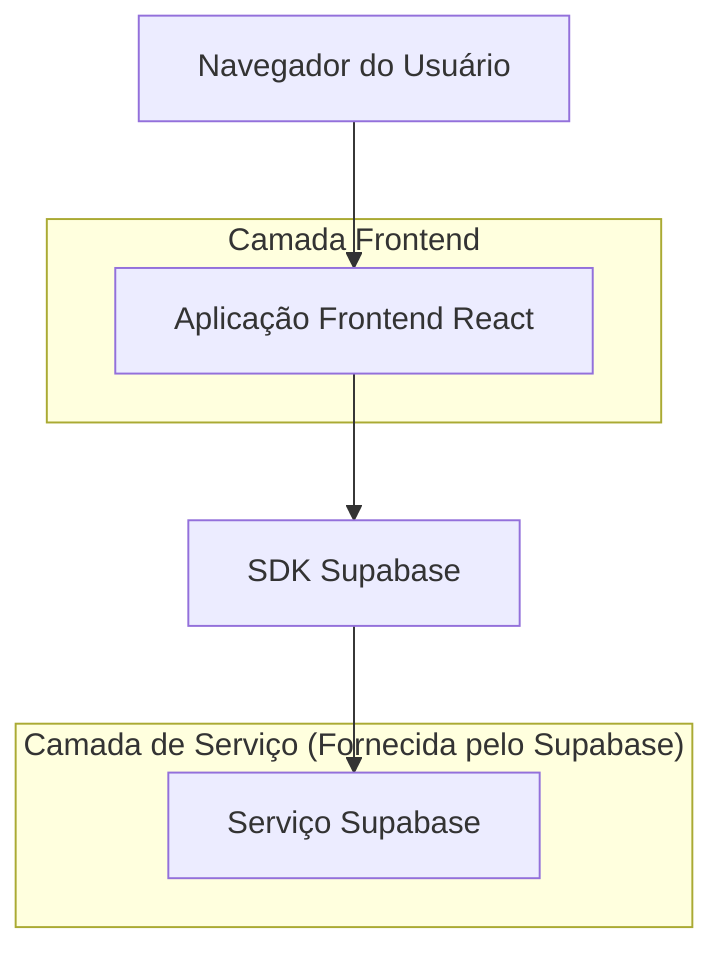
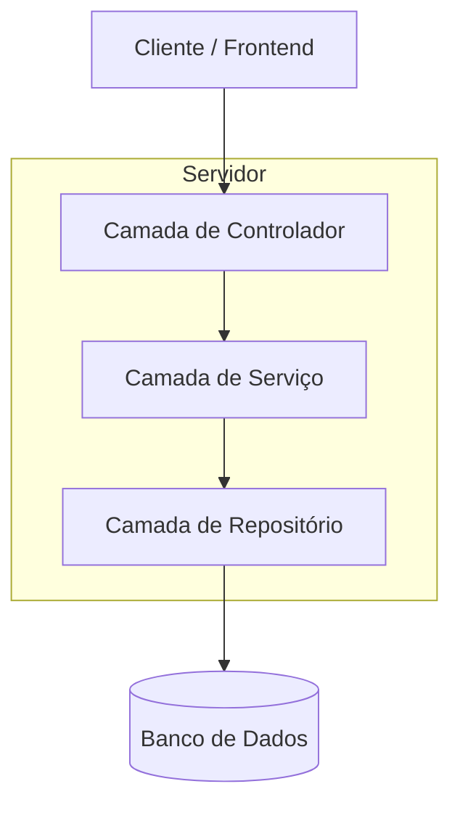
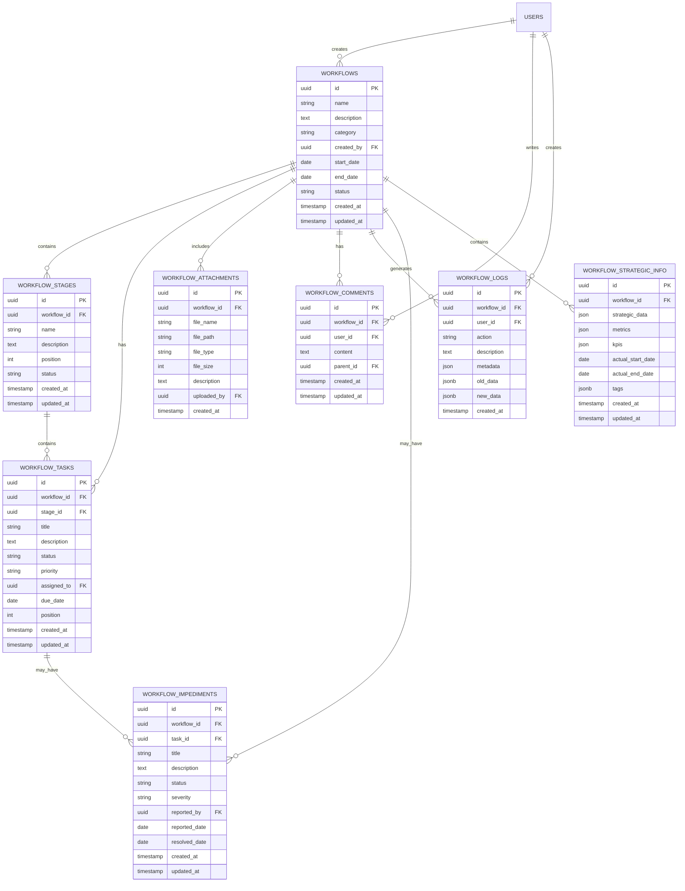

# Documento de Arquitetura Técnica - Sistema de Fluxo de Trabalho

## 1. Design da Arquitetura



## 2. Descrição da Tecnologia

* Frontend: React\@18 + tailwindcss\@3 + vite

* Backend: Supabase (PostgreSQL + Auth + Storage)

* Autenticação: Supabase Auth

* Banco de Dados: PostgreSQL (via Supabase)

## 3. Definições de Rotas

| Rota                         | Propósito                                                                        |
| ---------------------------- | -------------------------------------------------------------------------------- |
| /workflows                   | Página principal de listagem de fluxos de trabalho com modais de cadastro/edição |
| /workflows/\[id]             | Página de detalhes do fluxo de trabalho                                          |
| /workflows/\[id]/work-items  | Página de itens de trabalho (etapas, tarefas, impedimentos)                      |
| /workflows/\[id]/attachments | Página de gestão de anexos                                                       |
| /workflows/\[id]/comments    | Página de comentários                                                            |
| /workflows/\[id]/logs        | Página de logs e auditoria                                                       |
| /workflows/\[id]/strategic   | Página de informações estratégicas                                               |

## 4. Definições de API

### 4.1 APIs Principais

**Autenticação e autorização de usuários**

```
POST /api/auth/login
```

Request:

| Nome do Parâmetro | Tipo do Parâmetro | Obrigatório | Descrição        |
| ----------------- | ----------------- | ----------- | ---------------- |
| email             | string            | true        | Email do usuário |
| password          | string            | true        | Senha do usuário |

Response:

| Nome do Parâmetro | Tipo do Parâmetro | Descrição                    |
| ----------------- | ----------------- | ---------------------------- |
| success           | boolean           | Status da resposta           |
| user              | object            | Dados do usuário autenticado |

**Gestão de fluxos de trabalho**

```
GET /api/workflows
POST /api/workflows
GET /api/workflows/[id]
PUT /api/workflows/[id]
DELETE /api/workflows/[id]
```

**Gestão de itens de trabalho**

```
GET /api/workflows/[id]/work-items
POST /api/workflows/[id]/work-items
PUT /api/workflows/[id]/work-items/[itemId]
DELETE /api/workflows/[id]/work-items/[itemId]
```

**Gestão de anexos**

```
GET /api/workflows/[id]/attachments
POST /api/workflows/[id]/attachments
DELETE /api/workflows/[id]/attachments/[attachmentId]
```

**Sistema de comentários**

```
GET /api/workflows/[id]/comments
POST /api/workflows/[id]/comments
PUT /api/workflows/[id]/comments/[commentId]
DELETE /api/workflows/[id]/comments/[commentId]
```

**Sistema de logs**

```
GET /api/workflows/[id]/logs
```

Exemplo de Request (Criar Fluxo de Trabalho):

```json
{
  "name": "Melhoria do Processo de Vendas",
  "description": "Iniciativa para otimizar o processo de vendas",
  "category": "melhoria",
  "team_id": "uuid-da-equipe",
  "start_date": "2024-01-15",
  "end_date": "2024-06-15"
}
```

## 5. Arquitetura do Servidor



## 6. Modelo de Dados

### 6.1 Definição do Modelo de Dados



### 6.2 Linguagem de Definição de Dados

**Tabela de Fluxos de Trabalho (workflows)**

```sql
-- criar tabela
CREATE TABLE workflows (
    id UUID PRIMARY KEY DEFAULT gen_random_uuid(),
    name VARCHAR(255) NOT NULL,
    description TEXT,
    category VARCHAR(20) NOT NULL CHECK (category IN ('iniciativa', 'melhoria')),
    created_by UUID REFERENCES users(id) ON DELETE CASCADE,
    start_date DATE,
    end_date DATE,
    status VARCHAR(20) DEFAULT 'planejamento' CHECK (status IN ('planejamento', 'em_andamento', 'concluido', 'cancelado')),
    created_at TIMESTAMP WITH TIME ZONE DEFAULT NOW(),
    updated_at TIMESTAMP WITH TIME ZONE DEFAULT NOW()
);

-- criar índices
CREATE INDEX idx_workflows_created_by ON workflows(created_by);
CREATE INDEX idx_workflows_category ON workflows(category);
CREATE INDEX idx_workflows_status ON workflows(status);
CREATE INDEX idx_workflows_created_at ON workflows(created_at DESC);
```

**Tabela de Etapas do Fluxo (workflow\_stages)**

```sql
-- criar tabela
CREATE TABLE workflow_stages (
    id UUID PRIMARY KEY DEFAULT gen_random_uuid(),
    workflow_id UUID REFERENCES workflows(id) ON DELETE CASCADE,
    name VARCHAR(255) NOT NULL,
    description TEXT,
    position INTEGER NOT NULL,
    status VARCHAR(20) DEFAULT 'ativo' CHECK (status IN ('ativo', 'inativo')),
    created_by UUID REFERENCES users(id) ON DELETE CASCADE,
    created_at TIMESTAMP WITH TIME ZONE DEFAULT NOW(),
    updated_at TIMESTAMP WITH TIME ZONE DEFAULT NOW()
);

-- criar índices
CREATE INDEX idx_workflow_stages_workflow_id ON workflow_stages(workflow_id);
CREATE INDEX idx_workflow_stages_created_by ON workflow_stages(created_by);
CREATE INDEX idx_workflow_stages_position ON workflow_stages(workflow_id, position);
```

**Tabela de Tarefas do Fluxo (workflow\_tasks)**

```sql
-- criar tabela
CREATE TABLE workflow_tasks (
    id UUID PRIMARY KEY DEFAULT gen_random_uuid(),
    workflow_id UUID REFERENCES workflows(id) ON DELETE CASCADE,
    stage_id UUID REFERENCES workflow_stages(id) ON DELETE CASCADE,
    title VARCHAR(255) NOT NULL,
    description TEXT,
    status VARCHAR(20) DEFAULT 'pendente' CHECK (status IN ('pendente', 'em_andamento', 'concluida', 'bloqueada')),
    priority VARCHAR(10) DEFAULT 'media' CHECK (priority IN ('baixa', 'media', 'alta', 'critica')),
    assigned_to UUID REFERENCES users(id),
    due_date DATE,
    position INTEGER NOT NULL,
    created_by UUID REFERENCES users(id) ON DELETE CASCADE,
    created_at TIMESTAMP WITH TIME ZONE DEFAULT NOW(),
    updated_at TIMESTAMP WITH TIME ZONE DEFAULT NOW()
);

-- criar índices
CREATE INDEX idx_workflow_tasks_workflow_id ON workflow_tasks(workflow_id);
CREATE INDEX idx_workflow_tasks_stage_id ON workflow_tasks(stage_id);
CREATE INDEX idx_workflow_tasks_assigned_to ON workflow_tasks(assigned_to);
CREATE INDEX idx_workflow_tasks_status ON workflow_tasks(status);
CREATE INDEX idx_workflow_tasks_created_by ON workflow_tasks(created_by);
```

**Tabela de Anexos do Fluxo (workflow\_attachments)**

```sql
-- criar tabela
CREATE TABLE workflow_attachments (
    id UUID PRIMARY KEY DEFAULT gen_random_uuid(),
    workflow_id UUID REFERENCES workflows(id) ON DELETE CASCADE,
    file_name VARCHAR(255) NOT NULL,
    file_path TEXT NOT NULL,
    file_type VARCHAR(100),
    file_size INTEGER CHECK (file_size <= 10485760), -- 10MB limit
    description TEXT,
    uploaded_by UUID REFERENCES users(id) ON DELETE CASCADE,
    created_at TIMESTAMP WITH TIME ZONE DEFAULT NOW()
);

-- criar índices
CREATE INDEX idx_workflow_attachments_workflow_id ON workflow_attachments(workflow_id);
CREATE INDEX idx_workflow_attachments_uploaded_by ON workflow_attachments(uploaded_by);
```

**Tabela de Comentários do Fluxo (workflow\_comments)**

```sql
-- criar tabela
CREATE TABLE workflow_comments (
    id UUID PRIMARY KEY DEFAULT gen_random_uuid(),
    workflow_id UUID REFERENCES workflows(id) ON DELETE CASCADE,
    user_id UUID REFERENCES users(id) ON DELETE CASCADE,
    content TEXT NOT NULL,
    parent_id UUID REFERENCES workflow_comments(id),
    created_at TIMESTAMP WITH TIME ZONE DEFAULT NOW(),
    updated_at TIMESTAMP WITH TIME ZONE DEFAULT NOW()
);

-- criar índices
CREATE INDEX idx_workflow_comments_workflow_id ON workflow_comments(workflow_id);
CREATE INDEX idx_workflow_comments_user_id ON workflow_comments(user_id);
CREATE INDEX idx_workflow_comments_created_at ON workflow_comments(created_at DESC);
```

**Tabela de Logs do Fluxo (workflow\_logs)**

```sql
-- criar tabela
CREATE TABLE workflow_logs (
    id UUID PRIMARY KEY DEFAULT gen_random_uuid(),
    workflow_id UUID REFERENCES workflows(id) ON DELETE CASCADE,
    user_id UUID REFERENCES users(id),
    action VARCHAR(100) NOT NULL,
    description TEXT,
    metadata JSONB,
    old_data JSONB,
    new_data JSONB,
    created_at TIMESTAMP WITH TIME ZONE DEFAULT NOW()
);

-- criar índices
CREATE INDEX idx_workflow_logs_workflow_id ON workflow_logs(workflow_id);
CREATE INDEX idx_workflow_logs_user_id ON workflow_logs(user_id);
CREATE INDEX idx_workflow_logs_created_at ON workflow_logs(created_at DESC);
CREATE INDEX idx_workflow_logs_action ON workflow_logs(action);
```

**Tabela de Impedimentos do Fluxo (workflow\_impediments)**

```sql
-- criar tabela
CREATE TABLE workflow_impediments (
    id UUID PRIMARY KEY DEFAULT gen_random_uuid(),
    workflow_id UUID REFERENCES workflows(id) ON DELETE CASCADE,
    task_id UUID REFERENCES workflow_tasks(id) ON DELETE CASCADE,
    title VARCHAR(255) NOT NULL,
    description TEXT,
    status VARCHAR(20) DEFAULT 'aberto' CHECK (status IN ('aberto', 'em_resolucao', 'resolvido')),
    severity VARCHAR(10) DEFAULT 'media' CHECK (severity IN ('baixa', 'media', 'alta', 'critica')),
    reported_by UUID REFERENCES users(id) ON DELETE CASCADE,
    reported_date DATE DEFAULT CURRENT_DATE,
    resolved_date DATE,
    created_at TIMESTAMP WITH TIME ZONE DEFAULT NOW(),
    updated_at TIMESTAMP WITH TIME ZONE DEFAULT NOW()
);

-- criar índices
CREATE INDEX idx_workflow_impediments_workflow_id ON workflow_impediments(workflow_id);
CREATE INDEX idx_workflow_impediments_task_id ON workflow_impediments(task_id);
CREATE INDEX idx_workflow_impediments_status ON workflow_impediments(status);
CREATE INDEX idx_workflow_impediments_created_by ON workflow_impediments(created_by);
```

**Tabela de Informações Estratégicas (workflow\_strategic\_info)**

```sql
-- criar tabela
CREATE TABLE workflow_strategic_info (
    id UUID PRIMARY KEY DEFAULT gen_random_uuid(),
    workflow_id UUID REFERENCES workflows(id) ON DELETE CASCADE,
    strategic_data JSONB,
    metrics JSONB,
    kpis JSONB,
    actual_start_date DATE,
    actual_end_date DATE,
    tags JSONB,
    created_by UUID REFERENCES users(id) ON DELETE CASCADE,
    created_at TIMESTAMP WITH TIME ZONE DEFAULT NOW(),
    updated_at TIMESTAMP WITH TIME ZONE DEFAULT NOW()
);

-- criar índices
CREATE INDEX idx_workflow_strategic_info_workflow_id ON workflow_strategic_info(workflow_id);
CREATE INDEX idx_workflow_strategic_info_created_by ON workflow_strategic_info(created_by);
```

**Políticas de Segurança RLS (Row Level Security)**

```sql
-- Habilitar RLS para todas as tabelas
ALTER TABLE workflows ENABLE ROW LEVEL SECURITY;
ALTER TABLE workflow_stages ENABLE ROW LEVEL SECURITY;
ALTER TABLE workflow_tasks ENABLE ROW LEVEL SECURITY;
ALTER TABLE workflow_attachments ENABLE ROW LEVEL SECURITY;
ALTER TABLE workflow_comments ENABLE ROW LEVEL SECURITY;
ALTER TABLE workflow_logs ENABLE ROW LEVEL SECURITY;
ALTER TABLE workflow_impediments ENABLE ROW LEVEL SECURITY;
ALTER TABLE workflow_strategic_info ENABLE ROW LEVEL SECURITY;

-- Políticas simples para workflows - CRUD total para usuários autenticados
CREATE POLICY "Authenticated users can manage workflows" ON workflows
    FOR ALL USING (auth.role() = 'authenticated');

CREATE POLICY "Authenticated users can manage workflow_stages" ON workflow_stages
    FOR ALL USING (auth.role() = 'authenticated');

CREATE POLICY "Authenticated users can manage workflow_tasks" ON workflow_tasks
    FOR ALL USING (auth.role() = 'authenticated');

CREATE POLICY "Authenticated users can manage workflow_attachments" ON workflow_attachments
    FOR ALL USING (auth.role() = 'authenticated');

CREATE POLICY "Authenticated users can manage workflow_comments" ON workflow_comments
    FOR ALL USING (auth.role() = 'authenticated');

CREATE POLICY "Authenticated users can manage workflow_logs" ON workflow_logs
    FOR ALL USING (auth.role() = 'authenticated');

CREATE POLICY "Authenticated users can manage workflow_impediments" ON workflow_impediments
    FOR ALL USING (auth.role() = 'authenticated');

CREATE POLICY "Authenticated users can manage workflow_strategic_info" ON workflow_strategic_info
    FOR ALL USING (auth.role() = 'authenticated');

-- Conceder permissões básicas
GRANT SELECT ON workflows TO anon;
GRANT ALL PRIVILEGES ON workflows TO authenticated;
GRANT ALL PRIVILEGES ON workflow_stages TO authenticated;
GRANT ALL PRIVILEGES ON workflow_tasks TO authenticated;
GRANT ALL PRIVILEGES ON workflow_attachments TO authenticated;
GRANT ALL PRIVILEGES ON workflow_comments TO authenticated;
GRANT ALL PRIVILEGES ON workflow_logs TO authenticated;
GRANT ALL PRIVILEGES ON workflow_impediments TO authenticated;
GRANT ALL PRIVILEGES ON workflow_strategic_info TO authenticated;
```

**Dados iniciais**

```sql
-- Inserir categorias padrão e dados de exemplo
INSERT INTO workflows (name, description, category, created_by, start_date, end_date, status)
VALUES 
    ('Melhoria do Processo de Vendas', 'Iniciativa para otimizar o processo de vendas pessoal', 'melhoria', auth.uid(), '2024-01-15', '2024-06-15', 'em_andamento'),
    ('Implementação de Nova Tecnologia', 'Iniciativa para implementar nova stack tecnológica', 'iniciativa', auth.uid(), '2024-02-01', '2024-08-01', 'planejamento');
```

