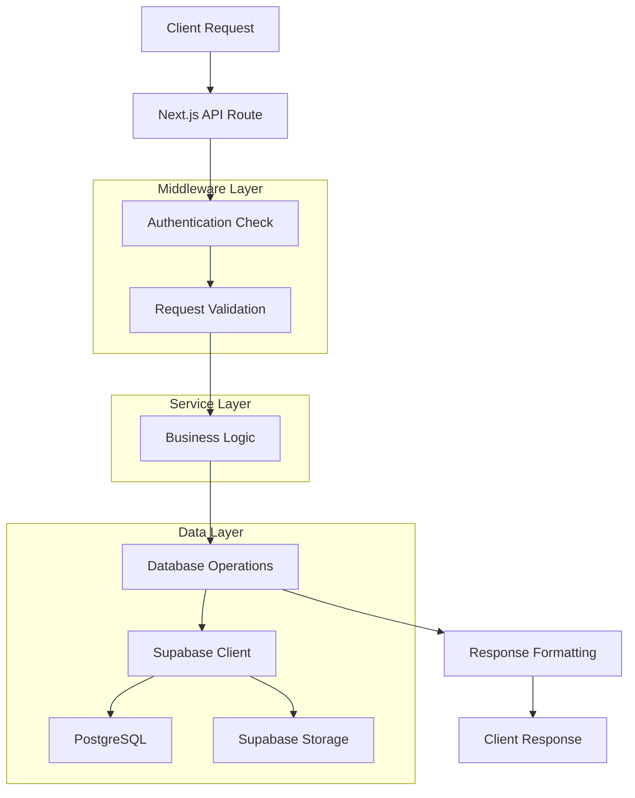
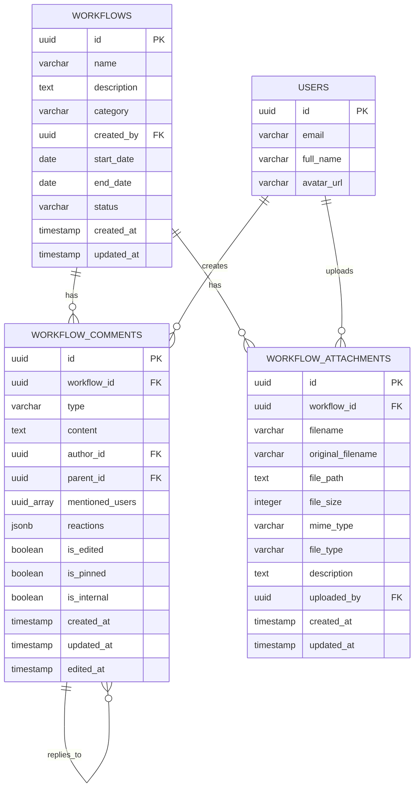

# Arquitetura Técnica - Comentários e Anexos para Workflows

## 1. Arquitetura Geral

```mermaid
graph TD
    A[Frontend React] --> B[API Routes]
    B --> C[Supabase Client]
    C --> D[PostgreSQL Database]
    C --> E[Supabase Storage]
    
    subgraph "Frontend Layer"
        F[WorkflowComments Component]
        G[WorkflowAttachments Component]
        H[useWorkflowComments Hook]
        I[useWorkflowAttachments Hook]
    end
    
    subgraph "API Layer"
        J[/api/workflows/[id]/comments]
        K[/api/workflows/[id]/attachments]
    end
    
    subgraph "Database Layer"
        L[workflow_comments table]
        M[workflow_attachments table]
        N[workflows table]
    end
    
    A --> F
    A --> G
    F --> H
    G --> I
    H --> J
    I --> K
    J --> L
    K --> M
    L --> N
    M --> N
```

## 2. Tecnologias Utilizadas

- **Frontend:** React 18 + TypeScript + Tailwind CSS
- **Backend:** Next.js API Routes
- **Database:** Supabase (PostgreSQL)
- **Storage:** Supabase Storage
- **Authentication:** Supabase Auth
- **Validation:** Zod
- **UI Components:** shadcn/ui

## 3. Estrutura de Rotas da API

| Rota | Método | Propósito |
|------|--------|----------|
| `/api/workflows/[id]/comments` | GET | Listar comentários do workflow |
| `/api/workflows/[id]/comments` | POST | Criar novo comentário |
| `/api/workflows/[id]/comments/[commentId]` | PUT | Atualizar comentário |
| `/api/workflows/[id]/comments/[commentId]` | DELETE | Deletar comentário |
| `/api/workflows/[id]/attachments` | GET | Listar anexos do workflow |
| `/api/workflows/[id]/attachments` | POST | Upload de anexo |
| `/api/workflows/[id]/attachments/[attachmentId]` | GET | Download de anexo |
| `/api/workflows/[id]/attachments/[attachmentId]` | DELETE | Deletar anexo |

## 4. Definições de API

### 4.1 Comentários

#### GET /api/workflows/[id]/comments

**Resposta:**
```typescript
{
  comments: [
    {
      id: string
      workflow_id: string
      type: 'comment' | 'status_change' | 'assignment' | 'mention' | 'system'
      content: string
      author_id: string
      parent_id?: string
      mentioned_users: string[]
      reactions: Record<string, string[]>
      is_edited: boolean
      is_pinned: boolean
      is_internal: boolean
      created_at: string
      updated_at: string
      edited_at?: string
      author: {
        id: string
        email: string
        user_metadata: {
          full_name?: string
          avatar_url?: string
        }
      }
    }
  ]
}
```

#### POST /api/workflows/[id]/comments

**Request:**
```typescript
{
  content: string
  type?: 'comment' | 'status_change' | 'assignment' | 'mention' | 'system'
  parent_id?: string
  mentioned_users?: string[]
  is_internal?: boolean
}
```

**Resposta:**
```typescript
{
  comment: WorkflowComment
}
```

### 4.2 Anexos

#### GET /api/workflows/[id]/attachments

**Resposta:**
```typescript
{
  attachments: [
    {
      id: string
      workflow_id: string
      filename: string
      original_filename: string
      file_path: string
      file_size: number
      mime_type: string
      file_type: string
      description: string
      uploaded_by: string
      created_at: string
      updated_at: string
      users: {
        full_name: string
        email: string
      }
    }
  ]
}
```

#### POST /api/workflows/[id]/attachments

**Request:** FormData
- `file`: File
- `description`: string

**Resposta:**
```typescript
{
  message: string
  attachment: WorkflowAttachment
}
```

## 5. Arquitetura do Servidor



## 6. Modelo de Dados

### 6.1 Diagrama ER



### 6.2 DDL (Data Definition Language)

#### Migração para workflow_comments
```sql
-- Expandir tabela workflow_comments para seguir padrão de projetos
ALTER TABLE workflow_comments 
ADD COLUMN IF NOT EXISTS type VARCHAR(20) DEFAULT 'comment' CHECK (type IN ('comment', 'status_change', 'assignment', 'mention', 'system')),
ADD COLUMN IF NOT EXISTS mentioned_users UUID[] DEFAULT '{}',
ADD COLUMN IF NOT EXISTS reactions JSONB DEFAULT '{}',
ADD COLUMN IF NOT EXISTS is_edited BOOLEAN DEFAULT FALSE,
ADD COLUMN IF NOT EXISTS is_pinned BOOLEAN DEFAULT FALSE,
ADD COLUMN IF NOT EXISTS is_internal BOOLEAN DEFAULT FALSE,
ADD COLUMN IF NOT EXISTS edited_at TIMESTAMP WITH TIME ZONE;

-- Renomear user_id para author_id para consistência
DO $$
BEGIN
    IF EXISTS (SELECT 1 FROM information_schema.columns WHERE table_name = 'workflow_comments' AND column_name = 'user_id') THEN
        ALTER TABLE workflow_comments RENAME COLUMN user_id TO author_id;
    END IF;
END $$;

-- Criar índices adicionais
CREATE INDEX IF NOT EXISTS idx_workflow_comments_type ON workflow_comments(type);
CREATE INDEX IF NOT EXISTS idx_workflow_comments_mentioned_users ON workflow_comments USING GIN(mentioned_users) WHERE mentioned_users != '{}';
CREATE INDEX IF NOT EXISTS idx_workflow_comments_reactions ON workflow_comments USING GIN(reactions) WHERE reactions != '{}';
CREATE INDEX IF NOT EXISTS idx_workflow_comments_pinned ON workflow_comments(is_pinned) WHERE is_pinned = TRUE;

-- Trigger para atualizar updated_at e marcar como editado
CREATE OR REPLACE FUNCTION update_workflow_comments_updated_at()
RETURNS TRIGGER AS $$
BEGIN
  NEW.updated_at = NOW();
  
  -- Se o conteúdo foi alterado, marcar como editado
  IF OLD.content != NEW.content THEN
    NEW.is_edited = TRUE;
    NEW.edited_at = NOW();
  END IF;
  
  RETURN NEW;
END;
$$ LANGUAGE plpgsql;

DROP TRIGGER IF EXISTS trigger_update_workflow_comments_updated_at ON workflow_comments;
CREATE TRIGGER trigger_update_workflow_comments_updated_at
  BEFORE UPDATE ON workflow_comments
  FOR EACH ROW
  EXECUTE FUNCTION update_workflow_comments_updated_at();
```

#### Migração para workflow_attachments
```sql
-- Expandir tabela workflow_attachments para seguir padrão de projetos
ALTER TABLE workflow_attachments 
ADD COLUMN IF NOT EXISTS original_filename VARCHAR(255),
ADD COLUMN IF NOT EXISTS mime_type VARCHAR(255),
ADD COLUMN IF NOT EXISTS updated_at TIMESTAMP WITH TIME ZONE DEFAULT NOW();

-- Renomear file_name para filename para consistência
DO $$
BEGIN
    IF EXISTS (SELECT 1 FROM information_schema.columns WHERE table_name = 'workflow_attachments' AND column_name = 'file_name') THEN
        ALTER TABLE workflow_attachments RENAME COLUMN file_name TO filename;
    END IF;
END $$;

-- Atualizar original_filename com valores existentes se necessário
UPDATE workflow_attachments 
SET original_filename = filename 
WHERE original_filename IS NULL;

-- Criar índices adicionais
CREATE INDEX IF NOT EXISTS idx_workflow_attachments_file_type ON workflow_attachments(file_type);
CREATE INDEX IF NOT EXISTS idx_workflow_attachments_updated_at ON workflow_attachments(updated_at);

-- Trigger para atualizar updated_at
DROP TRIGGER IF EXISTS trigger_update_workflow_attachments_updated_at ON workflow_attachments;
CREATE TRIGGER trigger_update_workflow_attachments_updated_at
  BEFORE UPDATE ON workflow_attachments
  FOR EACH ROW
  EXECUTE FUNCTION update_updated_at_column();
```

## 7. Segurança e Permissões

### 7.1 Row Level Security (RLS)

As políticas RLS já existem para workflows e se aplicam às tabelas relacionadas:

```sql
-- Verificar políticas existentes
SELECT schemaname, tablename, policyname, permissive, roles, cmd, qual 
FROM pg_policies 
WHERE tablename IN ('workflow_comments', 'workflow_attachments');
```

### 7.2 Validação de Dados

Utilização do Zod para validação:

```typescript
// Validação de comentários
const createWorkflowCommentSchema = z.object({
  content: z.string().min(1, 'Conteúdo é obrigatório').max(5000, 'Conteúdo muito longo'),
  type: z.enum(['comment', 'status_change', 'assignment', 'mention', 'system']).default('comment'),
  parent_id: z.string().uuid().optional(),
  mentioned_users: z.array(z.string().uuid()).default([]),
  is_internal: z.boolean().default(false)
})

// Validação de anexos
const uploadAttachmentSchema = z.object({
  description: z.string().min(1, 'Descrição é obrigatória').max(500, 'Descrição muito longa')
})
```

## 8. Performance e Otimização

### 8.1 Estratégias de Cache
- Cache de comentários recentes no lado do cliente
- Invalidação de cache ao criar/atualizar comentários
- Lazy loading para anexos grandes

### 8.2 Paginação
- Implementar paginação para comentários em workflows com muita atividade
- Carregar comentários mais recentes primeiro
- Scroll infinito para melhor UX

### 8.3 Otimizações de Query
- Índices apropriados para consultas frequentes
- JOIN otimizado para buscar dados do autor
- Limit e offset para paginação eficiente

## 9. Monitoramento e Logs

### 9.1 Métricas
- Número de comentários por workflow
- Tamanho e tipo de anexos mais comuns
- Tempo de resposta das APIs

### 9.2 Logs de Auditoria
- Criação, edição e exclusão de comentários
- Upload e download de anexos
- Tentativas de acesso não autorizado

## 10. Testes

### 10.1 Testes Unitários
- Hooks personalizados
- Funções de validação
- Utilitários de formatação

### 10.2 Testes de Integração
- APIs de comentários e anexos
- Fluxo completo de upload/download
- Permissões e segurança

### 10.3 Testes E2E
- Criação de comentários na interface
- Upload de arquivos via drag & drop
- Navegação entre comentários e anexos