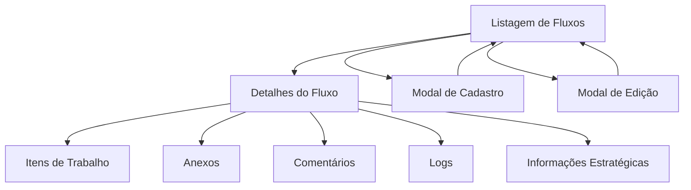

# Documento de Requisitos - Sistema de Fluxo de Trabalho

## 1. Visão Geral do Produto

O Sistema de Fluxo de Trabalho é uma nova funcionalidade que permite gerenciar iniciativas e melhorias organizacionais seguindo a mesma estrutura robusta do módulo de projetos, mas com particularidades específicas para fluxos de trabalho. O sistema oferece gestão completa de etapas, tarefas, impedimentos, anexos, comentários e logs, proporcionando visibilidade e controle total sobre os fluxos de trabalho da organização.

## 2. Funcionalidades Principais

### 2.1 Papéis de Usuário

| Papel | Método de Registro | Permissões Principais |
|-------|-------------------|----------------------|
| Usuário Autenticado | Registro por email | Pode criar, visualizar, editar e gerenciar seus próprios fluxos de trabalho |
| Administrador | Acesso administrativo | Controle total sobre todos os fluxos de trabalho do sistema |

### 2.2 Módulos de Funcionalidade

Nossos requisitos de fluxo de trabalho consistem nas seguintes páginas principais:

1. **Página de Listagem de Fluxos**: listagem de fluxos pessoais, filtros por categoria, indicadores de status, modais de cadastro/edição
2. **Página de Detalhes do Fluxo**: informações gerais, estatísticas, navegação para módulos
3. **Página de Itens de Trabalho**: gestão de etapas, tarefas e impedimentos (sem riscos)
4. **Página de Anexos**: upload e gestão de documentos
5. **Página de Comentários**: sistema de anotações pessoais
6. **Página de Logs**: histórico de alterações e atividades
7. **Página de Informações Estratégicas**: dados estratégicos e métricas do fluxo

### 2.3 Detalhes das Páginas

| Nome da Página | Nome do Módulo | Descrição da Funcionalidade |
|----------------|----------------|-----------------------------|
| Listagem de Fluxos | Lista Principal | Exibir fluxos de trabalho do usuário, filtrar por categoria (Iniciativa/Melhoria), buscar por nome, mostrar indicadores de status |
| Detalhes do Fluxo | Visão Geral | Mostrar informações gerais, estatísticas de progresso, links para outros módulos |
| Listagem de Fluxos | Modal de Cadastro | Janela modal para criar novo fluxo de trabalho, selecionar categoria, configurar informações básicas |
| Listagem de Fluxos | Modal de Edição | Janela modal para editar fluxo de trabalho existente, alterar categoria, atualizar informações |
| Itens de Trabalho | Gestão de Trabalho | Gerenciar etapas do fluxo, criar/editar tarefas, registrar impedimentos, acompanhar progresso |
| Anexos | Gestão de Arquivos | Upload de documentos, organizar anexos por categoria, controle de versões |
| Comentários | Comunicação | Sistema de anotações pessoais, histórico de observações |
| Logs | Auditoria | Histórico completo de alterações, logs de atividades, rastreabilidade |
| Informações Estratégicas | Estratégia | Dados estratégicos, métricas de desempenho, indicadores de sucesso |

## 3. Processo Principal

### Fluxo do Usuário
1. Usuário acessa a listagem de seus fluxos de trabalho
2. Filtra por categoria (Iniciativa ou Melhoria) se necessário
3. Seleciona um fluxo específico para visualizar detalhes
4. Navega pelos módulos (itens de trabalho, anexos, comentários)
5. Gerencia todas as atividades do fluxo
6. Cria novo fluxo de trabalho clicando no botão "Novo Fluxo" que abre modal de cadastro
7. Preenche informações básicas no modal e seleciona categoria
8. Edita fluxo existente através do modal de edição acessível na listagem
9. Monitora progresso através de logs e métricas

## 4. Design da Interface do Usuário

### 4.1 Estilo de Design

- **Cores primárias e secundárias**: Seguir o mesmo padrão do módulo de projetos com tons de azul (#3B82F6) e cinza
- **Estilo de botões**: Botões arredondados com efeitos hover, seguindo design system existente
- **Fonte e tamanhos**: Inter como fonte principal, tamanhos de 14px a 24px
- **Estilo de layout**: Layout baseado em cards, navegação superior, sidebar consistente
- **Ícones e emojis**: Ícones Lucide React, emojis para categorias (🚀 Iniciativa, 📈 Melhoria)

### 4.2 Visão Geral do Design das Páginas

| Nome da Página | Nome do Módulo | Elementos da UI |
|----------------|----------------|----------------|
| Listagem de Fluxos | Lista Principal | Cards de fluxo com indicadores de status, filtros por categoria, barra de busca, botão de criar novo |
| Listagem de Fluxos | Modal de Cadastro | Modal com formulário em duas colunas, seletor de categoria, validações em tempo real, botões de ação |
| Listagem de Fluxos | Modal de Edição | Modal com formulário preenchido, seletor de categoria editável, validações, botões salvar/cancelar |
| Detalhes do Fluxo | Visão Geral | Header com informações principais, cards de estatísticas, navegação em abas, seção de equipe |
| Itens de Trabalho | Gestão de Trabalho | Interface similar ao Kanban de projetos, colunas de etapas, cards de tarefas, modal de impedimentos |
| Anexos | Gestão de Arquivos | Área de drag-and-drop, lista de arquivos, preview de documentos, controle de permissões |
| Comentários | Comunicação | Thread de comentários, editor rich text, notificações, filtros por data |
| Logs | Auditoria | Tabela de logs com filtros, timeline de atividades, detalhes expandíveis |
| Informações Estratégicas | Estratégia | Dashboard com gráficos, métricas em cards, indicadores de performance |

### 4.3 Responsividade

O sistema será desenvolvido com abordagem mobile-first, garantindo adaptação completa para dispositivos móveis e tablets, com otimização para interação touch e navegação simplificada em telas menores.